## Summary of PDP, ALE, H-statistic Experiments

###  Declaration

1. All experiment data are the subset of `cslg` data set which contains **92938** papers and labeled by [Arxiv]() with `cs.LG` category.
2. All experiments are provided with the same query string `Machine Learnin `.
3. All experiments data with the same amount of paper are referring the same data set. For instance, the 500 paper data set used in PDP experiments are the same data set used in ALE experiments. And there are subsets:
   1. 100 papers;
   2. 200 papers;
   3. 500 papers;
   4. 1000 papers;
   5. 5000 papers;
   5. 92938 Papers

### PDP

#### Partial Dependence Evaluation

The partial function evaluation formula:

![](data:image/svg+xml, %3Csvg%20style%3D%22vertical-align%3A%20-2.819ex%22%20xmlns%3D%22http%3A%2F%2Fwww.w3.org%2F2000%2Fsvg%22%20width%3D%2224.712ex%22%20height%3D%226.354ex%22%20role%3D%22img%22%20focusable%3D%22false%22%20viewBox%3D%220%20-1562.5%2010922.8%202808.5%22%20xmlns%3Axlink%3D%22http%3A%2F%2Fwww.w3.org%2F1999%2Fxlink%22%3E%3Cdefs%3E%3Cpath%20id%3D%22MJX-6878-TEX-I-1D453%22%20d%3D%22M118%20-162Q120%20-162%20124%20-164T135%20-167T147%20-168Q160%20-168%20171%20-155T187%20-126Q197%20-99%20221%2027T267%20267T289%20382V385H242Q195%20385%20192%20387Q188%20390%20188%20397L195%20425Q197%20430%20203%20430T250%20431Q298%20431%20298%20432Q298%20434%20307%20482T319%20540Q356%20705%20465%20705Q502%20703%20526%20683T550%20630Q550%20594%20529%20578T487%20561Q443%20561%20443%20603Q443%20622%20454%20636T478%20657L487%20662Q471%20668%20457%20668Q445%20668%20434%20658T419%20630Q412%20601%20403%20552T387%20469T380%20433Q380%20431%20435%20431Q480%20431%20487%20430T498%20424Q499%20420%20496%20407T491%20391Q489%20386%20482%20386T428%20385H372L349%20263Q301%2015%20282%20-47Q255%20-132%20212%20-173Q175%20-205%20139%20-205Q107%20-205%2081%20-186T55%20-132Q55%20-95%2076%20-78T118%20-61Q162%20-61%20162%20-103Q162%20-122%20151%20-136T127%20-157L118%20-162Z%22%3E%3C%2Fpath%3E%3Cpath%20id%3D%22MJX-6878-TEX-N-5E%22%20d%3D%22M112%20560L249%20694L257%20686Q387%20562%20387%20560L361%20531Q359%20532%20303%20581L250%20627L195%20580Q182%20569%20169%20557T148%20538L140%20532Q138%20530%20125%20546L112%20560Z%22%3E%3C%2Fpath%3E%3Cpath%20id%3D%22MJX-6878-TEX-N-28%22%20d%3D%22M94%20250Q94%20319%20104%20381T127%20488T164%20576T202%20643T244%20695T277%20729T302%20750H315H319Q333%20750%20333%20741Q333%20738%20316%20720T275%20667T226%20581T184%20443T167%20250T184%2058T225%20-81T274%20-167T316%20-220T333%20-241Q333%20-250%20318%20-250H315H302L274%20-226Q180%20-141%20137%20-14T94%20250Z%22%3E%3C%2Fpath%3E%3Cpath%20id%3D%22MJX-6878-TEX-I-1D465%22%20d%3D%22M52%20289Q59%20331%20106%20386T222%20442Q257%20442%20286%20424T329%20379Q371%20442%20430%20442Q467%20442%20494%20420T522%20361Q522%20332%20508%20314T481%20292T458%20288Q439%20288%20427%20299T415%20328Q415%20374%20465%20391Q454%20404%20425%20404Q412%20404%20406%20402Q368%20386%20350%20336Q290%20115%20290%2078Q290%2050%20306%2038T341%2026Q378%2026%20414%2059T463%20140Q466%20150%20469%20151T485%20153H489Q504%20153%20504%20145Q504%20144%20502%20134Q486%2077%20440%2033T333%20-11Q263%20-11%20227%2052Q186%20-10%20133%20-10H127Q78%20-10%2057%2016T35%2071Q35%20103%2054%20123T99%20143Q142%20143%20142%20101Q142%2081%20130%2066T107%2046T94%2041L91%2040Q91%2039%2097%2036T113%2029T132%2026Q168%2026%20194%2071Q203%2087%20217%20139T245%20247T261%20313Q266%20340%20266%20352Q266%20380%20251%20392T217%20404Q177%20404%20142%20372T93%20290Q91%20281%2088%20280T72%20278H58Q52%20284%2052%20289Z%22%3E%3C%2Fpath%3E%3Cpath%20id%3D%22MJX-6878-TEX-I-1D446%22%20d%3D%22M308%2024Q367%2024%20416%2076T466%20197Q466%20260%20414%20284Q308%20311%20278%20321T236%20341Q176%20383%20176%20462Q176%20523%20208%20573T273%20648Q302%20673%20343%20688T407%20704H418H425Q521%20704%20564%20640Q565%20640%20577%20653T603%20682T623%20704Q624%20704%20627%20704T632%20705Q645%20705%20645%20698T617%20577T585%20459T569%20456Q549%20456%20549%20465Q549%20471%20550%20475Q550%20478%20551%20494T553%20520Q553%20554%20544%20579T526%20616T501%20641Q465%20662%20419%20662Q362%20662%20313%20616T263%20510Q263%20480%20278%20458T319%20427Q323%20425%20389%20408T456%20390Q490%20379%20522%20342T554%20242Q554%20216%20546%20186Q541%20164%20528%20137T492%2078T426%2018T332%20-20Q320%20-22%20298%20-22Q199%20-22%20144%2033L134%2044L106%2013Q83%20-14%2078%20-18T65%20-22Q52%20-22%2052%20-14Q52%20-11%20110%20221Q112%20227%20130%20227H143Q149%20221%20149%20216Q149%20214%20148%20207T144%20186T142%20153Q144%20114%20160%2087T203%2047T255%2029T308%2024Z%22%3E%3C%2Fpath%3E%3Cpath%20id%3D%22MJX-6878-TEX-N-29%22%20d%3D%22M60%20749L64%20750Q69%20750%2074%20750H86L114%20726Q208%20641%20251%20514T294%20250Q294%20182%20284%20119T261%2012T224%20-76T186%20-143T145%20-194T113%20-227T90%20-246Q87%20-249%2086%20-250H74Q66%20-250%2063%20-250T58%20-247T55%20-238Q56%20-237%2066%20-225Q221%20-64%20221%20250T66%20725Q56%20737%2055%20738Q55%20746%2060%20749Z%22%3E%3C%2Fpath%3E%3Cpath%20id%3D%22MJX-6878-TEX-N-3D%22%20d%3D%22M56%20347Q56%20360%2070%20367H707Q722%20359%20722%20347Q722%20336%20708%20328L390%20327H72Q56%20332%2056%20347ZM56%20153Q56%20168%2072%20173H708Q722%20163%20722%20153Q722%20140%20707%20133H70Q56%20140%2056%20153Z%22%3E%3C%2Fpath%3E%3Cpath%20id%3D%22MJX-6878-TEX-N-31%22%20d%3D%22M213%20578L200%20573Q186%20568%20160%20563T102%20556H83V602H102Q149%20604%20189%20617T245%20641T273%20663Q275%20666%20285%20666Q294%20666%20302%20660V361L303%2061Q310%2054%20315%2052T339%2048T401%2046H427V0H416Q395%203%20257%203Q121%203%20100%200H88V46H114Q136%2046%20152%2046T177%2047T193%2050T201%2052T207%2057T213%2061V578Z%22%3E%3C%2Fpath%3E%3Cpath%20id%3D%22MJX-6878-TEX-I-1D45B%22%20d%3D%22M21%20287Q22%20293%2024%20303T36%20341T56%20388T89%20425T135%20442Q171%20442%20195%20424T225%20390T231%20369Q231%20367%20232%20367L243%20378Q304%20442%20382%20442Q436%20442%20469%20415T503%20336T465%20179T427%2052Q427%2026%20444%2026Q450%2026%20453%2027Q482%2032%20505%2065T540%20145Q542%20153%20560%20153Q580%20153%20580%20145Q580%20144%20576%20130Q568%20101%20554%2073T508%2017T439%20-10Q392%20-10%20371%2017T350%2073Q350%2092%20386%20193T423%20345Q423%20404%20379%20404H374Q288%20404%20229%20303L222%20291L189%20157Q156%2026%20151%2016Q138%20-11%20108%20-11Q95%20-11%2087%20-5T76%207T74%2017Q74%2030%20112%20180T152%20343Q153%20348%20153%20366Q153%20405%20129%20405Q91%20405%2066%20305Q60%20285%2060%20284Q58%20278%2041%20278H27Q21%20284%2021%20287Z%22%3E%3C%2Fpath%3E%3Cpath%20id%3D%22MJX-6878-TEX-LO-2211%22%20d%3D%22M60%20948Q63%20950%20665%20950H1267L1325%20815Q1384%20677%201388%20669H1348L1341%20683Q1320%20724%201285%20761Q1235%20809%201174%20838T1033%20881T882%20898T699%20902H574H543H251L259%20891Q722%20258%20724%20252Q725%20250%20724%20246Q721%20243%20460%20-56L196%20-356Q196%20-357%20407%20-357Q459%20-357%20548%20-357T676%20-358Q812%20-358%20896%20-353T1063%20-332T1204%20-283T1307%20-196Q1328%20-170%201348%20-124H1388Q1388%20-125%201381%20-145T1356%20-210T1325%20-294L1267%20-449L666%20-450Q64%20-450%2061%20-448Q55%20-446%2055%20-439Q55%20-437%2057%20-433L590%20177Q590%20178%20557%20222T452%20366T322%20544L56%20909L55%20924Q55%20945%2060%20948Z%22%3E%3C%2Fpath%3E%3Cpath%20id%3D%22MJX-6878-TEX-I-1D456%22%20d%3D%22M184%20600Q184%20624%20203%20642T247%20661Q265%20661%20277%20649T290%20619Q290%20596%20270%20577T226%20557Q211%20557%20198%20567T184%20600ZM21%20287Q21%20295%2030%20318T54%20369T98%20420T158%20442Q197%20442%20223%20419T250%20357Q250%20340%20236%20301T196%20196T154%2083Q149%2061%20149%2051Q149%2026%20166%2026Q175%2026%20185%2029T208%2043T235%2078T260%20137Q263%20149%20265%20151T282%20153Q302%20153%20302%20143Q302%20135%20293%20112T268%2061T223%2011T161%20-11Q129%20-11%20102%2010T74%2074Q74%2091%2079%20106T122%20220Q160%20321%20166%20341T173%20380Q173%20404%20156%20404H154Q124%20404%2099%20371T61%20287Q60%20286%2059%20284T58%20281T56%20279T53%20278T49%20278T41%20278H27Q21%20284%2021%20287Z%22%3E%3C%2Fpath%3E%3Cpath%20id%3D%22MJX-6878-TEX-N-2C%22%20d%3D%22M78%2035T78%2060T94%20103T137%20121Q165%20121%20187%2096T210%208Q210%20-27%20201%20-60T180%20-117T154%20-158T130%20-185T117%20-194Q113%20-194%20104%20-185T95%20-172Q95%20-168%20106%20-156T131%20-126T157%20-76T173%20-3V9L172%208Q170%207%20167%206T161%203T152%201T140%200Q113%200%2096%2017Z%22%3E%3C%2Fpath%3E%3Cpath%20id%3D%22MJX-6878-TEX-I-1D436%22%20d%3D%22M50%20252Q50%20367%20117%20473T286%20641T490%20704Q580%20704%20633%20653Q642%20643%20648%20636T656%20626L657%20623Q660%20623%20684%20649Q691%20655%20699%20663T715%20679T725%20690L740%20705H746Q760%20705%20760%20698Q760%20694%20728%20561Q692%20422%20692%20421Q690%20416%20687%20415T669%20413H653Q647%20419%20647%20422Q647%20423%20648%20429T650%20449T651%20481Q651%20552%20619%20605T510%20659Q484%20659%20454%20652T382%20628T299%20572T226%20479Q194%20422%20175%20346T156%20222Q156%20108%20232%2058Q280%2024%20350%2024Q441%2024%20512%2092T606%20240Q610%20253%20612%20255T628%20257Q648%20257%20648%20248Q648%20243%20647%20239Q618%20132%20523%2055T319%20-22Q206%20-22%20128%2053T50%20252Z%22%3E%3C%2Fpath%3E%3C%2Fdefs%3E%3Cg%20stroke%3D%22currentColor%22%20fill%3D%22currentColor%22%20stroke-width%3D%220%22%20transform%3D%22scale(1%2C-1)%22%3E%3Cg%20data-mml-node%3D%22math%22%3E%3Cg%20data-mml-node%3D%22TeXAtom%22%20data-mjx-texclass%3D%22ORD%22%3E%3Cg%20data-mml-node%3D%22mover%22%3E%3Cg%20data-mml-node%3D%22mi%22%3E%3Cuse%20data-c%3D%221D453%22%20xlink%3Ahref%3D%22%23MJX-6878-TEX-I-1D453%22%3E%3C%2Fuse%3E%3C%2Fg%3E%3Cg%20data-mml-node%3D%22mo%22%20transform%3D%22translate(457%2C279)%20translate(-250%200)%22%3E%3Cuse%20data-c%3D%225E%22%20xlink%3Ahref%3D%22%23MJX-6878-TEX-N-5E%22%3E%3C%2Fuse%3E%3C%2Fg%3E%3C%2Fg%3E%3C%2Fg%3E%3Cg%20data-mml-node%3D%22mo%22%20transform%3D%22translate(550%2C0)%22%3E%3Cuse%20data-c%3D%2228%22%20xlink%3Ahref%3D%22%23MJX-6878-TEX-N-28%22%3E%3C%2Fuse%3E%3C%2Fg%3E%3Cg%20data-mml-node%3D%22msub%22%20transform%3D%22translate(939%2C0)%22%3E%3Cg%20data-mml-node%3D%22mi%22%3E%3Cuse%20data-c%3D%221D465%22%20xlink%3Ahref%3D%22%23MJX-6878-TEX-I-1D465%22%3E%3C%2Fuse%3E%3C%2Fg%3E%3Cg%20data-mml-node%3D%22mi%22%20transform%3D%22translate(605%2C-150)%20scale(0.707)%22%3E%3Cuse%20data-c%3D%221D446%22%20xlink%3Ahref%3D%22%23MJX-6878-TEX-I-1D446%22%3E%3C%2Fuse%3E%3C%2Fg%3E%3C%2Fg%3E%3Cg%20data-mml-node%3D%22mo%22%20transform%3D%22translate(2050.1%2C0)%22%3E%3Cuse%20data-c%3D%2229%22%20xlink%3Ahref%3D%22%23MJX-6878-TEX-N-29%22%3E%3C%2Fuse%3E%3C%2Fg%3E%3Cg%20data-mml-node%3D%22mo%22%20transform%3D%22translate(2716.9%2C0)%22%3E%3Cuse%20data-c%3D%223D%22%20xlink%3Ahref%3D%22%23MJX-6878-TEX-N-3D%22%3E%3C%2Fuse%3E%3C%2Fg%3E%3Cg%20data-mml-node%3D%22mfrac%22%20transform%3D%22translate(3772.6%2C0)%22%3E%3Cg%20data-mml-node%3D%22mn%22%20transform%3D%22translate(270%2C676)%22%3E%3Cuse%20data-c%3D%2231%22%20xlink%3Ahref%3D%22%23MJX-6878-TEX-N-31%22%3E%3C%2Fuse%3E%3C%2Fg%3E%3Cg%20data-mml-node%3D%22mi%22%20transform%3D%22translate(220%2C-686)%22%3E%3Cuse%20data-c%3D%221D45B%22%20xlink%3Ahref%3D%22%23MJX-6878-TEX-I-1D45B%22%3E%3C%2Fuse%3E%3C%2Fg%3E%3Crect%20width%3D%22800%22%20height%3D%2260%22%20x%3D%22120%22%20y%3D%22220%22%3E%3C%2Frect%3E%3C%2Fg%3E%3Cg%20data-mml-node%3D%22munderover%22%20transform%3D%22translate(4979.3%2C0)%22%3E%3Cg%20data-mml-node%3D%22mo%22%3E%3Cuse%20data-c%3D%222211%22%20xlink%3Ahref%3D%22%23MJX-6878-TEX-LO-2211%22%3E%3C%2Fuse%3E%3C%2Fg%3E%3Cg%20data-mml-node%3D%22TeXAtom%22%20transform%3D%22translate(148.2%2C-1087.9)%20scale(0.707)%22%20data-mjx-texclass%3D%22ORD%22%3E%3Cg%20data-mml-node%3D%22mi%22%3E%3Cuse%20data-c%3D%221D456%22%20xlink%3Ahref%3D%22%23MJX-6878-TEX-I-1D456%22%3E%3C%2Fuse%3E%3C%2Fg%3E%3Cg%20data-mml-node%3D%22mo%22%20transform%3D%22translate(345%2C0)%22%3E%3Cuse%20data-c%3D%223D%22%20xlink%3Ahref%3D%22%23MJX-6878-TEX-N-3D%22%3E%3C%2Fuse%3E%3C%2Fg%3E%3Cg%20data-mml-node%3D%22mn%22%20transform%3D%22translate(1123%2C0)%22%3E%3Cuse%20data-c%3D%2231%22%20xlink%3Ahref%3D%22%23MJX-6878-TEX-N-31%22%3E%3C%2Fuse%3E%3C%2Fg%3E%3C%2Fg%3E%3Cg%20data-mml-node%3D%22mi%22%20transform%3D%22translate(509.9%2C1150)%20scale(0.707)%22%3E%3Cuse%20data-c%3D%221D45B%22%20xlink%3Ahref%3D%22%23MJX-6878-TEX-I-1D45B%22%3E%3C%2Fuse%3E%3C%2Fg%3E%3C%2Fg%3E%3Cg%20data-mml-node%3D%22TeXAtom%22%20data-mjx-texclass%3D%22ORD%22%20transform%3D%22translate(6590%2C0)%22%3E%3Cg%20data-mml-node%3D%22mover%22%3E%3Cg%20data-mml-node%3D%22mi%22%3E%3Cuse%20data-c%3D%221D453%22%20xlink%3Ahref%3D%22%23MJX-6878-TEX-I-1D453%22%3E%3C%2Fuse%3E%3C%2Fg%3E%3Cg%20data-mml-node%3D%22mo%22%20transform%3D%22translate(457%2C279)%20translate(-250%200)%22%3E%3Cuse%20data-c%3D%225E%22%20xlink%3Ahref%3D%22%23MJX-6878-TEX-N-5E%22%3E%3C%2Fuse%3E%3C%2Fg%3E%3C%2Fg%3E%3C%2Fg%3E%3Cg%20data-mml-node%3D%22mo%22%20transform%3D%22translate(7140%2C0)%22%3E%3Cuse%20data-c%3D%2228%22%20xlink%3Ahref%3D%22%23MJX-6878-TEX-N-28%22%3E%3C%2Fuse%3E%3C%2Fg%3E%3Cg%20data-mml-node%3D%22msub%22%20transform%3D%22translate(7529%2C0)%22%3E%3Cg%20data-mml-node%3D%22mi%22%3E%3Cuse%20data-c%3D%221D465%22%20xlink%3Ahref%3D%22%23MJX-6878-TEX-I-1D465%22%3E%3C%2Fuse%3E%3C%2Fg%3E%3Cg%20data-mml-node%3D%22mi%22%20transform%3D%22translate(605%2C-150)%20scale(0.707)%22%3E%3Cuse%20data-c%3D%221D446%22%20xlink%3Ahref%3D%22%23MJX-6878-TEX-I-1D446%22%3E%3C%2Fuse%3E%3C%2Fg%3E%3C%2Fg%3E%3Cg%20data-mml-node%3D%22mo%22%20transform%3D%22translate(8640.1%2C0)%22%3E%3Cuse%20data-c%3D%222C%22%20xlink%3Ahref%3D%22%23MJX-6878-TEX-N-2C%22%3E%3C%2Fuse%3E%3C%2Fg%3E%3Cg%20data-mml-node%3D%22msubsup%22%20transform%3D%22translate(9084.7%2C0)%22%3E%3Cg%20data-mml-node%3D%22mi%22%3E%3Cuse%20data-c%3D%221D465%22%20xlink%3Ahref%3D%22%23MJX-6878-TEX-I-1D465%22%3E%3C%2Fuse%3E%3C%2Fg%3E%3Cg%20data-mml-node%3D%22TeXAtom%22%20transform%3D%22translate(605%2C530.4)%20scale(0.707)%22%20data-mjx-texclass%3D%22ORD%22%3E%3Cg%20data-mml-node%3D%22mo%22%3E%3Cuse%20data-c%3D%2228%22%20xlink%3Ahref%3D%22%23MJX-6878-TEX-N-28%22%3E%3C%2Fuse%3E%3C%2Fg%3E%3Cg%20data-mml-node%3D%22mi%22%20transform%3D%22translate(389%2C0)%22%3E%3Cuse%20data-c%3D%221D456%22%20xlink%3Ahref%3D%22%23MJX-6878-TEX-I-1D456%22%3E%3C%2Fuse%3E%3C%2Fg%3E%3Cg%20data-mml-node%3D%22mo%22%20transform%3D%22translate(734%2C0)%22%3E%3Cuse%20data-c%3D%2229%22%20xlink%3Ahref%3D%22%23MJX-6878-TEX-N-29%22%3E%3C%2Fuse%3E%3C%2Fg%3E%3C%2Fg%3E%3Cg%20data-mml-node%3D%22mi%22%20transform%3D%22translate(605%2C-324.9)%20scale(0.707)%22%3E%3Cuse%20data-c%3D%221D436%22%20xlink%3Ahref%3D%22%23MJX-6878-TEX-I-1D436%22%3E%3C%2Fuse%3E%3C%2Fg%3E%3C%2Fg%3E%3Cg%20data-mml-node%3D%22mo%22%20transform%3D%22translate(10533.8%2C0)%22%3E%3Cuse%20data-c%3D%2229%22%20xlink%3Ahref%3D%22%23MJX-6878-TEX-N-29%22%3E%3C%2Fuse%3E%3C%2Fg%3E%3C%2Fg%3E%3C%2Fg%3E%3C%2Fsvg%3E)

|                           Notation                           | Explanation                                                  |
| :----------------------------------------------------------: | ------------------------------------------------------------ |
| ![img](data:image/svg+xml, %3Csvg%20style%3D%22vertical-align%3A%20-0.464ex%22%20xmlns%3D%22http%3A%2F%2Fwww.w3.org%2F2000%2Fsvg%22%20width%3D%221.244ex%22%20height%3D%222.891ex%22%20role%3D%22img%22%20focusable%3D%22false%22%20viewBox%3D%220%20-1073%20550%201278%22%20xmlns%3Axlink%3D%22http%3A%2F%2Fwww.w3.org%2F1999%2Fxlink%22%3E%3Cdefs%3E%3Cpath%20id%3D%22MJX-6875-TEX-I-1D453%22%20d%3D%22M118%20-162Q120%20-162%20124%20-164T135%20-167T147%20-168Q160%20-168%20171%20-155T187%20-126Q197%20-99%20221%2027T267%20267T289%20382V385H242Q195%20385%20192%20387Q188%20390%20188%20397L195%20425Q197%20430%20203%20430T250%20431Q298%20431%20298%20432Q298%20434%20307%20482T319%20540Q356%20705%20465%20705Q502%20703%20526%20683T550%20630Q550%20594%20529%20578T487%20561Q443%20561%20443%20603Q443%20622%20454%20636T478%20657L487%20662Q471%20668%20457%20668Q445%20668%20434%20658T419%20630Q412%20601%20403%20552T387%20469T380%20433Q380%20431%20435%20431Q480%20431%20487%20430T498%20424Q499%20420%20496%20407T491%20391Q489%20386%20482%20386T428%20385H372L349%20263Q301%2015%20282%20-47Q255%20-132%20212%20-173Q175%20-205%20139%20-205Q107%20-205%2081%20-186T55%20-132Q55%20-95%2076%20-78T118%20-61Q162%20-61%20162%20-103Q162%20-122%20151%20-136T127%20-157L118%20-162Z%22%3E%3C%2Fpath%3E%3Cpath%20id%3D%22MJX-6875-TEX-N-5E%22%20d%3D%22M112%20560L249%20694L257%20686Q387%20562%20387%20560L361%20531Q359%20532%20303%20581L250%20627L195%20580Q182%20569%20169%20557T148%20538L140%20532Q138%20530%20125%20546L112%20560Z%22%3E%3C%2Fpath%3E%3C%2Fdefs%3E%3Cg%20stroke%3D%22currentColor%22%20fill%3D%22currentColor%22%20stroke-width%3D%220%22%20transform%3D%22scale(1%2C-1)%22%3E%3Cg%20data-mml-node%3D%22math%22%3E%3Cg%20data-mml-node%3D%22TeXAtom%22%20data-mjx-texclass%3D%22ORD%22%3E%3Cg%20data-mml-node%3D%22mover%22%3E%3Cg%20data-mml-node%3D%22mi%22%3E%3Cuse%20data-c%3D%221D453%22%20xlink%3Ahref%3D%22%23MJX-6875-TEX-I-1D453%22%3E%3C%2Fuse%3E%3C%2Fg%3E%3Cg%20data-mml-node%3D%22mo%22%20transform%3D%22translate(457%2C279)%20translate(-250%200)%22%3E%3Cuse%20data-c%3D%225E%22%20xlink%3Ahref%3D%22%23MJX-6875-TEX-N-5E%22%3E%3C%2Fuse%3E%3C%2Fg%3E%3C%2Fg%3E%3C%2Fg%3E%3C%2Fg%3E%3C%2Fg%3E%3C%2Fsvg%3E) | the partial function                                         |
| ![img](data:image/svg+xml, %3Csvg%20style%3D%22vertical-align%3A%20-0.05ex%22%20xmlns%3D%22http%3A%2F%2Fwww.w3.org%2F2000%2Fsvg%22%20width%3D%221.459ex%22%20height%3D%221.645ex%22%20role%3D%22img%22%20focusable%3D%22false%22%20viewBox%3D%220%20-705%20645%20727%22%20xmlns%3Axlink%3D%22http%3A%2F%2Fwww.w3.org%2F1999%2Fxlink%22%3E%3Cdefs%3E%3Cpath%20id%3D%22MJX-6902-TEX-I-1D446%22%20d%3D%22M308%2024Q367%2024%20416%2076T466%20197Q466%20260%20414%20284Q308%20311%20278%20321T236%20341Q176%20383%20176%20462Q176%20523%20208%20573T273%20648Q302%20673%20343%20688T407%20704H418H425Q521%20704%20564%20640Q565%20640%20577%20653T603%20682T623%20704Q624%20704%20627%20704T632%20705Q645%20705%20645%20698T617%20577T585%20459T569%20456Q549%20456%20549%20465Q549%20471%20550%20475Q550%20478%20551%20494T553%20520Q553%20554%20544%20579T526%20616T501%20641Q465%20662%20419%20662Q362%20662%20313%20616T263%20510Q263%20480%20278%20458T319%20427Q323%20425%20389%20408T456%20390Q490%20379%20522%20342T554%20242Q554%20216%20546%20186Q541%20164%20528%20137T492%2078T426%2018T332%20-20Q320%20-22%20298%20-22Q199%20-22%20144%2033L134%2044L106%2013Q83%20-14%2078%20-18T65%20-22Q52%20-22%2052%20-14Q52%20-11%20110%20221Q112%20227%20130%20227H143Q149%20221%20149%20216Q149%20214%20148%20207T144%20186T142%20153Q144%20114%20160%2087T203%2047T255%2029T308%2024Z%22%3E%3C%2Fpath%3E%3C%2Fdefs%3E%3Cg%20stroke%3D%22currentColor%22%20fill%3D%22currentColor%22%20stroke-width%3D%220%22%20transform%3D%22scale(1%2C-1)%22%3E%3Cg%20data-mml-node%3D%22math%22%3E%3Cg%20data-mml-node%3D%22mi%22%3E%3Cuse%20data-c%3D%221D446%22%20xlink%3Ahref%3D%22%23MJX-6902-TEX-I-1D446%22%3E%3C%2Fuse%3E%3C%2Fg%3E%3C%2Fg%3E%3C%2Fg%3E%3C%2Fsvg%3E) | the features that we are interested in                       |
| ![img](data:image/svg+xml, %3Csvg%20style%3D%22vertical-align%3A%20-0.05ex%22%20xmlns%3D%22http%3A%2F%2Fwww.w3.org%2F2000%2Fsvg%22%20width%3D%221.719ex%22%20height%3D%221.645ex%22%20role%3D%22img%22%20focusable%3D%22false%22%20viewBox%3D%220%20-705%20760%20727%22%20xmlns%3Axlink%3D%22http%3A%2F%2Fwww.w3.org%2F1999%2Fxlink%22%3E%3Cdefs%3E%3Cpath%20id%3D%22MJX-6899-TEX-I-1D436%22%20d%3D%22M50%20252Q50%20367%20117%20473T286%20641T490%20704Q580%20704%20633%20653Q642%20643%20648%20636T656%20626L657%20623Q660%20623%20684%20649Q691%20655%20699%20663T715%20679T725%20690L740%20705H746Q760%20705%20760%20698Q760%20694%20728%20561Q692%20422%20692%20421Q690%20416%20687%20415T669%20413H653Q647%20419%20647%20422Q647%20423%20648%20429T650%20449T651%20481Q651%20552%20619%20605T510%20659Q484%20659%20454%20652T382%20628T299%20572T226%20479Q194%20422%20175%20346T156%20222Q156%20108%20232%2058Q280%2024%20350%2024Q441%2024%20512%2092T606%20240Q610%20253%20612%20255T628%20257Q648%20257%20648%20248Q648%20243%20647%20239Q618%20132%20523%2055T319%20-22Q206%20-22%20128%2053T50%20252Z%22%3E%3C%2Fpath%3E%3C%2Fdefs%3E%3Cg%20stroke%3D%22currentColor%22%20fill%3D%22currentColor%22%20stroke-width%3D%220%22%20transform%3D%22scale(1%2C-1)%22%3E%3Cg%20data-mml-node%3D%22math%22%3E%3Cg%20data-mml-node%3D%22mi%22%3E%3Cuse%20data-c%3D%221D436%22%20xlink%3Ahref%3D%22%23MJX-6899-TEX-I-1D436%22%3E%3C%2Fuse%3E%3C%2Fg%3E%3C%2Fg%3E%3C%2Fg%3E%3C%2Fsvg%3E) | the features that are not correlated with features ![img](data:image/svg+xml, %3Csvg%20style%3D%22vertical-align%3A%20-0.05ex%22%20xmlns%3D%22http%3A%2F%2Fwww.w3.org%2F2000%2Fsvg%22%20width%3D%221.459ex%22%20height%3D%221.645ex%22%20role%3D%22img%22%20focusable%3D%22false%22%20viewBox%3D%220%20-705%20645%20727%22%20xmlns%3Axlink%3D%22http%3A%2F%2Fwww.w3.org%2F1999%2Fxlink%22%3E%3Cdefs%3E%3Cpath%20id%3D%22MJX-6877-TEX-I-1D446%22%20d%3D%22M308%2024Q367%2024%20416%2076T466%20197Q466%20260%20414%20284Q308%20311%20278%20321T236%20341Q176%20383%20176%20462Q176%20523%20208%20573T273%20648Q302%20673%20343%20688T407%20704H418H425Q521%20704%20564%20640Q565%20640%20577%20653T603%20682T623%20704Q624%20704%20627%20704T632%20705Q645%20705%20645%20698T617%20577T585%20459T569%20456Q549%20456%20549%20465Q549%20471%20550%20475Q550%20478%20551%20494T553%20520Q553%20554%20544%20579T526%20616T501%20641Q465%20662%20419%20662Q362%20662%20313%20616T263%20510Q263%20480%20278%20458T319%20427Q323%20425%20389%20408T456%20390Q490%20379%20522%20342T554%20242Q554%20216%20546%20186Q541%20164%20528%20137T492%2078T426%2018T332%20-20Q320%20-22%20298%20-22Q199%20-22%20144%2033L134%2044L106%2013Q83%20-14%2078%20-18T65%20-22Q52%20-22%2052%20-14Q52%20-11%20110%20221Q112%20227%20130%20227H143Q149%20221%20149%20216Q149%20214%20148%20207T144%20186T142%20153Q144%20114%20160%2087T203%2047T255%2029T308%2024Z%22%3E%3C%2Fpath%3E%3C%2Fdefs%3E%3Cg%20stroke%3D%22currentColor%22%20fill%3D%22currentColor%22%20stroke-width%3D%220%22%20transform%3D%22scale(1%2C-1)%22%3E%3Cg%20data-mml-node%3D%22math%22%3E%3Cg%20data-mml-node%3D%22mi%22%3E%3Cuse%20data-c%3D%221D446%22%20xlink%3Ahref%3D%22%23MJX-6877-TEX-I-1D446%22%3E%3C%2Fuse%3E%3C%2Fg%3E%3C%2Fg%3E%3C%2Fg%3E%3C%2Fsvg%3E) |
| ![img](data:image/svg+xml, %3Csvg%20style%3D%22vertical-align%3A%20-0.375ex%22%20xmlns%3D%22http%3A%2F%2Fwww.w3.org%2F2000%2Fsvg%22%20width%3D%222.514ex%22%20height%3D%221.375ex%22%20role%3D%22img%22%20focusable%3D%22false%22%20viewBox%3D%220%20-442%201111.1%20607.6%22%20xmlns%3Axlink%3D%22http%3A%2F%2Fwww.w3.org%2F1999%2Fxlink%22%3E%3Cdefs%3E%3Cpath%20id%3D%22MJX-6900-TEX-I-1D465%22%20d%3D%22M52%20289Q59%20331%20106%20386T222%20442Q257%20442%20286%20424T329%20379Q371%20442%20430%20442Q467%20442%20494%20420T522%20361Q522%20332%20508%20314T481%20292T458%20288Q439%20288%20427%20299T415%20328Q415%20374%20465%20391Q454%20404%20425%20404Q412%20404%20406%20402Q368%20386%20350%20336Q290%20115%20290%2078Q290%2050%20306%2038T341%2026Q378%2026%20414%2059T463%20140Q466%20150%20469%20151T485%20153H489Q504%20153%20504%20145Q504%20144%20502%20134Q486%2077%20440%2033T333%20-11Q263%20-11%20227%2052Q186%20-10%20133%20-10H127Q78%20-10%2057%2016T35%2071Q35%20103%2054%20123T99%20143Q142%20143%20142%20101Q142%2081%20130%2066T107%2046T94%2041L91%2040Q91%2039%2097%2036T113%2029T132%2026Q168%2026%20194%2071Q203%2087%20217%20139T245%20247T261%20313Q266%20340%20266%20352Q266%20380%20251%20392T217%20404Q177%20404%20142%20372T93%20290Q91%20281%2088%20280T72%20278H58Q52%20284%2052%20289Z%22%3E%3C%2Fpath%3E%3Cpath%20id%3D%22MJX-6900-TEX-I-1D446%22%20d%3D%22M308%2024Q367%2024%20416%2076T466%20197Q466%20260%20414%20284Q308%20311%20278%20321T236%20341Q176%20383%20176%20462Q176%20523%20208%20573T273%20648Q302%20673%20343%20688T407%20704H418H425Q521%20704%20564%20640Q565%20640%20577%20653T603%20682T623%20704Q624%20704%20627%20704T632%20705Q645%20705%20645%20698T617%20577T585%20459T569%20456Q549%20456%20549%20465Q549%20471%20550%20475Q550%20478%20551%20494T553%20520Q553%20554%20544%20579T526%20616T501%20641Q465%20662%20419%20662Q362%20662%20313%20616T263%20510Q263%20480%20278%20458T319%20427Q323%20425%20389%20408T456%20390Q490%20379%20522%20342T554%20242Q554%20216%20546%20186Q541%20164%20528%20137T492%2078T426%2018T332%20-20Q320%20-22%20298%20-22Q199%20-22%20144%2033L134%2044L106%2013Q83%20-14%2078%20-18T65%20-22Q52%20-22%2052%20-14Q52%20-11%20110%20221Q112%20227%20130%20227H143Q149%20221%20149%20216Q149%20214%20148%20207T144%20186T142%20153Q144%20114%20160%2087T203%2047T255%2029T308%2024Z%22%3E%3C%2Fpath%3E%3C%2Fdefs%3E%3Cg%20stroke%3D%22currentColor%22%20fill%3D%22currentColor%22%20stroke-width%3D%220%22%20transform%3D%22scale(1%2C-1)%22%3E%3Cg%20data-mml-node%3D%22math%22%3E%3Cg%20data-mml-node%3D%22msub%22%3E%3Cg%20data-mml-node%3D%22mi%22%3E%3Cuse%20data-c%3D%221D465%22%20xlink%3Ahref%3D%22%23MJX-6900-TEX-I-1D465%22%3E%3C%2Fuse%3E%3C%2Fg%3E%3Cg%20data-mml-node%3D%22mi%22%20transform%3D%22translate(605%2C-150)%20scale(0.707)%22%3E%3Cuse%20data-c%3D%221D446%22%20xlink%3Ahref%3D%22%23MJX-6900-TEX-I-1D446%22%3E%3C%2Fuse%3E%3C%2Fg%3E%3C%2Fg%3E%3C%2Fg%3E%3C%2Fg%3E%3C%2Fsvg%3E) | the set of features' values that partial dependence function should be plotted |
| ![img](data:image/svg+xml, %3Csvg%20style%3D%22vertical-align%3A%20-0.375ex%22%20xmlns%3D%22http%3A%2F%2Fwww.w3.org%2F2000%2Fsvg%22%20width%3D%222.698ex%22%20height%3D%221.375ex%22%20role%3D%22img%22%20focusable%3D%22false%22%20viewBox%3D%220%20-442%201192.4%20607.6%22%20xmlns%3Axlink%3D%22http%3A%2F%2Fwww.w3.org%2F1999%2Fxlink%22%3E%3Cdefs%3E%3Cpath%20id%3D%22MJX-6876-TEX-I-1D465%22%20d%3D%22M52%20289Q59%20331%20106%20386T222%20442Q257%20442%20286%20424T329%20379Q371%20442%20430%20442Q467%20442%20494%20420T522%20361Q522%20332%20508%20314T481%20292T458%20288Q439%20288%20427%20299T415%20328Q415%20374%20465%20391Q454%20404%20425%20404Q412%20404%20406%20402Q368%20386%20350%20336Q290%20115%20290%2078Q290%2050%20306%2038T341%2026Q378%2026%20414%2059T463%20140Q466%20150%20469%20151T485%20153H489Q504%20153%20504%20145Q504%20144%20502%20134Q486%2077%20440%2033T333%20-11Q263%20-11%20227%2052Q186%20-10%20133%20-10H127Q78%20-10%2057%2016T35%2071Q35%20103%2054%20123T99%20143Q142%20143%20142%20101Q142%2081%20130%2066T107%2046T94%2041L91%2040Q91%2039%2097%2036T113%2029T132%2026Q168%2026%20194%2071Q203%2087%20217%20139T245%20247T261%20313Q266%20340%20266%20352Q266%20380%20251%20392T217%20404Q177%20404%20142%20372T93%20290Q91%20281%2088%20280T72%20278H58Q52%20284%2052%20289Z%22%3E%3C%2Fpath%3E%3Cpath%20id%3D%22MJX-6876-TEX-I-1D436%22%20d%3D%22M50%20252Q50%20367%20117%20473T286%20641T490%20704Q580%20704%20633%20653Q642%20643%20648%20636T656%20626L657%20623Q660%20623%20684%20649Q691%20655%20699%20663T715%20679T725%20690L740%20705H746Q760%20705%20760%20698Q760%20694%20728%20561Q692%20422%20692%20421Q690%20416%20687%20415T669%20413H653Q647%20419%20647%20422Q647%20423%20648%20429T650%20449T651%20481Q651%20552%20619%20605T510%20659Q484%20659%20454%20652T382%20628T299%20572T226%20479Q194%20422%20175%20346T156%20222Q156%20108%20232%2058Q280%2024%20350%2024Q441%2024%20512%2092T606%20240Q610%20253%20612%20255T628%20257Q648%20257%20648%20248Q648%20243%20647%20239Q618%20132%20523%2055T319%20-22Q206%20-22%20128%2053T50%20252Z%22%3E%3C%2Fpath%3E%3C%2Fdefs%3E%3Cg%20stroke%3D%22currentColor%22%20fill%3D%22currentColor%22%20stroke-width%3D%220%22%20transform%3D%22scale(1%2C-1)%22%3E%3Cg%20data-mml-node%3D%22math%22%3E%3Cg%20data-mml-node%3D%22msub%22%3E%3Cg%20data-mml-node%3D%22mi%22%3E%3Cuse%20data-c%3D%221D465%22%20xlink%3Ahref%3D%22%23MJX-6876-TEX-I-1D465%22%3E%3C%2Fuse%3E%3C%2Fg%3E%3Cg%20data-mml-node%3D%22mi%22%20transform%3D%22translate(605%2C-150)%20scale(0.707)%22%3E%3Cuse%20data-c%3D%221D436%22%20xlink%3Ahref%3D%22%23MJX-6876-TEX-I-1D436%22%3E%3C%2Fuse%3E%3C%2Fg%3E%3C%2Fg%3E%3C%2Fg%3E%3C%2Fg%3E%3C%2Fsvg%3E) | the set of other features’ values                            |
| ![img](data:image/svg+xml, %3Csvg%20style%3D%22vertical-align%3A%20-0.025ex%22%20xmlns%3D%22http%3A%2F%2Fwww.w3.org%2F2000%2Fsvg%22%20width%3D%221.357ex%22%20height%3D%221.025ex%22%20role%3D%22img%22%20focusable%3D%22false%22%20viewBox%3D%220%20-442%20600%20453%22%20xmlns%3Axlink%3D%22http%3A%2F%2Fwww.w3.org%2F1999%2Fxlink%22%3E%3Cdefs%3E%3Cpath%20id%3D%22MJX-6901-TEX-I-1D45B%22%20d%3D%22M21%20287Q22%20293%2024%20303T36%20341T56%20388T89%20425T135%20442Q171%20442%20195%20424T225%20390T231%20369Q231%20367%20232%20367L243%20378Q304%20442%20382%20442Q436%20442%20469%20415T503%20336T465%20179T427%2052Q427%2026%20444%2026Q450%2026%20453%2027Q482%2032%20505%2065T540%20145Q542%20153%20560%20153Q580%20153%20580%20145Q580%20144%20576%20130Q568%20101%20554%2073T508%2017T439%20-10Q392%20-10%20371%2017T350%2073Q350%2092%20386%20193T423%20345Q423%20404%20379%20404H374Q288%20404%20229%20303L222%20291L189%20157Q156%2026%20151%2016Q138%20-11%20108%20-11Q95%20-11%2087%20-5T76%207T74%2017Q74%2030%20112%20180T152%20343Q153%20348%20153%20366Q153%20405%20129%20405Q91%20405%2066%20305Q60%20285%2060%20284Q58%20278%2041%20278H27Q21%20284%2021%20287Z%22%3E%3C%2Fpath%3E%3C%2Fdefs%3E%3Cg%20stroke%3D%22currentColor%22%20fill%3D%22currentColor%22%20stroke-width%3D%220%22%20transform%3D%22scale(1%2C-1)%22%3E%3Cg%20data-mml-node%3D%22math%22%3E%3Cg%20data-mml-node%3D%22mi%22%3E%3Cuse%20data-c%3D%221D45B%22%20xlink%3Ahref%3D%22%23MJX-6901-TEX-I-1D45B%22%3E%3C%2Fuse%3E%3C%2Fg%3E%3C%2Fg%3E%3C%2Fg%3E%3C%2Fsvg%3E) | the number of the instances                                  |

If the $x_S$ contains one feature, then it's a 1-way PDP.

#### PDP-based Feature Importance Evaluation

The basic motivation is that a flat PDP indicates that the feature is not important, and the more the PDP varies, the more important the feature is.
$$
I(x_S) =  \sqrt{\frac{1}{K-1}\sum_{k=1}^K(\hat{f}_S(x^{(k)}_S) - \frac{1}{K}\sum_{k=1}^K \hat{f}_S({x^{(k)}_S))^2}}
$$
Note that here the $x_S^{(k)}$ are the $K$ unique values of feature the $x_S$.

#### PDP-based Feature Interaction Evaluation

When we are computing the partial dependence function for two features, we will get a matrix for every possible values pair of two features.

  Figure 1. 2-way PDPs Matrix for feature i and feature j

We can get the importance $I(x_i)$ for each unique value of  $x_j^{(k)}$ denoted as $I(x_i|x_j)$, and take the standard deviation of those importance values. The same can be done for $x_j$ and get the average of those two results. Large values would be indicative of the possible interaction strength.
$$
Std_{X_i} = std(I(x_i|x_j))
\\
Std_{X_j} = std(I(x_j|x_i))
\\
Interaction(x_i, x_j) = \frac{(Std_{X_i} + Std_{X_j})}{2}
$$
This is why we should estimate the 2-way partial dependence value for the feature pairs.

To estimate the partial dependence value for 2 features, the time complexity of the functions will be:
$$
O(N\times UNI(x_i)\times UNI(x_j))
$$
where $UNI(x_i)$ denote the number of unique values in feature space of feature $x_i$. In our case, For categorical features title, abstract, authors, the values are same as the number of the sample number. Hence for the 2-way PDP of those three features, the time complexities will be $O(N^3)$.

In that manner, calculating 2-way PDP for even a 300 papers will be a heavy work. For now I just performed the experiment for 100 papers and 200 papers.

#### 1-way PDP Experiment For Feature Importance

##### 100 Papers

###### Plots

The following picture shows the partial dependence plots on 100 paper for categorical features.

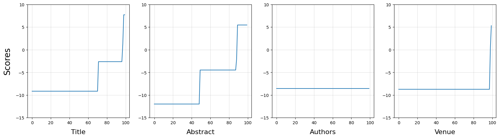

Figure 2. PDPs of for categorical features for 100 papers data set.  The values of Y-axis are the average partial dependence scores of the feature value.  The values of X-axis are the sequence number of the feature values sorted by the predicted scores. 

A total of 100 paper are used, so there are 100 feature values for each categorical feature.

The following picture shows the partial dependence plots on 100 paper for numerical features.

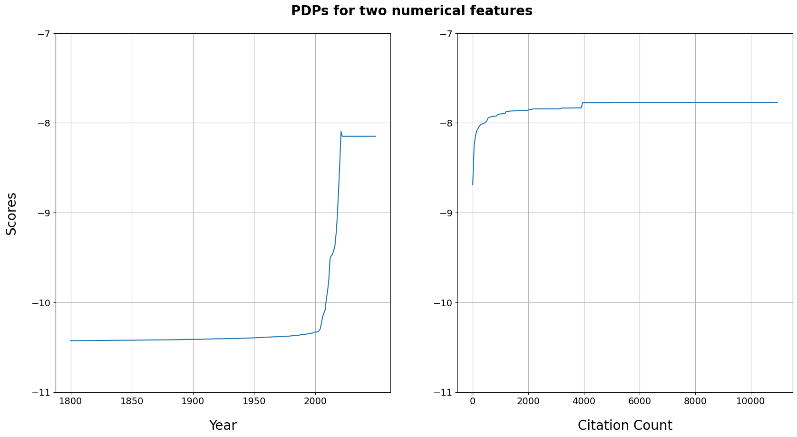

Figure 3. PDPs of for numerical features for 100 papers data set.  The values of Y-axis are the average partial dependence scores of the feature value.  The values of X-axis are the ascending feature values.

##### 200 Papers

###### Plots

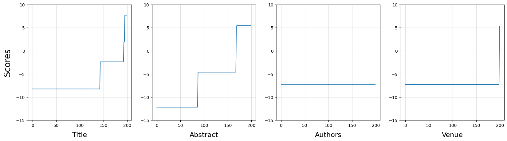

Figure 4. PDPs of for categorical features for 200 papers data set.  The values of Y-axis are the average partial dependence scores of the feature value.  The values of X-axis are the sequence number of the feature values sorted by the predicted scores. 

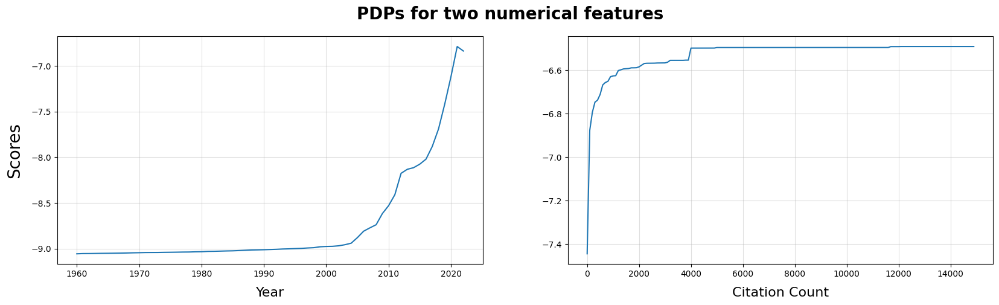

Figure 5. PDPs of for numerical features for 200 papers data set.  The values of Y-axis are the average partial dependence scores of the feature value.  The values of X-axis are the ascending feature values.

##### 500 Papers

###### Plots

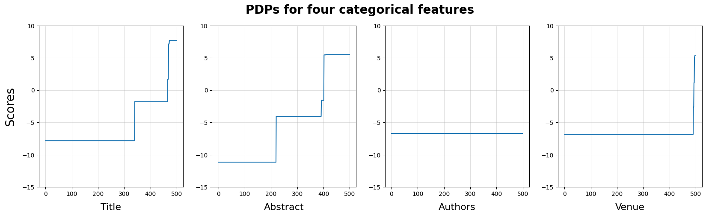

Figure 6. PDPs of for categorical features for 500 papers data set.  The values of Y-axis are the average partial dependence scores of the feature value.  The values of X-axis are the sequence number of the feature values sorted by the predicted scores. 

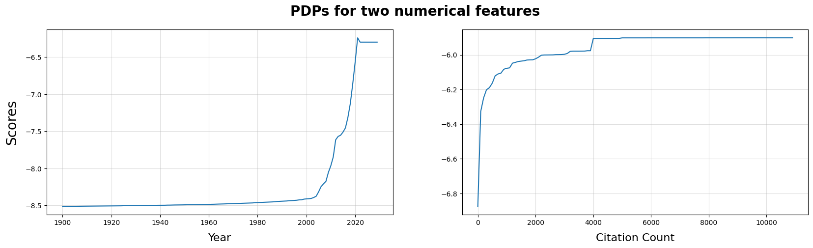

Figure 7. PDPs of for numerical features for 500 papers data set.  The values of Y-axis are the average partial dependence scores of the feature value.  The values of X-axis are the ascending feature values.

##### 1000 Papers

###### Plots

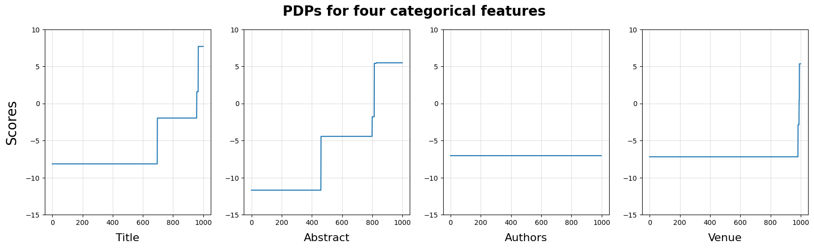

Figure 8. PDPs of for categorical features for 1000 papers data set.  The values of Y-axis are the average partial dependence scores of the feature value.  The values of X-axis are the sequence number of the feature values sorted by the predicted scores. 

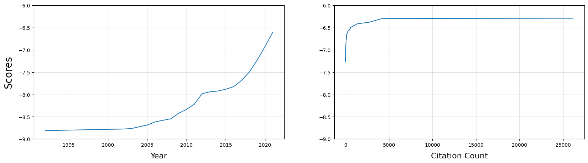

Figure 9. PDPs of for numerical features for 1000 papers data set.  The values of Y-axis are the average partial dependence scores of the feature value.  The values of X-axis are the ascending feature values.

##### 5000 Papers

**Because this experiment use the most large data set of 1-way PDP experiments, it is considered as the most representative experiment hence some plots have zoomed sub-plot for better illustration.**

###### Plots

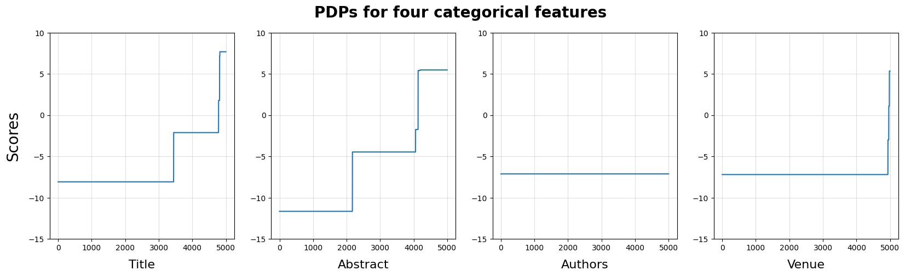

Figure 10. PDPs of for categorical features for 5000 papers data set.  The values of Y-axis are the average partial dependence scores of the feature value.  The values of X-axis are the sequence number of the feature values sorted by the predicted scores. 

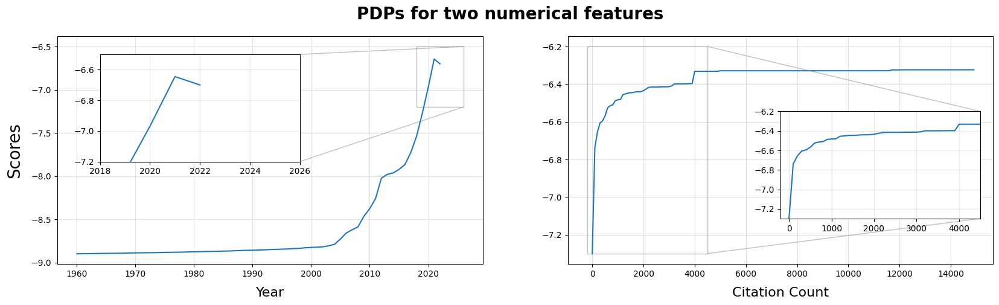

Figure 11. PDPs of for numerical features for 5000 papers data set.  The values of Y-axis are the average partial dependence scores of the feature value.  The values of X-axis are the ascending feature values.

##### Conclusion

After computing and putting the PDP-based importance values together, we can have:

| Feature name | 100p. PDP-based Imp. | 200 P. PDP-based Imp. | 500p. PDP-based Imp. | 1000p. PDP-based Imp. | 5000p. PDP-based Imp. |
| :----------: | :------------------: | :-------------------: | :------------------: | :-------------------: | :-------------------: |
|   abstract   |       5.683929       |       6.195750        |       6.238987       |       6.366324        |       6.155994        |
|    title     |       3.660768       |       3.486766        |       4.274033       |       3.769771        |       3.788171        |
|    venue     |       1.663986       |       0.892033        |       1.340470       |       1.218480        |       3.788171        |
|     year     |       0.454161       |       0.445873        |       0.474727       |       0.478728        |       0.470416        |
| n_citations  |       0.190772       |       0.191021        |       0.184865       |       0.199331        |       0.193581        |
|   authors    |       0.000000       |       0.000000        |       0.000000       |       0.000000        |       0.000000        |

Table 1. PDP-based Feature Importance list for all data set.

All five PDP experiments are showing the same feature importance order: 
$$
abstract > title > venue > year > n\_citations > authors
$$

#### 2-way PDP Experiment For Feature Interaction

Since too many plots for two experiments, you can refer to the Github to check the plots: 

1. https://github.com/youyinnn/s2search/blob/pipelining/pipelining/pdp-exp1/pdp-exp1_cslg-rand-100_plotting_2w.ipynb
2. https://github.com/youyinnn/s2search/blob/pipelining/pipelining/pdp-exp1/pdp-exp1_cslg-rand-200_plotting_2w.ipynb

The joint result of feature interaction estimation is shown as follow:

|         Feature Pairs         | 100p. PDP-based Int. | 200p. PDP-based Int. |
| :---------------------------: | :------------------: | :------------------: |
|    $title \times abstract$    |       1.937379       |       2.016726       |
|      $title\times venue$      |       0.309480       |       0.207367       |
|      $title\times year$       |       0.048401       |       0.045000       |
|  $title\times n\_citations$   |       0.014476       |       0.019629       |
|    $abstract\times venue$     |       0.603521       |       0.438959       |
|     $abstract\times year$     |       0.029938       |       0.030917       |
| $abstract\times n\_citations$ |       0.007853       |       0.008880       |
|      $venue\times year$       |       0.038115       |       0.005358       |
|  $venue\times n\_citations$   |       0.004152       |       0.036003       |
|   $year\times n\_citations$   |       0.056796       |       0.056069       |

Table 2. PDP-based Feature Interaction Strength for data set of 100 Papers and 200 Papers.

Notice that any pair that contains feature authors will not be shown in the table because their values are all zero.

##### Conclusion

From the result, we can draw the conclusion that the top 3 interactions are:

1. $title \times abstract$
2. $abstract\times venue$
3. $title\times venue$

and the first interaction strength is much stronger than the sum of all the others.

#### Heat-map and Network Graph

Using the idea from https://arxiv.org/abs/2108.04310, we can have the heat-map and network graph for showing the feature importance and the feature interaction strength at the same time.

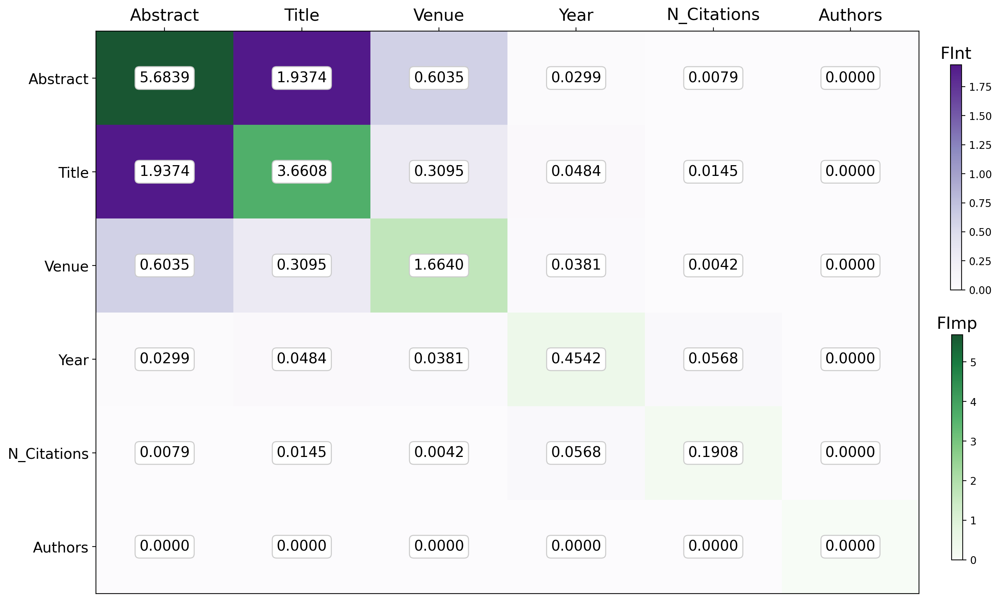

  Figure 12. PDP-based Heat-map for Showing Feature Importance and the Feature Interaction Strength. 
  Cells with Green Color Indicate the Feature Importance Values. Deeper color indicates larger value.  
  Cells with Purple Color Indicate the Feature Interaction Strength. Deeper color indicates larger value. 
  The Cells Are Ordered by the Sum of Two Metrics. The Top Left Most Cells Contribute More than the Others.

And the graph:

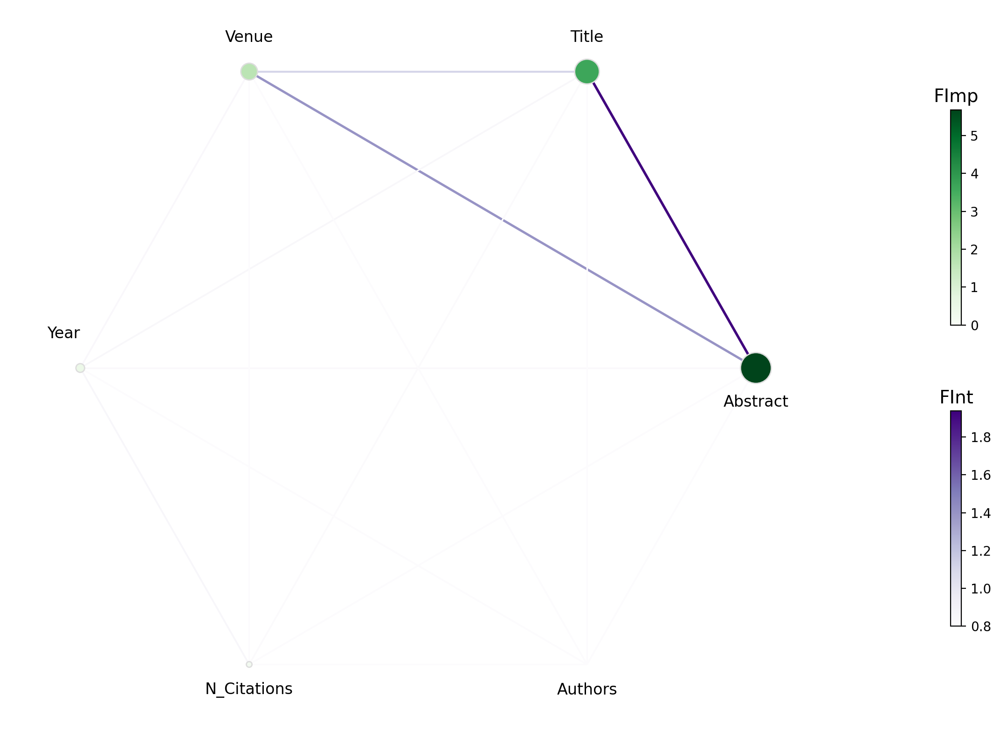

  Figure 13. PDP-based Network Graph for Showing Feature Importance and the Feature Interaction Strength. 
  Notes with Green Color Indicate the Feature Importance Values. Deeper color and bigger size indicates larger value. 
  Edges with Purple Color Indicate the Feature Interaction Strength. Deeper color and wider edge width indicates larger value.

### ALE

#### Accumulated Local Effect Evaluation

The 1-way ale evaluation formula is:

![](data:image/svg+xml, %3Csvg%20style%3D%22vertical-align%3A%20-7.155ex%22%20xmlns%3D%22http%3A%2F%2Fwww.w3.org%2F2000%2Fsvg%22%20width%3D%2261.343ex%22%20height%3D%2211.452ex%22%20role%3D%22img%22%20focusable%3D%22false%22%20viewBox%3D%220%20-1899.4%2027113.4%205061.7%22%20xmlns%3Axlink%3D%22http%3A%2F%2Fwww.w3.org%2F1999%2Fxlink%22%3E%3Cdefs%3E%3Cpath%20id%3D%22MJX-6913-TEX-I-1D434%22%20d%3D%22M208%2074Q208%2050%20254%2046Q272%2046%20272%2035Q272%2034%20270%2022Q267%208%20264%204T251%200Q249%200%20239%200T205%201T141%202Q70%202%2050%200H42Q35%207%2035%2011Q37%2038%2048%2046H62Q132%2049%20164%2096Q170%20102%20345%20401T523%20704Q530%20716%20547%20716H555H572Q578%20707%20578%20706L606%20383Q634%2060%20636%2057Q641%2046%20701%2046Q726%2046%20726%2036Q726%2034%20723%2022Q720%207%20718%204T704%200Q701%200%20690%200T651%201T578%202Q484%202%20455%200H443Q437%206%20437%209T439%2027Q443%2040%20445%2043L449%2046H469Q523%2049%20533%2063L521%20213H283L249%20155Q208%2086%20208%2074ZM516%20260Q516%20271%20504%20416T490%20562L463%20519Q447%20492%20400%20412L310%20260L413%20259Q516%20259%20516%20260Z%22%3E%3C%2Fpath%3E%3Cpath%20id%3D%22MJX-6913-TEX-I-1D43F%22%20d%3D%22M228%20637Q194%20637%20192%20641Q191%20643%20191%20649Q191%20673%20202%20682Q204%20683%20217%20683Q271%20680%20344%20680Q485%20680%20506%20683H518Q524%20677%20524%20674T522%20656Q517%20641%20513%20637H475Q406%20636%20394%20628Q387%20624%20380%20600T313%20336Q297%20271%20279%20198T252%2088L243%2052Q243%2048%20252%2048T311%2046H328Q360%2046%20379%2047T428%2054T478%2072T522%20106T564%20161Q580%20191%20594%20228T611%20270Q616%20273%20628%20273H641Q647%20264%20647%20262T627%20203T583%2083T557%209Q555%204%20553%203T537%200T494%20-1Q483%20-1%20418%20-1T294%200H116Q32%200%2032%2010Q32%2017%2034%2024Q39%2043%2044%2045Q48%2046%2059%2046H65Q92%2046%20125%2049Q139%2052%20144%2061Q147%2065%20216%20339T285%20628Q285%20635%20228%20637Z%22%3E%3C%2Fpath%3E%3Cpath%20id%3D%22MJX-6913-TEX-I-1D438%22%20d%3D%22M492%20213Q472%20213%20472%20226Q472%20230%20477%20250T482%20285Q482%20316%20461%20323T364%20330H312Q311%20328%20277%20192T243%2052Q243%2048%20254%2048T334%2046Q428%2046%20458%2048T518%2061Q567%2077%20599%20117T670%20248Q680%20270%20683%20272Q690%20274%20698%20274Q718%20274%20718%20261Q613%207%20608%202Q605%200%20322%200H133Q31%200%2031%2011Q31%2013%2034%2025Q38%2041%2042%2043T65%2046Q92%2046%20125%2049Q139%2052%20144%2061Q146%2066%20215%20342T285%20622Q285%20629%20281%20629Q273%20632%20228%20634H197Q191%20640%20191%20642T193%20659Q197%20676%20203%20680H757Q764%20676%20764%20669Q764%20664%20751%20557T737%20447Q735%20440%20717%20440H705Q698%20445%20698%20453L701%20476Q704%20500%20704%20528Q704%20558%20697%20578T678%20609T643%20625T596%20632T532%20634H485Q397%20633%20392%20631Q388%20629%20386%20622Q385%20619%20355%20499T324%20377Q347%20376%20372%20376H398Q464%20376%20489%20391T534%20472Q538%20488%20540%20490T557%20493Q562%20493%20565%20493T570%20492T572%20491T574%20487T577%20483L544%20351Q511%20218%20508%20216Q505%20213%20492%20213Z%22%3E%3C%2Fpath%3E%3Cpath%20id%3D%22MJX-6913-TEX-S4-2C6%22%20d%3D%22M5%20561Q-4%20561%20-9%20582T-14%20618Q-14%20623%20-13%20625Q-11%20628%20461%20736T943%20845Q945%20845%201417%20738T1896%20628Q1902%20628%201902%20618Q1902%20607%201897%20584T1883%20561Q1881%20561%201412%20654L945%20750L476%20654Q6%20561%205%20561Z%22%3E%3C%2Fpath%3E%3Cpath%20id%3D%22MJX-6913-TEX-N-28%22%20d%3D%22M94%20250Q94%20319%20104%20381T127%20488T164%20576T202%20643T244%20695T277%20729T302%20750H315H319Q333%20750%20333%20741Q333%20738%20316%20720T275%20667T226%20581T184%20443T167%20250T184%2058T225%20-81T274%20-167T316%20-220T333%20-241Q333%20-250%20318%20-250H315H302L274%20-226Q180%20-141%20137%20-14T94%20250Z%22%3E%3C%2Fpath%3E%3Cpath%20id%3D%22MJX-6913-TEX-I-1D465%22%20d%3D%22M52%20289Q59%20331%20106%20386T222%20442Q257%20442%20286%20424T329%20379Q371%20442%20430%20442Q467%20442%20494%20420T522%20361Q522%20332%20508%20314T481%20292T458%20288Q439%20288%20427%20299T415%20328Q415%20374%20465%20391Q454%20404%20425%20404Q412%20404%20406%20402Q368%20386%20350%20336Q290%20115%20290%2078Q290%2050%20306%2038T341%2026Q378%2026%20414%2059T463%20140Q466%20150%20469%20151T485%20153H489Q504%20153%20504%20145Q504%20144%20502%20134Q486%2077%20440%2033T333%20-11Q263%20-11%20227%2052Q186%20-10%20133%20-10H127Q78%20-10%2057%2016T35%2071Q35%20103%2054%20123T99%20143Q142%20143%20142%20101Q142%2081%20130%2066T107%2046T94%2041L91%2040Q91%2039%2097%2036T113%2029T132%2026Q168%2026%20194%2071Q203%2087%20217%20139T245%20247T261%20313Q266%20340%20266%20352Q266%20380%20251%20392T217%20404Q177%20404%20142%20372T93%20290Q91%20281%2088%20280T72%20278H58Q52%20284%2052%20289Z%22%3E%3C%2Fpath%3E%3Cpath%20id%3D%22MJX-6913-TEX-I-1D457%22%20d%3D%22M297%20596Q297%20627%20318%20644T361%20661Q378%20661%20389%20651T403%20623Q403%20595%20384%20576T340%20557Q322%20557%20310%20567T297%20596ZM288%20376Q288%20405%20262%20405Q240%20405%20220%20393T185%20362T161%20325T144%20293L137%20279Q135%20278%20121%20278H107Q101%20284%20101%20286T105%20299Q126%20348%20164%20391T252%20441Q253%20441%20260%20441T272%20442Q296%20441%20316%20432Q341%20418%20354%20401T367%20348V332L318%20133Q267%20-67%20264%20-75Q246%20-125%20194%20-164T75%20-204Q25%20-204%207%20-183T-12%20-137Q-12%20-110%207%20-91T53%20-71Q70%20-71%2082%20-81T95%20-112Q95%20-148%2063%20-167Q69%20-168%2077%20-168Q111%20-168%20139%20-140T182%20-74L193%20-32Q204%2011%20219%2072T251%20197T278%20308T289%20365Q289%20372%20288%20376Z%22%3E%3C%2Fpath%3E%3Cpath%20id%3D%22MJX-6913-TEX-N-29%22%20d%3D%22M60%20749L64%20750Q69%20750%2074%20750H86L114%20726Q208%20641%20251%20514T294%20250Q294%20182%20284%20119T261%2012T224%20-76T186%20-143T145%20-194T113%20-227T90%20-246Q87%20-249%2086%20-250H74Q66%20-250%2063%20-250T58%20-247T55%20-238Q56%20-237%2066%20-225Q221%20-64%20221%20250T66%20725Q56%20737%2055%20738Q55%20746%2060%20749Z%22%3E%3C%2Fpath%3E%3Cpath%20id%3D%22MJX-6913-TEX-N-3D%22%20d%3D%22M56%20347Q56%20360%2070%20367H707Q722%20359%20722%20347Q722%20336%20708%20328L390%20327H72Q56%20332%2056%20347ZM56%20153Q56%20168%2072%20173H708Q722%20163%20722%20153Q722%20140%20707%20133H70Q56%20140%2056%20153Z%22%3E%3C%2Fpath%3E%3Cpath%20id%3D%22MJX-6913-TEX-LO-2211%22%20d%3D%22M60%20948Q63%20950%20665%20950H1267L1325%20815Q1384%20677%201388%20669H1348L1341%20683Q1320%20724%201285%20761Q1235%20809%201174%20838T1033%20881T882%20898T699%20902H574H543H251L259%20891Q722%20258%20724%20252Q725%20250%20724%20246Q721%20243%20460%20-56L196%20-356Q196%20-357%20407%20-357Q459%20-357%20548%20-357T676%20-358Q812%20-358%20896%20-353T1063%20-332T1204%20-283T1307%20-196Q1328%20-170%201348%20-124H1388Q1388%20-125%201381%20-145T1356%20-210T1325%20-294L1267%20-449L666%20-450Q64%20-450%2061%20-448Q55%20-446%2055%20-439Q55%20-437%2057%20-433L590%20177Q590%20178%20557%20222T452%20366T322%20544L56%20909L55%20924Q55%20945%2060%20948Z%22%3E%3C%2Fpath%3E%3Cpath%20id%3D%22MJX-6913-TEX-I-1D458%22%20d%3D%22M121%20647Q121%20657%20125%20670T137%20683Q138%20683%20209%20688T282%20694Q294%20694%20294%20686Q294%20679%20244%20477Q194%20279%20194%20272Q213%20282%20223%20291Q247%20309%20292%20354T362%20415Q402%20442%20438%20442Q468%20442%20485%20423T503%20369Q503%20344%20496%20327T477%20302T456%20291T438%20288Q418%20288%20406%20299T394%20328Q394%20353%20410%20369T442%20390L458%20393Q446%20405%20434%20405H430Q398%20402%20367%20380T294%20316T228%20255Q230%20254%20243%20252T267%20246T293%20238T320%20224T342%20206T359%20180T365%20147Q365%20130%20360%20106T354%2066Q354%2026%20381%2026Q429%2026%20459%20145Q461%20153%20479%20153H483Q499%20153%20499%20144Q499%20139%20496%20130Q455%20-11%20378%20-11Q333%20-11%20305%2015T277%2090Q277%20108%20280%20121T283%20145Q283%20167%20269%20183T234%20206T200%20217T182%20220H180Q168%20178%20159%20139T145%2081T136%2044T129%2020T122%207T111%20-2Q98%20-11%2083%20-11Q66%20-11%2057%20-1T48%2016Q48%2026%2085%20176T158%20471L195%20616Q196%20629%20188%20632T149%20637H144Q134%20637%20131%20637T124%20640T121%20647Z%22%3E%3C%2Fpath%3E%3Cpath%20id%3D%22MJX-6913-TEX-N-31%22%20d%3D%22M213%20578L200%20573Q186%20568%20160%20563T102%20556H83V602H102Q149%20604%20189%20617T245%20641T273%20663Q275%20666%20285%20666Q294%20666%20302%20660V361L303%2061Q310%2054%20315%2052T339%2048T401%2046H427V0H416Q395%203%20257%203Q121%203%20100%200H88V46H114Q136%2046%20152%2046T177%2047T193%2050T201%2052T207%2057T213%2061V578Z%22%3E%3C%2Fpath%3E%3Cpath%20id%3D%22MJX-6913-TEX-I-1D45B%22%20d%3D%22M21%20287Q22%20293%2024%20303T36%20341T56%20388T89%20425T135%20442Q171%20442%20195%20424T225%20390T231%20369Q231%20367%20232%20367L243%20378Q304%20442%20382%20442Q436%20442%20469%20415T503%20336T465%20179T427%2052Q427%2026%20444%2026Q450%2026%20453%2027Q482%2032%20505%2065T540%20145Q542%20153%20560%20153Q580%20153%20580%20145Q580%20144%20576%20130Q568%20101%20554%2073T508%2017T439%20-10Q392%20-10%20371%2017T350%2073Q350%2092%20386%20193T423%20345Q423%20404%20379%20404H374Q288%20404%20229%20303L222%20291L189%20157Q156%2026%20151%2016Q138%20-11%20108%20-11Q95%20-11%2087%20-5T76%207T74%2017Q74%2030%20112%20180T152%20343Q153%20348%20153%20366Q153%20405%20129%20405Q91%20405%2066%20305Q60%20285%2060%20284Q58%20278%2041%20278H27Q21%20284%2021%20287Z%22%3E%3C%2Fpath%3E%3Cpath%20id%3D%22MJX-6913-TEX-I-1D456%22%20d%3D%22M184%20600Q184%20624%20203%20642T247%20661Q265%20661%20277%20649T290%20619Q290%20596%20270%20577T226%20557Q211%20557%20198%20567T184%20600ZM21%20287Q21%20295%2030%20318T54%20369T98%20420T158%20442Q197%20442%20223%20419T250%20357Q250%20340%20236%20301T196%20196T154%2083Q149%2061%20149%2051Q149%2026%20166%2026Q175%2026%20185%2029T208%2043T235%2078T260%20137Q263%20149%20265%20151T282%20153Q302%20153%20302%20143Q302%20135%20293%20112T268%2061T223%2011T161%20-11Q129%20-11%20102%2010T74%2074Q74%2091%2079%20106T122%20220Q160%20321%20166%20341T173%20380Q173%20404%20156%20404H154Q124%20404%2099%20371T61%20287Q60%20286%2059%20284T58%20281T56%20279T53%20278T49%20278T41%20278H27Q21%20284%2021%20287Z%22%3E%3C%2Fpath%3E%3Cpath%20id%3D%22MJX-6913-TEX-N-3A%22%20d%3D%22M78%20370Q78%20394%2095%20412T138%20430Q162%20430%20180%20414T199%20371Q199%20346%20182%20328T139%20310T96%20327T78%20370ZM78%2060Q78%2084%2095%20102T138%20120Q162%20120%20180%20104T199%2061Q199%2036%20182%2018T139%200T96%2017T78%2060Z%22%3E%3C%2Fpath%3E%3Cpath%20id%3D%22MJX-6913-TEX-N-2208%22%20d%3D%22M84%20250Q84%20372%20166%20450T360%20539Q361%20539%20377%20539T419%20540T469%20540H568Q583%20532%20583%20520Q583%20511%20570%20501L466%20500Q355%20499%20329%20494Q280%20482%20242%20458T183%20409T147%20354T129%20306T124%20272V270H568Q583%20262%20583%20250T568%20230H124V228Q124%20207%20134%20177T167%20112T231%2048T328%207Q355%201%20466%200H570Q583%20-10%20583%20-20Q583%20-32%20568%20-40H471Q464%20-40%20446%20-40T417%20-41Q262%20-41%20172%2045Q84%20127%2084%20250Z%22%3E%3C%2Fpath%3E%3Cpath%20id%3D%22MJX-6913-TEX-I-1D441%22%20d%3D%22M234%20637Q231%20637%20226%20637Q201%20637%20196%20638T191%20649Q191%20676%20202%20682Q204%20683%20299%20683Q376%20683%20387%20683T401%20677Q612%20181%20616%20168L670%20381Q723%20592%20723%20606Q723%20633%20659%20637Q635%20637%20635%20648Q635%20650%20637%20660Q641%20676%20643%20679T653%20683Q656%20683%20684%20682T767%20680Q817%20680%20843%20681T873%20682Q888%20682%20888%20672Q888%20650%20880%20642Q878%20637%20858%20637Q787%20633%20769%20597L620%207Q618%200%20599%200Q585%200%20582%202Q579%205%20453%20305L326%20604L261%20344Q196%2088%20196%2079Q201%2046%20268%2046H278Q284%2041%20284%2038T282%2019Q278%206%20272%200H259Q228%202%20151%202Q123%202%20100%202T63%202T46%201Q31%201%2031%2010Q31%2014%2034%2026T39%2040Q41%2046%2062%2046Q130%2049%20150%2085Q154%2091%20221%20362L289%20634Q287%20635%20234%20637Z%22%3E%3C%2Fpath%3E%3Cpath%20id%3D%22MJX-6913-TEX-N-5B%22%20d%3D%22M118%20-250V750H255V710H158V-210H255V-250H118Z%22%3E%3C%2Fpath%3E%3Cpath%20id%3D%22MJX-6913-TEX-I-1D453%22%20d%3D%22M118%20-162Q120%20-162%20124%20-164T135%20-167T147%20-168Q160%20-168%20171%20-155T187%20-126Q197%20-99%20221%2027T267%20267T289%20382V385H242Q195%20385%20192%20387Q188%20390%20188%20397L195%20425Q197%20430%20203%20430T250%20431Q298%20431%20298%20432Q298%20434%20307%20482T319%20540Q356%20705%20465%20705Q502%20703%20526%20683T550%20630Q550%20594%20529%20578T487%20561Q443%20561%20443%20603Q443%20622%20454%20636T478%20657L487%20662Q471%20668%20457%20668Q445%20668%20434%20658T419%20630Q412%20601%20403%20552T387%20469T380%20433Q380%20431%20435%20431Q480%20431%20487%20430T498%20424Q499%20420%20496%20407T491%20391Q489%20386%20482%20386T428%20385H372L349%20263Q301%2015%20282%20-47Q255%20-132%20212%20-173Q175%20-205%20139%20-205Q107%20-205%2081%20-186T55%20-132Q55%20-95%2076%20-78T118%20-61Q162%20-61%20162%20-103Q162%20-122%20151%20-136T127%20-157L118%20-162Z%22%3E%3C%2Fpath%3E%3Cpath%20id%3D%22MJX-6913-TEX-I-1D467%22%20d%3D%22M347%20338Q337%20338%20294%20349T231%20360Q211%20360%20197%20356T174%20346T162%20335T155%20324L153%20320Q150%20317%20138%20317Q117%20317%20117%20325Q117%20330%20120%20339Q133%20378%20163%20406T229%20440Q241%20442%20246%20442Q271%20442%20291%20425T329%20392T367%20375Q389%20375%20411%20408T434%20441Q435%20442%20449%20442H462Q468%20436%20468%20434Q468%20430%20463%20420T449%20399T432%20377T418%20358L411%20349Q368%20298%20275%20214T160%20106L148%2094L163%2093Q185%2093%20227%2082T290%2071Q328%2071%20360%2090T402%20140Q406%20149%20409%20151T424%20153Q443%20153%20443%20143Q443%20138%20442%20134Q425%2072%20376%2031T278%20-11Q252%20-11%20232%206T193%2040T155%2057Q111%2057%2076%20-3Q70%20-11%2059%20-11H54H41Q35%20-5%2035%20-2Q35%2013%2093%2084Q132%20129%20225%20214T340%20322Q352%20338%20347%20338Z%22%3E%3C%2Fpath%3E%3Cpath%20id%3D%22MJX-6913-TEX-N-2C%22%20d%3D%22M78%2035T78%2060T94%20103T137%20121Q165%20121%20187%2096T210%208Q210%20-27%20201%20-60T180%20-117T154%20-158T130%20-185T117%20-194Q113%20-194%20104%20-185T95%20-172Q95%20-168%20106%20-156T131%20-126T157%20-76T173%20-3V9L172%208Q170%207%20167%206T161%203T152%201T140%200Q113%200%2096%2017Z%22%3E%3C%2Fpath%3E%3Cpath%20id%3D%22MJX-6913-TEX-N-2216%22%20d%3D%22M56%20731Q56%20740%2062%20745T75%20750Q85%20750%2092%20740Q96%20733%20270%20255T444%20-231Q444%20-239%20438%20-244T424%20-250Q414%20-250%20407%20-240Q404%20-236%20230%20242T56%20731Z%22%3E%3C%2Fpath%3E%3Cpath%20id%3D%22MJX-6913-TEX-N-2212%22%20d%3D%22M84%20237T84%20250T98%20270H679Q694%20262%20694%20250T679%20230H98Q84%20237%2084%20250Z%22%3E%3C%2Fpath%3E%3Cpath%20id%3D%22MJX-6913-TEX-N-5D%22%20d%3D%22M22%20710V750H159V-250H22V-210H119V710H22Z%22%3E%3C%2Fpath%3E%3Cpath%20id%3D%22MJX-6913-TEX-S4-E152%22%20d%3D%22M-24%20327L-18%20333H-1Q11%20333%2015%20333T22%20329T27%20322T35%20308T54%20284Q115%20203%20225%20162T441%20120Q454%20120%20457%20117T460%2095V60V28Q460%208%20457%204T442%200Q355%200%20260%2036Q75%20118%20-16%20278L-24%20292V327Z%22%3E%3C%2Fpath%3E%3Cpath%20id%3D%22MJX-6913-TEX-S4-E153%22%20d%3D%22M-10%2060V95Q-10%20113%20-7%20116T9%20120Q151%20120%20250%20171T396%20284Q404%20293%20412%20305T424%20324T431%20331Q433%20333%20451%20333H468L474%20327V292L466%20278Q375%20118%20190%2036Q95%200%208%200Q-5%200%20-7%203T-10%2024V60Z%22%3E%3C%2Fpath%3E%3Cpath%20id%3D%22MJX-6913-TEX-S4-E151%22%20d%3D%22M-10%2060Q-10%20104%20-10%20111T-5%20118Q-1%20120%2010%20120Q96%20120%20190%2084Q375%202%20466%20-158L474%20-172V-207L468%20-213H451H447Q437%20-213%20434%20-213T428%20-209T423%20-202T414%20-187T396%20-163Q331%20-82%20224%20-41T9%200Q-4%200%20-7%203T-10%2025V60Z%22%3E%3C%2Fpath%3E%3Cpath%20id%3D%22MJX-6913-TEX-S4-E150%22%20d%3D%22M-18%20-213L-24%20-207V-172L-16%20-158Q75%202%20260%2084Q334%20113%20415%20119Q418%20119%20427%20119T440%20120Q454%20120%20457%20117T460%2098V60V25Q460%207%20457%204T441%200Q308%200%20193%20-55T25%20-205Q21%20-211%2018%20-212T-1%20-213H-18Z%22%3E%3C%2Fpath%3E%3Cpath%20id%3D%22MJX-6913-TEX-S4-E154%22%20d%3D%22M-10%200V120H410V0H-10Z%22%3E%3C%2Fpath%3E%3Cpath%20id%3D%22MJX-6913-TEX-N-75%22%20d%3D%22M383%2058Q327%20-10%20256%20-10H249Q124%20-10%20105%2089Q104%2096%20103%20226Q102%20335%20102%20348T96%20369Q86%20385%2036%20385H25V408Q25%20431%2027%20431L38%20432Q48%20433%2067%20434T105%20436Q122%20437%20142%20438T172%20441T184%20442H187V261Q188%2077%20190%2064Q193%2049%20204%2040Q224%2026%20264%2026Q290%2026%20311%2035T343%2058T363%2090T375%20120T379%20144Q379%20145%20379%20161T380%20201T380%20248V315Q380%20361%20370%20372T320%20385H302V431Q304%20431%20378%20436T457%20442H464V264Q464%2084%20465%2081Q468%2061%20479%2055T524%2046H542V0Q540%200%20467%20-5T390%20-11H383V58Z%22%3E%3C%2Fpath%3E%3Cpath%20id%3D%22MJX-6913-TEX-N-6E%22%20d%3D%22M41%2046H55Q94%2046%20102%2060V68Q102%2077%20102%2091T102%20122T103%20161T103%20203Q103%20234%20103%20269T102%20328V351Q99%20370%2088%20376T43%20385H25V408Q25%20431%2027%20431L37%20432Q47%20433%2065%20434T102%20436Q119%20437%20138%20438T167%20441T178%20442H181V402Q181%20364%20182%20364T187%20369T199%20384T218%20402T247%20421T285%20437Q305%20442%20336%20442Q450%20438%20463%20329Q464%20322%20464%20190V104Q464%2066%20466%2059T477%2049Q498%2046%20526%2046H542V0H534L510%201Q487%202%20460%202T422%203Q319%203%20310%200H302V46H318Q379%2046%20379%2062Q380%2064%20380%20200Q379%20335%20378%20343Q372%20371%20358%20385T334%20402T308%20404Q263%20404%20229%20370Q202%20343%20195%20315T187%20232V168V108Q187%2078%20188%2068T191%2055T200%2049Q221%2046%20249%2046H265V0H257L234%201Q210%202%20183%202T145%203Q42%203%2033%200H25V46H41Z%22%3E%3C%2Fpath%3E%3Cpath%20id%3D%22MJX-6913-TEX-N-63%22%20d%3D%22M370%20305T349%20305T313%20320T297%20358Q297%20381%20312%20396Q317%20401%20317%20402T307%20404Q281%20408%20258%20408Q209%20408%20178%20376Q131%20329%20131%20219Q131%20137%20162%2090Q203%2029%20272%2029Q313%2029%20338%2055T374%20117Q376%20125%20379%20127T395%20129H409Q415%20123%20415%20120Q415%20116%20411%20104T395%2071T366%2033T318%202T249%20-11Q163%20-11%2099%2053T34%20214Q34%20318%2099%20383T250%20448T370%20421T404%20357Q404%20334%20387%20320Z%22%3E%3C%2Fpath%3E%3Cpath%20id%3D%22MJX-6913-TEX-N-65%22%20d%3D%22M28%20218Q28%20273%2048%20318T98%20391T163%20433T229%20448Q282%20448%20320%20430T378%20380T406%20316T415%20245Q415%20238%20408%20231H126V216Q126%2068%20226%2036Q246%2030%20270%2030Q312%2030%20342%2062Q359%2079%20369%20104L379%20128Q382%20131%20395%20131H398Q415%20131%20415%20121Q415%20117%20412%20108Q393%2053%20349%2021T250%20-11Q155%20-11%2092%2058T28%20218ZM333%20275Q322%20403%20238%20411H236Q228%20411%20220%20410T195%20402T166%20381T143%20340T127%20274V267H333V275Z%22%3E%3C%2Fpath%3E%3Cpath%20id%3D%22MJX-6913-TEX-N-74%22%20d%3D%22M27%20422Q80%20426%20109%20478T141%20600V615H181V431H316V385H181V241Q182%20116%20182%20100T189%2068Q203%2029%20238%2029Q282%2029%20292%20100Q293%20108%20293%20146V181H333V146V134Q333%2057%20291%2017Q264%20-10%20221%20-10Q187%20-10%20162%202T124%2033T105%2068T98%20100Q97%20107%2097%20248V385H18V422H27Z%22%3E%3C%2Fpath%3E%3Cpath%20id%3D%22MJX-6913-TEX-N-72%22%20d%3D%22M36%2046H50Q89%2046%2097%2060V68Q97%2077%2097%2091T98%20122T98%20161T98%20203Q98%20234%2098%20269T98%20328L97%20351Q94%20370%2083%20376T38%20385H20V408Q20%20431%2022%20431L32%20432Q42%20433%2060%20434T96%20436Q112%20437%20131%20438T160%20441T171%20442H174V373Q213%20441%20271%20441H277Q322%20441%20343%20419T364%20373Q364%20352%20351%20337T313%20322Q288%20322%20276%20338T263%20372Q263%20381%20265%20388T270%20400T273%20405Q271%20407%20250%20401Q234%20393%20226%20386Q179%20341%20179%20207V154Q179%20141%20179%20127T179%20101T180%2081T180%2066V61Q181%2059%20183%2057T188%2054T193%2051T200%2049T207%2048T216%2047T225%2047T235%2046T245%2046H276V0H267Q249%203%20140%203Q37%203%2028%200H20V46H36Z%22%3E%3C%2Fpath%3E%3Cpath%20id%3D%22MJX-6913-TEX-N-64%22%20d%3D%22M376%20495Q376%20511%20376%20535T377%20568Q377%20613%20367%20624T316%20637H298V660Q298%20683%20300%20683L310%20684Q320%20685%20339%20686T376%20688Q393%20689%20413%20690T443%20693T454%20694H457V390Q457%2084%20458%2081Q461%2061%20472%2055T517%2046H535V0Q533%200%20459%20-5T380%20-11H373V44L365%2037Q307%20-11%20235%20-11Q158%20-11%2096%2050T34%20215Q34%20315%2097%20378T244%20442Q319%20442%20376%20393V495ZM373%20342Q328%20405%20260%20405Q211%20405%20173%20369Q146%20341%20139%20305T131%20211Q131%20155%20138%20120T173%2059Q203%2026%20251%2026Q322%2026%20373%20103V342Z%22%3E%3C%2Fpath%3E%3Cpath%20id%3D%22MJX-6913-TEX-I-1D450%22%20d%3D%22M34%20159Q34%20268%20120%20355T306%20442Q362%20442%20394%20418T427%20355Q427%20326%20408%20306T360%20285Q341%20285%20330%20295T319%20325T330%20359T352%20380T366%20386H367Q367%20388%20361%20392T340%20400T306%20404Q276%20404%20249%20390Q228%20381%20206%20359Q162%20315%20142%20235T121%20119Q121%2073%20147%2050Q169%2026%20205%2026H209Q321%2026%20394%20111Q403%20121%20406%20121Q410%20121%20419%20112T429%2098T420%2083T391%2055T346%2025T282%200T202%20-11Q127%20-11%2081%2037T34%20159Z%22%3E%3C%2Fpath%3E%3C%2Fdefs%3E%3Cg%20stroke%3D%22currentColor%22%20fill%3D%22currentColor%22%20stroke-width%3D%220%22%20transform%3D%22scale(1%2C-1)%22%3E%3Cg%20data-mml-node%3D%22math%22%3E%3Cg%20data-mml-node%3D%22TeXAtom%22%20data-mjx-texclass%3D%22ORD%22%3E%3Cg%20data-mml-node%3D%22mover%22%3E%3Cg%20data-mml-node%3D%22mrow%22%3E%3Cg%20data-mml-node%3D%22mi%22%3E%3Cuse%20data-c%3D%221D434%22%20xlink%3Ahref%3D%22%23MJX-6913-TEX-I-1D434%22%3E%3C%2Fuse%3E%3C%2Fg%3E%3Cg%20data-mml-node%3D%22mi%22%20transform%3D%22translate(750%2C0)%22%3E%3Cuse%20data-c%3D%221D43F%22%20xlink%3Ahref%3D%22%23MJX-6913-TEX-I-1D43F%22%3E%3C%2Fuse%3E%3C%2Fg%3E%3Cg%20data-mml-node%3D%22mi%22%20transform%3D%22translate(1431%2C0)%22%3E%3Cuse%20data-c%3D%221D438%22%20xlink%3Ahref%3D%22%23MJX-6913-TEX-I-1D438%22%3E%3C%2Fuse%3E%3C%2Fg%3E%3C%2Fg%3E%3Cg%20data-mml-node%3D%22mo%22%20transform%3D%22translate(1097.5%2C260)%20translate(-951%200)%22%3E%3Cuse%20data-c%3D%222C6%22%20xlink%3Ahref%3D%22%23MJX-6913-TEX-S4-2C6%22%3E%3C%2Fuse%3E%3C%2Fg%3E%3C%2Fg%3E%3C%2Fg%3E%3Cg%20data-mml-node%3D%22mo%22%20transform%3D%22translate(2195%2C0)%22%3E%3Cuse%20data-c%3D%2228%22%20xlink%3Ahref%3D%22%23MJX-6913-TEX-N-28%22%3E%3C%2Fuse%3E%3C%2Fg%3E%3Cg%20data-mml-node%3D%22msub%22%20transform%3D%22translate(2584%2C0)%22%3E%3Cg%20data-mml-node%3D%22mi%22%3E%3Cuse%20data-c%3D%221D465%22%20xlink%3Ahref%3D%22%23MJX-6913-TEX-I-1D465%22%3E%3C%2Fuse%3E%3C%2Fg%3E%3Cg%20data-mml-node%3D%22mi%22%20transform%3D%22translate(605%2C-150)%20scale(0.707)%22%3E%3Cuse%20data-c%3D%221D457%22%20xlink%3Ahref%3D%22%23MJX-6913-TEX-I-1D457%22%3E%3C%2Fuse%3E%3C%2Fg%3E%3C%2Fg%3E%3Cg%20data-mml-node%3D%22mo%22%20transform%3D%22translate(3530.3%2C0)%22%3E%3Cuse%20data-c%3D%2229%22%20xlink%3Ahref%3D%22%23MJX-6913-TEX-N-29%22%3E%3C%2Fuse%3E%3C%2Fg%3E%3Cg%20data-mml-node%3D%22mo%22%20transform%3D%22translate(4197.1%2C0)%22%3E%3Cuse%20data-c%3D%223D%22%20xlink%3Ahref%3D%22%23MJX-6913-TEX-N-3D%22%3E%3C%2Fuse%3E%3C%2Fg%3E%3Cg%20data-mml-node%3D%22munder%22%20transform%3D%22translate(5252.9%2C0)%22%3E%3Cg%20data-mml-node%3D%22TeXAtom%22%20data-mjx-texclass%3D%22OP%22%3E%3Cg%20data-mml-node%3D%22munder%22%3E%3Cg%20data-mml-node%3D%22mrow%22%3E%3Cg%20data-mml-node%3D%22munderover%22%3E%3Cg%20data-mml-node%3D%22mo%22%20transform%3D%22translate(71.8%2C0)%22%3E%3Cuse%20data-c%3D%222211%22%20xlink%3Ahref%3D%22%23MJX-6913-TEX-LO-2211%22%3E%3C%2Fuse%3E%3C%2Fg%3E%3Cg%20data-mml-node%3D%22TeXAtom%22%20transform%3D%22translate(157.8%2C-1107.7)%20scale(0.707)%22%20data-mjx-texclass%3D%22ORD%22%3E%3Cg%20data-mml-node%3D%22mi%22%3E%3Cuse%20data-c%3D%221D458%22%20xlink%3Ahref%3D%22%23MJX-6913-TEX-I-1D458%22%3E%3C%2Fuse%3E%3C%2Fg%3E%3Cg%20data-mml-node%3D%22mo%22%20transform%3D%22translate(521%2C0)%22%3E%3Cuse%20data-c%3D%223D%22%20xlink%3Ahref%3D%22%23MJX-6913-TEX-N-3D%22%3E%3C%2Fuse%3E%3C%2Fg%3E%3Cg%20data-mml-node%3D%22mn%22%20transform%3D%22translate(1299%2C0)%22%3E%3Cuse%20data-c%3D%2231%22%20xlink%3Ahref%3D%22%23MJX-6913-TEX-N-31%22%3E%3C%2Fuse%3E%3C%2Fg%3E%3C%2Fg%3E%3Cg%20data-mml-node%3D%22TeXAtom%22%20transform%3D%22translate(0%2C1269.1)%20scale(0.707)%22%20data-mjx-texclass%3D%22ORD%22%3E%3Cg%20data-mml-node%3D%22msub%22%3E%3Cg%20data-mml-node%3D%22mi%22%3E%3Cuse%20data-c%3D%221D458%22%20xlink%3Ahref%3D%22%23MJX-6913-TEX-I-1D458%22%3E%3C%2Fuse%3E%3C%2Fg%3E%3Cg%20data-mml-node%3D%22mi%22%20transform%3D%22translate(554%2C-150)%20scale(0.707)%22%3E%3Cuse%20data-c%3D%221D457%22%20xlink%3Ahref%3D%22%23MJX-6913-TEX-I-1D457%22%3E%3C%2Fuse%3E%3C%2Fg%3E%3C%2Fg%3E%3Cg%20data-mml-node%3D%22mo%22%20transform%3D%22translate(895.3%2C0)%22%3E%3Cuse%20data-c%3D%2228%22%20xlink%3Ahref%3D%22%23MJX-6913-TEX-N-28%22%3E%3C%2Fuse%3E%3C%2Fg%3E%3Cg%20data-mml-node%3D%22mi%22%20transform%3D%22translate(1284.3%2C0)%22%3E%3Cuse%20data-c%3D%221D465%22%20xlink%3Ahref%3D%22%23MJX-6913-TEX-I-1D465%22%3E%3C%2Fuse%3E%3C%2Fg%3E%3Cg%20data-mml-node%3D%22mo%22%20transform%3D%22translate(1856.3%2C0)%22%3E%3Cuse%20data-c%3D%2229%22%20xlink%3Ahref%3D%22%23MJX-6913-TEX-N-29%22%3E%3C%2Fuse%3E%3C%2Fg%3E%3C%2Fg%3E%3C%2Fg%3E%3Cg%20data-mml-node%3D%22mfrac%22%20transform%3D%22translate(1754.4%2C0)%22%3E%3Cg%20data-mml-node%3D%22mn%22%20transform%3D%22translate(1106.7%2C676)%22%3E%3Cuse%20data-c%3D%2231%22%20xlink%3Ahref%3D%22%23MJX-6913-TEX-N-31%22%3E%3C%2Fuse%3E%3C%2Fg%3E%3Cg%20data-mml-node%3D%22mrow%22%20transform%3D%22translate(220%2C-710)%22%3E%3Cg%20data-mml-node%3D%22msub%22%3E%3Cg%20data-mml-node%3D%22mi%22%3E%3Cuse%20data-c%3D%221D45B%22%20xlink%3Ahref%3D%22%23MJX-6913-TEX-I-1D45B%22%3E%3C%2Fuse%3E%3C%2Fg%3E%3Cg%20data-mml-node%3D%22mi%22%20transform%3D%22translate(633%2C-150)%20scale(0.707)%22%3E%3Cuse%20data-c%3D%221D457%22%20xlink%3Ahref%3D%22%23MJX-6913-TEX-I-1D457%22%3E%3C%2Fuse%3E%3C%2Fg%3E%3C%2Fg%3E%3Cg%20data-mml-node%3D%22mo%22%20transform%3D%22translate(974.3%2C0)%22%3E%3Cuse%20data-c%3D%2228%22%20xlink%3Ahref%3D%22%23MJX-6913-TEX-N-28%22%3E%3C%2Fuse%3E%3C%2Fg%3E%3Cg%20data-mml-node%3D%22mi%22%20transform%3D%22translate(1363.3%2C0)%22%3E%3Cuse%20data-c%3D%221D458%22%20xlink%3Ahref%3D%22%23MJX-6913-TEX-I-1D458%22%3E%3C%2Fuse%3E%3C%2Fg%3E%3Cg%20data-mml-node%3D%22mo%22%20transform%3D%22translate(1884.3%2C0)%22%3E%3Cuse%20data-c%3D%2229%22%20xlink%3Ahref%3D%22%23MJX-6913-TEX-N-29%22%3E%3C%2Fuse%3E%3C%2Fg%3E%3C%2Fg%3E%3Crect%20width%3D%222473.3%22%20height%3D%2260%22%20x%3D%22120%22%20y%3D%22220%22%3E%3C%2Frect%3E%3C%2Fg%3E%3Cg%20data-mml-node%3D%22munderover%22%20transform%3D%22translate(4634.3%2C0)%22%3E%3Cg%20data-mml-node%3D%22mo%22%20transform%3D%22translate(1121.9%2C0)%22%3E%3Cuse%20data-c%3D%222211%22%20xlink%3Ahref%3D%22%23MJX-6913-TEX-LO-2211%22%3E%3C%2Fuse%3E%3C%2Fg%3E%3Cg%20data-mml-node%3D%22TeXAtom%22%20transform%3D%22translate(0%2C-1367)%20scale(0.707)%22%20data-mjx-texclass%3D%22ORD%22%3E%3Cg%20data-mml-node%3D%22mi%22%3E%3Cuse%20data-c%3D%221D456%22%20xlink%3Ahref%3D%22%23MJX-6913-TEX-I-1D456%22%3E%3C%2Fuse%3E%3C%2Fg%3E%3Cg%20data-mml-node%3D%22mo%22%20transform%3D%22translate(345%2C0)%22%3E%3Cuse%20data-c%3D%223A%22%20xlink%3Ahref%3D%22%23MJX-6913-TEX-N-3A%22%3E%3C%2Fuse%3E%3C%2Fg%3E%3Cg%20data-mml-node%3D%22msubsup%22%20transform%3D%22translate(623%2C0)%22%3E%3Cg%20data-mml-node%3D%22mi%22%3E%3Cuse%20data-c%3D%221D465%22%20xlink%3Ahref%3D%22%23MJX-6913-TEX-I-1D465%22%3E%3C%2Fuse%3E%3C%2Fg%3E%3Cg%20data-mml-node%3D%22TeXAtom%22%20transform%3D%22translate(605%2C530.4)%20scale(0.707)%22%20data-mjx-texclass%3D%22ORD%22%3E%3Cg%20data-mml-node%3D%22mo%22%3E%3Cuse%20data-c%3D%2228%22%20xlink%3Ahref%3D%22%23MJX-6913-TEX-N-28%22%3E%3C%2Fuse%3E%3C%2Fg%3E%3Cg%20data-mml-node%3D%22mi%22%20transform%3D%22translate(389%2C0)%22%3E%3Cuse%20data-c%3D%221D456%22%20xlink%3Ahref%3D%22%23MJX-6913-TEX-I-1D456%22%3E%3C%2Fuse%3E%3C%2Fg%3E%3Cg%20data-mml-node%3D%22mo%22%20transform%3D%22translate(734%2C0)%22%3E%3Cuse%20data-c%3D%2229%22%20xlink%3Ahref%3D%22%23MJX-6913-TEX-N-29%22%3E%3C%2Fuse%3E%3C%2Fg%3E%3C%2Fg%3E%3Cg%20data-mml-node%3D%22mi%22%20transform%3D%22translate(605%2C-293.8)%20scale(0.707)%22%3E%3Cuse%20data-c%3D%221D457%22%20xlink%3Ahref%3D%22%23MJX-6913-TEX-I-1D457%22%3E%3C%2Fuse%3E%3C%2Fg%3E%3C%2Fg%3E%3Cg%20data-mml-node%3D%22mo%22%20transform%3D%22translate(2072.1%2C0)%22%3E%3Cuse%20data-c%3D%222208%22%20xlink%3Ahref%3D%22%23MJX-6913-TEX-N-2208%22%3E%3C%2Fuse%3E%3C%2Fg%3E%3Cg%20data-mml-node%3D%22msub%22%20transform%3D%22translate(2739.1%2C0)%22%3E%3Cg%20data-mml-node%3D%22mi%22%3E%3Cuse%20data-c%3D%221D441%22%20xlink%3Ahref%3D%22%23MJX-6913-TEX-I-1D441%22%3E%3C%2Fuse%3E%3C%2Fg%3E%3Cg%20data-mml-node%3D%22mi%22%20transform%3D%22translate(836%2C-150)%20scale(0.707)%22%3E%3Cuse%20data-c%3D%221D457%22%20xlink%3Ahref%3D%22%23MJX-6913-TEX-I-1D457%22%3E%3C%2Fuse%3E%3C%2Fg%3E%3C%2Fg%3E%3Cg%20data-mml-node%3D%22mo%22%20transform%3D%22translate(3916.4%2C0)%22%3E%3Cuse%20data-c%3D%2228%22%20xlink%3Ahref%3D%22%23MJX-6913-TEX-N-28%22%3E%3C%2Fuse%3E%3C%2Fg%3E%3Cg%20data-mml-node%3D%22mi%22%20transform%3D%22translate(4305.4%2C0)%22%3E%3Cuse%20data-c%3D%221D458%22%20xlink%3Ahref%3D%22%23MJX-6913-TEX-I-1D458%22%3E%3C%2Fuse%3E%3C%2Fg%3E%3Cg%20data-mml-node%3D%22mo%22%20transform%3D%22translate(4826.4%2C0)%22%3E%3Cuse%20data-c%3D%2229%22%20xlink%3Ahref%3D%22%23MJX-6913-TEX-N-29%22%3E%3C%2Fuse%3E%3C%2Fg%3E%3C%2Fg%3E%3Cg%20data-mml-node%3D%22mi%22%20transform%3D%22translate(1631.8%2C1150)%20scale(0.707)%22%3E%3Cuse%20data-c%3D%221D45B%22%20xlink%3Ahref%3D%22%23MJX-6913-TEX-I-1D45B%22%3E%3C%2Fuse%3E%3C%2Fg%3E%3C%2Fg%3E%3Cg%20data-mml-node%3D%22mo%22%20transform%3D%22translate(8322.2%2C0)%22%3E%3Cuse%20data-c%3D%225B%22%20xlink%3Ahref%3D%22%23MJX-6913-TEX-N-5B%22%3E%3C%2Fuse%3E%3C%2Fg%3E%3Cg%20data-mml-node%3D%22TeXAtom%22%20data-mjx-texclass%3D%22ORD%22%20transform%3D%22translate(8600.2%2C0)%22%3E%3Cg%20data-mml-node%3D%22mi%22%3E%3Cuse%20data-c%3D%221D453%22%20xlink%3Ahref%3D%22%23MJX-6913-TEX-I-1D453%22%3E%3C%2Fuse%3E%3C%2Fg%3E%3C%2Fg%3E%3Cg%20data-mml-node%3D%22mo%22%20transform%3D%22translate(9150.2%2C0)%22%3E%3Cuse%20data-c%3D%2228%22%20xlink%3Ahref%3D%22%23MJX-6913-TEX-N-28%22%3E%3C%2Fuse%3E%3C%2Fg%3E%3Cg%20data-mml-node%3D%22msub%22%20transform%3D%22translate(9539.2%2C0)%22%3E%3Cg%20data-mml-node%3D%22mi%22%3E%3Cuse%20data-c%3D%221D467%22%20xlink%3Ahref%3D%22%23MJX-6913-TEX-I-1D467%22%3E%3C%2Fuse%3E%3C%2Fg%3E%3Cg%20data-mml-node%3D%22TeXAtom%22%20transform%3D%22translate(498%2C-150)%20scale(0.707)%22%20data-mjx-texclass%3D%22ORD%22%3E%3Cg%20data-mml-node%3D%22mi%22%3E%3Cuse%20data-c%3D%221D458%22%20xlink%3Ahref%3D%22%23MJX-6913-TEX-I-1D458%22%3E%3C%2Fuse%3E%3C%2Fg%3E%3Cg%20data-mml-node%3D%22mo%22%20transform%3D%22translate(521%2C0)%22%3E%3Cuse%20data-c%3D%222C%22%20xlink%3Ahref%3D%22%23MJX-6913-TEX-N-2C%22%3E%3C%2Fuse%3E%3C%2Fg%3E%3Cg%20data-mml-node%3D%22mi%22%20transform%3D%22translate(799%2C0)%22%3E%3Cuse%20data-c%3D%221D457%22%20xlink%3Ahref%3D%22%23MJX-6913-TEX-I-1D457%22%3E%3C%2Fuse%3E%3C%2Fg%3E%3C%2Fg%3E%3C%2Fg%3E%3Cg%20data-mml-node%3D%22mo%22%20transform%3D%22translate(10943.5%2C0)%22%3E%3Cuse%20data-c%3D%222C%22%20xlink%3Ahref%3D%22%23MJX-6913-TEX-N-2C%22%3E%3C%2Fuse%3E%3C%2Fg%3E%3Cg%20data-mml-node%3D%22msubsup%22%20transform%3D%22translate(11388.2%2C0)%22%3E%3Cg%20data-mml-node%3D%22mi%22%3E%3Cuse%20data-c%3D%221D465%22%20xlink%3Ahref%3D%22%23MJX-6913-TEX-I-1D465%22%3E%3C%2Fuse%3E%3C%2Fg%3E%3Cg%20data-mml-node%3D%22TeXAtom%22%20transform%3D%22translate(605%2C530.4)%20scale(0.707)%22%20data-mjx-texclass%3D%22ORD%22%3E%3Cg%20data-mml-node%3D%22mo%22%3E%3Cuse%20data-c%3D%2228%22%20xlink%3Ahref%3D%22%23MJX-6913-TEX-N-28%22%3E%3C%2Fuse%3E%3C%2Fg%3E%3Cg%20data-mml-node%3D%22mi%22%20transform%3D%22translate(389%2C0)%22%3E%3Cuse%20data-c%3D%221D456%22%20xlink%3Ahref%3D%22%23MJX-6913-TEX-I-1D456%22%3E%3C%2Fuse%3E%3C%2Fg%3E%3Cg%20data-mml-node%3D%22mo%22%20transform%3D%22translate(734%2C0)%22%3E%3Cuse%20data-c%3D%2229%22%20xlink%3Ahref%3D%22%23MJX-6913-TEX-N-29%22%3E%3C%2Fuse%3E%3C%2Fg%3E%3C%2Fg%3E%3Cg%20data-mml-node%3D%22TeXAtom%22%20transform%3D%22translate(605%2C-356.7)%20scale(0.707)%22%20data-mjx-texclass%3D%22ORD%22%3E%3Cg%20data-mml-node%3D%22mi%22%3E%3Cuse%20data-c%3D%222216%22%20xlink%3Ahref%3D%22%23MJX-6913-TEX-N-2216%22%3E%3C%2Fuse%3E%3C%2Fg%3E%3Cg%20data-mml-node%3D%22mi%22%20transform%3D%22translate(500%2C0)%22%3E%3Cuse%20data-c%3D%221D457%22%20xlink%3Ahref%3D%22%23MJX-6913-TEX-I-1D457%22%3E%3C%2Fuse%3E%3C%2Fg%3E%3C%2Fg%3E%3C%2Fg%3E%3Cg%20data-mml-node%3D%22mo%22%20transform%3D%22translate(12837.3%2C0)%22%3E%3Cuse%20data-c%3D%2229%22%20xlink%3Ahref%3D%22%23MJX-6913-TEX-N-29%22%3E%3C%2Fuse%3E%3C%2Fg%3E%3Cg%20data-mml-node%3D%22mo%22%20transform%3D%22translate(13448.5%2C0)%22%3E%3Cuse%20data-c%3D%222212%22%20xlink%3Ahref%3D%22%23MJX-6913-TEX-N-2212%22%3E%3C%2Fuse%3E%3C%2Fg%3E%3Cg%20data-mml-node%3D%22TeXAtom%22%20data-mjx-texclass%3D%22ORD%22%20transform%3D%22translate(14448.7%2C0)%22%3E%3Cg%20data-mml-node%3D%22mi%22%3E%3Cuse%20data-c%3D%221D453%22%20xlink%3Ahref%3D%22%23MJX-6913-TEX-I-1D453%22%3E%3C%2Fuse%3E%3C%2Fg%3E%3C%2Fg%3E%3Cg%20data-mml-node%3D%22mo%22%20transform%3D%22translate(14998.7%2C0)%22%3E%3Cuse%20data-c%3D%2228%22%20xlink%3Ahref%3D%22%23MJX-6913-TEX-N-28%22%3E%3C%2Fuse%3E%3C%2Fg%3E%3Cg%20data-mml-node%3D%22msub%22%20transform%3D%22translate(15387.7%2C0)%22%3E%3Cg%20data-mml-node%3D%22mi%22%3E%3Cuse%20data-c%3D%221D467%22%20xlink%3Ahref%3D%22%23MJX-6913-TEX-I-1D467%22%3E%3C%2Fuse%3E%3C%2Fg%3E%3Cg%20data-mml-node%3D%22TeXAtom%22%20transform%3D%22translate(498%2C-150)%20scale(0.707)%22%20data-mjx-texclass%3D%22ORD%22%3E%3Cg%20data-mml-node%3D%22mi%22%3E%3Cuse%20data-c%3D%221D458%22%20xlink%3Ahref%3D%22%23MJX-6913-TEX-I-1D458%22%3E%3C%2Fuse%3E%3C%2Fg%3E%3Cg%20data-mml-node%3D%22mo%22%20transform%3D%22translate(521%2C0)%22%3E%3Cuse%20data-c%3D%222212%22%20xlink%3Ahref%3D%22%23MJX-6913-TEX-N-2212%22%3E%3C%2Fuse%3E%3C%2Fg%3E%3Cg%20data-mml-node%3D%22mn%22%20transform%3D%22translate(1299%2C0)%22%3E%3Cuse%20data-c%3D%2231%22%20xlink%3Ahref%3D%22%23MJX-6913-TEX-N-31%22%3E%3C%2Fuse%3E%3C%2Fg%3E%3C%2Fg%3E%3C%2Fg%3E%3Cg%20data-mml-node%3D%22mo%22%20transform%3D%22translate(17207.8%2C0)%22%3E%3Cuse%20data-c%3D%222C%22%20xlink%3Ahref%3D%22%23MJX-6913-TEX-N-2C%22%3E%3C%2Fuse%3E%3C%2Fg%3E%3Cg%20data-mml-node%3D%22msubsup%22%20transform%3D%22translate(17652.4%2C0)%22%3E%3Cg%20data-mml-node%3D%22mi%22%3E%3Cuse%20data-c%3D%221D465%22%20xlink%3Ahref%3D%22%23MJX-6913-TEX-I-1D465%22%3E%3C%2Fuse%3E%3C%2Fg%3E%3Cg%20data-mml-node%3D%22TeXAtom%22%20transform%3D%22translate(605%2C530.4)%20scale(0.707)%22%20data-mjx-texclass%3D%22ORD%22%3E%3Cg%20data-mml-node%3D%22mo%22%3E%3Cuse%20data-c%3D%2228%22%20xlink%3Ahref%3D%22%23MJX-6913-TEX-N-28%22%3E%3C%2Fuse%3E%3C%2Fg%3E%3Cg%20data-mml-node%3D%22mi%22%20transform%3D%22translate(389%2C0)%22%3E%3Cuse%20data-c%3D%221D456%22%20xlink%3Ahref%3D%22%23MJX-6913-TEX-I-1D456%22%3E%3C%2Fuse%3E%3C%2Fg%3E%3Cg%20data-mml-node%3D%22mo%22%20transform%3D%22translate(734%2C0)%22%3E%3Cuse%20data-c%3D%2229%22%20xlink%3Ahref%3D%22%23MJX-6913-TEX-N-29%22%3E%3C%2Fuse%3E%3C%2Fg%3E%3C%2Fg%3E%3Cg%20data-mml-node%3D%22TeXAtom%22%20transform%3D%22translate(605%2C-356.7)%20scale(0.707)%22%20data-mjx-texclass%3D%22ORD%22%3E%3Cg%20data-mml-node%3D%22mi%22%3E%3Cuse%20data-c%3D%222216%22%20xlink%3Ahref%3D%22%23MJX-6913-TEX-N-2216%22%3E%3C%2Fuse%3E%3C%2Fg%3E%3Cg%20data-mml-node%3D%22mi%22%20transform%3D%22translate(500%2C0)%22%3E%3Cuse%20data-c%3D%221D457%22%20xlink%3Ahref%3D%22%23MJX-6913-TEX-I-1D457%22%3E%3C%2Fuse%3E%3C%2Fg%3E%3C%2Fg%3E%3C%2Fg%3E%3Cg%20data-mml-node%3D%22mo%22%20transform%3D%22translate(19101.5%2C0)%22%3E%3Cuse%20data-c%3D%2229%22%20xlink%3Ahref%3D%22%23MJX-6913-TEX-N-29%22%3E%3C%2Fuse%3E%3C%2Fg%3E%3Cg%20data-mml-node%3D%22mo%22%20transform%3D%22translate(19490.5%2C0)%22%3E%3Cuse%20data-c%3D%225D%22%20xlink%3Ahref%3D%22%23MJX-6913-TEX-N-5D%22%3E%3C%2Fuse%3E%3C%2Fg%3E%3C%2Fg%3E%3Cg%20data-mml-node%3D%22mo%22%20transform%3D%22translate(0%2C-2201.8)%22%3E%3Cuse%20data-c%3D%22E152%22%20xlink%3Ahref%3D%22%23MJX-6913-TEX-S4-E152%22%3E%3C%2Fuse%3E%3Cuse%20data-c%3D%22E153%22%20xlink%3Ahref%3D%22%23MJX-6913-TEX-S4-E153%22%20transform%3D%22translate(19318.5%2C0)%22%3E%3C%2Fuse%3E%3Cg%20data-c%3D%22E156%22%20transform%3D%22translate(9434.3%2C0)%22%3E%3Cuse%20data-c%3D%22E151%22%20xlink%3Ahref%3D%22%23MJX-6913-TEX-S4-E151%22%3E%3C%2Fuse%3E%3Cuse%20data-c%3D%22E150%22%20xlink%3Ahref%3D%22%23MJX-6913-TEX-S4-E150%22%20transform%3D%22translate(450%2C0)%22%3E%3C%2Fuse%3E%3C%2Fg%3E%3Csvg%20width%3D%229184.3%22%20height%3D%22720%22%20x%3D%22350%22%20y%3D%22-300%22%20viewBox%3D%222296.1%20-300%209184.3%20720%22%3E%3Cuse%20data-c%3D%22E154%22%20xlink%3Ahref%3D%22%23MJX-6913-TEX-S4-E154%22%20transform%3D%22scale(34.441%2C1)%22%3E%3C%2Fuse%3E%3C%2Fsvg%3E%3Csvg%20width%3D%229184.3%22%20height%3D%22720%22%20x%3D%2210234.3%22%20y%3D%22-300%22%20viewBox%3D%222296.1%20-300%209184.3%20720%22%3E%3Cuse%20data-c%3D%22E154%22%20xlink%3Ahref%3D%22%23MJX-6913-TEX-S4-E154%22%20transform%3D%22scale(34.441%2C1)%22%3E%3C%2Fuse%3E%3C%2Fsvg%3E%3C%2Fg%3E%3C%2Fg%3E%3C%2Fg%3E%3Cg%20data-mml-node%3D%22TeXAtom%22%20transform%3D%22translate(8193.9%2C-3054.5)%20scale(0.707)%22%20data-mjx-texclass%3D%22ORD%22%3E%3Cg%20data-mml-node%3D%22mtext%22%3E%3Cuse%20data-c%3D%2275%22%20xlink%3Ahref%3D%22%23MJX-6913-TEX-N-75%22%3E%3C%2Fuse%3E%3Cuse%20data-c%3D%226E%22%20xlink%3Ahref%3D%22%23MJX-6913-TEX-N-6E%22%20transform%3D%22translate(556%2C0)%22%3E%3C%2Fuse%3E%3Cuse%20data-c%3D%2263%22%20xlink%3Ahref%3D%22%23MJX-6913-TEX-N-63%22%20transform%3D%22translate(1112%2C0)%22%3E%3C%2Fuse%3E%3Cuse%20data-c%3D%2265%22%20xlink%3Ahref%3D%22%23MJX-6913-TEX-N-65%22%20transform%3D%22translate(1556%2C0)%22%3E%3C%2Fuse%3E%3Cuse%20data-c%3D%226E%22%20xlink%3Ahref%3D%22%23MJX-6913-TEX-N-6E%22%20transform%3D%22translate(2000%2C0)%22%3E%3C%2Fuse%3E%3Cuse%20data-c%3D%2274%22%20xlink%3Ahref%3D%22%23MJX-6913-TEX-N-74%22%20transform%3D%22translate(2556%2C0)%22%3E%3C%2Fuse%3E%3Cuse%20data-c%3D%2265%22%20xlink%3Ahref%3D%22%23MJX-6913-TEX-N-65%22%20transform%3D%22translate(2945%2C0)%22%3E%3C%2Fuse%3E%3Cuse%20data-c%3D%2272%22%20xlink%3Ahref%3D%22%23MJX-6913-TEX-N-72%22%20transform%3D%22translate(3389%2C0)%22%3E%3C%2Fuse%3E%3Cuse%20data-c%3D%2265%22%20xlink%3Ahref%3D%22%23MJX-6913-TEX-N-65%22%20transform%3D%22translate(3781%2C0)%22%3E%3C%2Fuse%3E%3Cuse%20data-c%3D%2264%22%20xlink%3Ahref%3D%22%23MJX-6913-TEX-N-64%22%20transform%3D%22translate(4225%2C0)%22%3E%3C%2Fuse%3E%3C%2Fg%3E%3C%2Fg%3E%3C%2Fg%3E%3Cg%20data-mml-node%3D%22mo%22%20transform%3D%22translate(25243.6%2C0)%22%3E%3Cuse%20data-c%3D%222212%22%20xlink%3Ahref%3D%22%23MJX-6913-TEX-N-2212%22%3E%3C%2Fuse%3E%3C%2Fg%3E%3Cg%20data-mml-node%3D%22msub%22%20transform%3D%22translate(26243.9%2C0)%22%3E%3Cg%20data-mml-node%3D%22mi%22%3E%3Cuse%20data-c%3D%221D450%22%20xlink%3Ahref%3D%22%23MJX-6913-TEX-I-1D450%22%3E%3C%2Fuse%3E%3C%2Fg%3E%3Cg%20data-mml-node%3D%22mn%22%20transform%3D%22translate(466%2C-150)%20scale(0.707)%22%3E%3Cuse%20data-c%3D%2231%22%20xlink%3Ahref%3D%22%23MJX-6913-TEX-N-31%22%3E%3C%2Fuse%3E%3C%2Fg%3E%3C%2Fg%3E%3C%2Fg%3E%3C%2Fg%3E%3C%2Fsvg%3E)

|                            Notion                            | Explanation                                                  |
| :----------------------------------------------------------: | ------------------------------------------------------------ |
| ![img](data:image/svg+xml, %3Csvg%20style%3D%22vertical-align%3A%200%22%20xmlns%3D%22http%3A%2F%2Fwww.w3.org%2F2000%2Fsvg%22%20width%3D%224.966ex%22%20height%3D%222.726ex%22%20role%3D%22img%22%20focusable%3D%22false%22%20viewBox%3D%220%20-1205%202195%201205%22%20xmlns%3Axlink%3D%22http%3A%2F%2Fwww.w3.org%2F1999%2Fxlink%22%3E%3Cdefs%3E%3Cpath%20id%3D%22MJX-6904-TEX-I-1D434%22%20d%3D%22M208%2074Q208%2050%20254%2046Q272%2046%20272%2035Q272%2034%20270%2022Q267%208%20264%204T251%200Q249%200%20239%200T205%201T141%202Q70%202%2050%200H42Q35%207%2035%2011Q37%2038%2048%2046H62Q132%2049%20164%2096Q170%20102%20345%20401T523%20704Q530%20716%20547%20716H555H572Q578%20707%20578%20706L606%20383Q634%2060%20636%2057Q641%2046%20701%2046Q726%2046%20726%2036Q726%2034%20723%2022Q720%207%20718%204T704%200Q701%200%20690%200T651%201T578%202Q484%202%20455%200H443Q437%206%20437%209T439%2027Q443%2040%20445%2043L449%2046H469Q523%2049%20533%2063L521%20213H283L249%20155Q208%2086%20208%2074ZM516%20260Q516%20271%20504%20416T490%20562L463%20519Q447%20492%20400%20412L310%20260L413%20259Q516%20259%20516%20260Z%22%3E%3C%2Fpath%3E%3Cpath%20id%3D%22MJX-6904-TEX-I-1D43F%22%20d%3D%22M228%20637Q194%20637%20192%20641Q191%20643%20191%20649Q191%20673%20202%20682Q204%20683%20217%20683Q271%20680%20344%20680Q485%20680%20506%20683H518Q524%20677%20524%20674T522%20656Q517%20641%20513%20637H475Q406%20636%20394%20628Q387%20624%20380%20600T313%20336Q297%20271%20279%20198T252%2088L243%2052Q243%2048%20252%2048T311%2046H328Q360%2046%20379%2047T428%2054T478%2072T522%20106T564%20161Q580%20191%20594%20228T611%20270Q616%20273%20628%20273H641Q647%20264%20647%20262T627%20203T583%2083T557%209Q555%204%20553%203T537%200T494%20-1Q483%20-1%20418%20-1T294%200H116Q32%200%2032%2010Q32%2017%2034%2024Q39%2043%2044%2045Q48%2046%2059%2046H65Q92%2046%20125%2049Q139%2052%20144%2061Q147%2065%20216%20339T285%20628Q285%20635%20228%20637Z%22%3E%3C%2Fpath%3E%3Cpath%20id%3D%22MJX-6904-TEX-I-1D438%22%20d%3D%22M492%20213Q472%20213%20472%20226Q472%20230%20477%20250T482%20285Q482%20316%20461%20323T364%20330H312Q311%20328%20277%20192T243%2052Q243%2048%20254%2048T334%2046Q428%2046%20458%2048T518%2061Q567%2077%20599%20117T670%20248Q680%20270%20683%20272Q690%20274%20698%20274Q718%20274%20718%20261Q613%207%20608%202Q605%200%20322%200H133Q31%200%2031%2011Q31%2013%2034%2025Q38%2041%2042%2043T65%2046Q92%2046%20125%2049Q139%2052%20144%2061Q146%2066%20215%20342T285%20622Q285%20629%20281%20629Q273%20632%20228%20634H197Q191%20640%20191%20642T193%20659Q197%20676%20203%20680H757Q764%20676%20764%20669Q764%20664%20751%20557T737%20447Q735%20440%20717%20440H705Q698%20445%20698%20453L701%20476Q704%20500%20704%20528Q704%20558%20697%20578T678%20609T643%20625T596%20632T532%20634H485Q397%20633%20392%20631Q388%20629%20386%20622Q385%20619%20355%20499T324%20377Q347%20376%20372%20376H398Q464%20376%20489%20391T534%20472Q538%20488%20540%20490T557%20493Q562%20493%20565%20493T570%20492T572%20491T574%20487T577%20483L544%20351Q511%20218%20508%20216Q505%20213%20492%20213Z%22%3E%3C%2Fpath%3E%3Cpath%20id%3D%22MJX-6904-TEX-S4-2C6%22%20d%3D%22M5%20561Q-4%20561%20-9%20582T-14%20618Q-14%20623%20-13%20625Q-11%20628%20461%20736T943%20845Q945%20845%201417%20738T1896%20628Q1902%20628%201902%20618Q1902%20607%201897%20584T1883%20561Q1881%20561%201412%20654L945%20750L476%20654Q6%20561%205%20561Z%22%3E%3C%2Fpath%3E%3C%2Fdefs%3E%3Cg%20stroke%3D%22currentColor%22%20fill%3D%22currentColor%22%20stroke-width%3D%220%22%20transform%3D%22scale(1%2C-1)%22%3E%3Cg%20data-mml-node%3D%22math%22%3E%3Cg%20data-mml-node%3D%22TeXAtom%22%20data-mjx-texclass%3D%22ORD%22%3E%3Cg%20data-mml-node%3D%22mover%22%3E%3Cg%20data-mml-node%3D%22mrow%22%3E%3Cg%20data-mml-node%3D%22mi%22%3E%3Cuse%20data-c%3D%221D434%22%20xlink%3Ahref%3D%22%23MJX-6904-TEX-I-1D434%22%3E%3C%2Fuse%3E%3C%2Fg%3E%3Cg%20data-mml-node%3D%22mi%22%20transform%3D%22translate(750%2C0)%22%3E%3Cuse%20data-c%3D%221D43F%22%20xlink%3Ahref%3D%22%23MJX-6904-TEX-I-1D43F%22%3E%3C%2Fuse%3E%3C%2Fg%3E%3Cg%20data-mml-node%3D%22mi%22%20transform%3D%22translate(1431%2C0)%22%3E%3Cuse%20data-c%3D%221D438%22%20xlink%3Ahref%3D%22%23MJX-6904-TEX-I-1D438%22%3E%3C%2Fuse%3E%3C%2Fg%3E%3C%2Fg%3E%3Cg%20data-mml-node%3D%22mo%22%20transform%3D%22translate(1097.5%2C260)%20translate(-951%200)%22%3E%3Cuse%20data-c%3D%222C6%22%20xlink%3Ahref%3D%22%23MJX-6904-TEX-S4-2C6%22%3E%3C%2Fuse%3E%3C%2Fg%3E%3C%2Fg%3E%3C%2Fg%3E%3C%2Fg%3E%3C%2Fg%3E%3C%2Fsvg%3E) | the accumulated local effect function                        |
| ![img](data:image/svg+xml, %3Csvg%20style%3D%22vertical-align%3A%20-0.439ex%22%20xmlns%3D%22http%3A%2F%2Fwww.w3.org%2F2000%2Fsvg%22%20width%3D%228.743ex%22%20height%3D%221.439ex%22%20role%3D%22img%22%20focusable%3D%22false%22%20viewBox%3D%220%20-442%203864.4%20636%22%20xmlns%3Axlink%3D%22http%3A%2F%2Fwww.w3.org%2F1999%2Fxlink%22%3E%3Cdefs%3E%3Cpath%20id%3D%22MJX-6905-TEX-I-1D467%22%20d%3D%22M347%20338Q337%20338%20294%20349T231%20360Q211%20360%20197%20356T174%20346T162%20335T155%20324L153%20320Q150%20317%20138%20317Q117%20317%20117%20325Q117%20330%20120%20339Q133%20378%20163%20406T229%20440Q241%20442%20246%20442Q271%20442%20291%20425T329%20392T367%20375Q389%20375%20411%20408T434%20441Q435%20442%20449%20442H462Q468%20436%20468%20434Q468%20430%20463%20420T449%20399T432%20377T418%20358L411%20349Q368%20298%20275%20214T160%20106L148%2094L163%2093Q185%2093%20227%2082T290%2071Q328%2071%20360%2090T402%20140Q406%20149%20409%20151T424%20153Q443%20153%20443%20143Q443%20138%20442%20134Q425%2072%20376%2031T278%20-11Q252%20-11%20232%206T193%2040T155%2057Q111%2057%2076%20-3Q70%20-11%2059%20-11H54H41Q35%20-5%2035%20-2Q35%2013%2093%2084Q132%20129%20225%20214T340%20322Q352%20338%20347%20338Z%22%3E%3C%2Fpath%3E%3Cpath%20id%3D%22MJX-6905-TEX-N-30%22%20d%3D%22M96%20585Q152%20666%20249%20666Q297%20666%20345%20640T423%20548Q460%20465%20460%20320Q460%20165%20417%2083Q397%2041%20362%2016T301%20-15T250%20-22Q224%20-22%20198%20-16T137%2016T82%2083Q39%20165%2039%20320Q39%20494%2096%20585ZM321%20597Q291%20629%20250%20629Q208%20629%20178%20597Q153%20571%20145%20525T137%20333Q137%20175%20145%20125T181%2046Q209%2016%20250%2016Q290%2016%20318%2046Q347%2076%20354%20130T362%20333Q362%20478%20354%20524T321%20597Z%22%3E%3C%2Fpath%3E%3Cpath%20id%3D%22MJX-6905-TEX-N-2C%22%20d%3D%22M78%2035T78%2060T94%20103T137%20121Q165%20121%20187%2096T210%208Q210%20-27%20201%20-60T180%20-117T154%20-158T130%20-185T117%20-194Q113%20-194%20104%20-185T95%20-172Q95%20-168%20106%20-156T131%20-126T157%20-76T173%20-3V9L172%208Q170%207%20167%206T161%203T152%201T140%200Q113%200%2096%2017Z%22%3E%3C%2Fpath%3E%3Cpath%20id%3D%22MJX-6905-TEX-N-31%22%20d%3D%22M213%20578L200%20573Q186%20568%20160%20563T102%20556H83V602H102Q149%20604%20189%20617T245%20641T273%20663Q275%20666%20285%20666Q294%20666%20302%20660V361L303%2061Q310%2054%20315%2052T339%2048T401%2046H427V0H416Q395%203%20257%203Q121%203%20100%200H88V46H114Q136%2046%20152%2046T177%2047T193%2050T201%2052T207%2057T213%2061V578Z%22%3E%3C%2Fpath%3E%3Cpath%20id%3D%22MJX-6905-TEX-N-2026%22%20d%3D%22M78%2060Q78%2084%2095%20102T138%20120Q162%20120%20180%20104T199%2061Q199%2036%20182%2018T139%200T96%2017T78%2060ZM525%2060Q525%2084%20542%20102T585%20120Q609%20120%20627%20104T646%2061Q646%2036%20629%2018T586%200T543%2017T525%2060ZM972%2060Q972%2084%20989%20102T1032%20120Q1056%20120%201074%20104T1093%2061Q1093%2036%201076%2018T1033%200T990%2017T972%2060Z%22%3E%3C%2Fpath%3E%3C%2Fdefs%3E%3Cg%20stroke%3D%22currentColor%22%20fill%3D%22currentColor%22%20stroke-width%3D%220%22%20transform%3D%22scale(1%2C-1)%22%3E%3Cg%20data-mml-node%3D%22math%22%3E%3Cg%20data-mml-node%3D%22msub%22%3E%3Cg%20data-mml-node%3D%22mi%22%3E%3Cuse%20data-c%3D%221D467%22%20xlink%3Ahref%3D%22%23MJX-6905-TEX-I-1D467%22%3E%3C%2Fuse%3E%3C%2Fg%3E%3Cg%20data-mml-node%3D%22mn%22%20transform%3D%22translate(498%2C-150)%20scale(0.707)%22%3E%3Cuse%20data-c%3D%2230%22%20xlink%3Ahref%3D%22%23MJX-6905-TEX-N-30%22%3E%3C%2Fuse%3E%3C%2Fg%3E%3C%2Fg%3E%3Cg%20data-mml-node%3D%22mo%22%20transform%3D%22translate(901.6%2C0)%22%3E%3Cuse%20data-c%3D%222C%22%20xlink%3Ahref%3D%22%23MJX-6905-TEX-N-2C%22%3E%3C%2Fuse%3E%3C%2Fg%3E%3Cg%20data-mml-node%3D%22msub%22%20transform%3D%22translate(1346.2%2C0)%22%3E%3Cg%20data-mml-node%3D%22mi%22%3E%3Cuse%20data-c%3D%221D467%22%20xlink%3Ahref%3D%22%23MJX-6905-TEX-I-1D467%22%3E%3C%2Fuse%3E%3C%2Fg%3E%3Cg%20data-mml-node%3D%22mn%22%20transform%3D%22translate(498%2C-150)%20scale(0.707)%22%3E%3Cuse%20data-c%3D%2231%22%20xlink%3Ahref%3D%22%23MJX-6905-TEX-N-31%22%3E%3C%2Fuse%3E%3C%2Fg%3E%3C%2Fg%3E%3Cg%20data-mml-node%3D%22mo%22%20transform%3D%22translate(2247.8%2C0)%22%3E%3Cuse%20data-c%3D%222C%22%20xlink%3Ahref%3D%22%23MJX-6905-TEX-N-2C%22%3E%3C%2Fuse%3E%3C%2Fg%3E%3Cg%20data-mml-node%3D%22mo%22%20transform%3D%22translate(2692.4%2C0)%22%3E%3Cuse%20data-c%3D%222026%22%20xlink%3Ahref%3D%22%23MJX-6905-TEX-N-2026%22%3E%3C%2Fuse%3E%3C%2Fg%3E%3C%2Fg%3E%3C%2Fg%3E%3C%2Fsvg%3E) | the sufficiently fine interval of the feature ![img](data:image/svg+xml, %3Csvg%20style%3D%22vertical-align%3A%20-0.666ex%22%20xmlns%3D%22http%3A%2F%2Fwww.w3.org%2F2000%2Fsvg%22%20width%3D%222.141ex%22%20height%3D%221.666ex%22%20role%3D%22img%22%20focusable%3D%22false%22%20viewBox%3D%220%20-442%20946.3%20736.2%22%20xmlns%3Axlink%3D%22http%3A%2F%2Fwww.w3.org%2F1999%2Fxlink%22%3E%3Cdefs%3E%3Cpath%20id%3D%22MJX-6907-TEX-I-1D465%22%20d%3D%22M52%20289Q59%20331%20106%20386T222%20442Q257%20442%20286%20424T329%20379Q371%20442%20430%20442Q467%20442%20494%20420T522%20361Q522%20332%20508%20314T481%20292T458%20288Q439%20288%20427%20299T415%20328Q415%20374%20465%20391Q454%20404%20425%20404Q412%20404%20406%20402Q368%20386%20350%20336Q290%20115%20290%2078Q290%2050%20306%2038T341%2026Q378%2026%20414%2059T463%20140Q466%20150%20469%20151T485%20153H489Q504%20153%20504%20145Q504%20144%20502%20134Q486%2077%20440%2033T333%20-11Q263%20-11%20227%2052Q186%20-10%20133%20-10H127Q78%20-10%2057%2016T35%2071Q35%20103%2054%20123T99%20143Q142%20143%20142%20101Q142%2081%20130%2066T107%2046T94%2041L91%2040Q91%2039%2097%2036T113%2029T132%2026Q168%2026%20194%2071Q203%2087%20217%20139T245%20247T261%20313Q266%20340%20266%20352Q266%20380%20251%20392T217%20404Q177%20404%20142%20372T93%20290Q91%20281%2088%20280T72%20278H58Q52%20284%2052%20289Z%22%3E%3C%2Fpath%3E%3Cpath%20id%3D%22MJX-6907-TEX-I-1D457%22%20d%3D%22M297%20596Q297%20627%20318%20644T361%20661Q378%20661%20389%20651T403%20623Q403%20595%20384%20576T340%20557Q322%20557%20310%20567T297%20596ZM288%20376Q288%20405%20262%20405Q240%20405%20220%20393T185%20362T161%20325T144%20293L137%20279Q135%20278%20121%20278H107Q101%20284%20101%20286T105%20299Q126%20348%20164%20391T252%20441Q253%20441%20260%20441T272%20442Q296%20441%20316%20432Q341%20418%20354%20401T367%20348V332L318%20133Q267%20-67%20264%20-75Q246%20-125%20194%20-164T75%20-204Q25%20-204%207%20-183T-12%20-137Q-12%20-110%207%20-91T53%20-71Q70%20-71%2082%20-81T95%20-112Q95%20-148%2063%20-167Q69%20-168%2077%20-168Q111%20-168%20139%20-140T182%20-74L193%20-32Q204%2011%20219%2072T251%20197T278%20308T289%20365Q289%20372%20288%20376Z%22%3E%3C%2Fpath%3E%3C%2Fdefs%3E%3Cg%20stroke%3D%22currentColor%22%20fill%3D%22currentColor%22%20stroke-width%3D%220%22%20transform%3D%22scale(1%2C-1)%22%3E%3Cg%20data-mml-node%3D%22math%22%3E%3Cg%20data-mml-node%3D%22msub%22%3E%3Cg%20data-mml-node%3D%22mi%22%3E%3Cuse%20data-c%3D%221D465%22%20xlink%3Ahref%3D%22%23MJX-6907-TEX-I-1D465%22%3E%3C%2Fuse%3E%3C%2Fg%3E%3Cg%20data-mml-node%3D%22mi%22%20transform%3D%22translate(605%2C-150)%20scale(0.707)%22%3E%3Cuse%20data-c%3D%221D457%22%20xlink%3Ahref%3D%22%23MJX-6907-TEX-I-1D457%22%3E%3C%2Fuse%3E%3C%2Fg%3E%3C%2Fg%3E%3C%2Fg%3E%3C%2Fg%3E%3C%2Fsvg%3E) |
| ![img](data:image/svg+xml, %3Csvg%20style%3D%22vertical-align%3A%20-0.566ex%22%20xmlns%3D%22http%3A%2F%2Fwww.w3.org%2F2000%2Fsvg%22%20width%3D%224.948ex%22%20height%3D%222.262ex%22%20role%3D%22img%22%20focusable%3D%22false%22%20viewBox%3D%220%20-750%202187%201000%22%20xmlns%3Axlink%3D%22http%3A%2F%2Fwww.w3.org%2F1999%2Fxlink%22%3E%3Cdefs%3E%3Cpath%20id%3D%22MJX-6903-TEX-I-1D441%22%20d%3D%22M234%20637Q231%20637%20226%20637Q201%20637%20196%20638T191%20649Q191%20676%20202%20682Q204%20683%20299%20683Q376%20683%20387%20683T401%20677Q612%20181%20616%20168L670%20381Q723%20592%20723%20606Q723%20633%20659%20637Q635%20637%20635%20648Q635%20650%20637%20660Q641%20676%20643%20679T653%20683Q656%20683%20684%20682T767%20680Q817%20680%20843%20681T873%20682Q888%20682%20888%20672Q888%20650%20880%20642Q878%20637%20858%20637Q787%20633%20769%20597L620%207Q618%200%20599%200Q585%200%20582%202Q579%205%20453%20305L326%20604L261%20344Q196%2088%20196%2079Q201%2046%20268%2046H278Q284%2041%20284%2038T282%2019Q278%206%20272%200H259Q228%202%20151%202Q123%202%20100%202T63%202T46%201Q31%201%2031%2010Q31%2014%2034%2026T39%2040Q41%2046%2062%2046Q130%2049%20150%2085Q154%2091%20221%20362L289%20634Q287%20635%20234%20637Z%22%3E%3C%2Fpath%3E%3Cpath%20id%3D%22MJX-6903-TEX-N-28%22%20d%3D%22M94%20250Q94%20319%20104%20381T127%20488T164%20576T202%20643T244%20695T277%20729T302%20750H315H319Q333%20750%20333%20741Q333%20738%20316%20720T275%20667T226%20581T184%20443T167%20250T184%2058T225%20-81T274%20-167T316%20-220T333%20-241Q333%20-250%20318%20-250H315H302L274%20-226Q180%20-141%20137%20-14T94%20250Z%22%3E%3C%2Fpath%3E%3Cpath%20id%3D%22MJX-6903-TEX-I-1D458%22%20d%3D%22M121%20647Q121%20657%20125%20670T137%20683Q138%20683%20209%20688T282%20694Q294%20694%20294%20686Q294%20679%20244%20477Q194%20279%20194%20272Q213%20282%20223%20291Q247%20309%20292%20354T362%20415Q402%20442%20438%20442Q468%20442%20485%20423T503%20369Q503%20344%20496%20327T477%20302T456%20291T438%20288Q418%20288%20406%20299T394%20328Q394%20353%20410%20369T442%20390L458%20393Q446%20405%20434%20405H430Q398%20402%20367%20380T294%20316T228%20255Q230%20254%20243%20252T267%20246T293%20238T320%20224T342%20206T359%20180T365%20147Q365%20130%20360%20106T354%2066Q354%2026%20381%2026Q429%2026%20459%20145Q461%20153%20479%20153H483Q499%20153%20499%20144Q499%20139%20496%20130Q455%20-11%20378%20-11Q333%20-11%20305%2015T277%2090Q277%20108%20280%20121T283%20145Q283%20167%20269%20183T234%20206T200%20217T182%20220H180Q168%20178%20159%20139T145%2081T136%2044T129%2020T122%207T111%20-2Q98%20-11%2083%20-11Q66%20-11%2057%20-1T48%2016Q48%2026%2085%20176T158%20471L195%20616Q196%20629%20188%20632T149%20637H144Q134%20637%20131%20637T124%20640T121%20647Z%22%3E%3C%2Fpath%3E%3Cpath%20id%3D%22MJX-6903-TEX-N-29%22%20d%3D%22M60%20749L64%20750Q69%20750%2074%20750H86L114%20726Q208%20641%20251%20514T294%20250Q294%20182%20284%20119T261%2012T224%20-76T186%20-143T145%20-194T113%20-227T90%20-246Q87%20-249%2086%20-250H74Q66%20-250%2063%20-250T58%20-247T55%20-238Q56%20-237%2066%20-225Q221%20-64%20221%20250T66%20725Q56%20737%2055%20738Q55%20746%2060%20749Z%22%3E%3C%2Fpath%3E%3C%2Fdefs%3E%3Cg%20stroke%3D%22currentColor%22%20fill%3D%22currentColor%22%20stroke-width%3D%220%22%20transform%3D%22scale(1%2C-1)%22%3E%3Cg%20data-mml-node%3D%22math%22%3E%3Cg%20data-mml-node%3D%22mi%22%3E%3Cuse%20data-c%3D%221D441%22%20xlink%3Ahref%3D%22%23MJX-6903-TEX-I-1D441%22%3E%3C%2Fuse%3E%3C%2Fg%3E%3Cg%20data-mml-node%3D%22mo%22%20transform%3D%22translate(888%2C0)%22%3E%3Cuse%20data-c%3D%2228%22%20xlink%3Ahref%3D%22%23MJX-6903-TEX-N-28%22%3E%3C%2Fuse%3E%3C%2Fg%3E%3Cg%20data-mml-node%3D%22mi%22%20transform%3D%22translate(1277%2C0)%22%3E%3Cuse%20data-c%3D%221D458%22%20xlink%3Ahref%3D%22%23MJX-6903-TEX-I-1D458%22%3E%3C%2Fuse%3E%3C%2Fg%3E%3Cg%20data-mml-node%3D%22mo%22%20transform%3D%22translate(1798%2C0)%22%3E%3Cuse%20data-c%3D%2229%22%20xlink%3Ahref%3D%22%23MJX-6903-TEX-N-29%22%3E%3C%2Fuse%3E%3C%2Fg%3E%3C%2Fg%3E%3C%2Fg%3E%3C%2Fsvg%3E) | the interval ![img](data:image/svg+xml, %3Csvg%20style%3D%22vertical-align%3A%20-0.566ex%22%20xmlns%3D%22http%3A%2F%2Fwww.w3.org%2F2000%2Fsvg%22%20width%3D%228.706ex%22%20height%3D%222.262ex%22%20role%3D%22img%22%20focusable%3D%22false%22%20viewBox%3D%220%20-750%203848.2%201000%22%20xmlns%3Axlink%3D%22http%3A%2F%2Fwww.w3.org%2F1999%2Fxlink%22%3E%3Cdefs%3E%3Cpath%20id%3D%22MJX-6881-TEX-N-5B%22%20d%3D%22M118%20-250V750H255V710H158V-210H255V-250H118Z%22%3E%3C%2Fpath%3E%3Cpath%20id%3D%22MJX-6881-TEX-I-1D467%22%20d%3D%22M347%20338Q337%20338%20294%20349T231%20360Q211%20360%20197%20356T174%20346T162%20335T155%20324L153%20320Q150%20317%20138%20317Q117%20317%20117%20325Q117%20330%20120%20339Q133%20378%20163%20406T229%20440Q241%20442%20246%20442Q271%20442%20291%20425T329%20392T367%20375Q389%20375%20411%20408T434%20441Q435%20442%20449%20442H462Q468%20436%20468%20434Q468%20430%20463%20420T449%20399T432%20377T418%20358L411%20349Q368%20298%20275%20214T160%20106L148%2094L163%2093Q185%2093%20227%2082T290%2071Q328%2071%20360%2090T402%20140Q406%20149%20409%20151T424%20153Q443%20153%20443%20143Q443%20138%20442%20134Q425%2072%20376%2031T278%20-11Q252%20-11%20232%206T193%2040T155%2057Q111%2057%2076%20-3Q70%20-11%2059%20-11H54H41Q35%20-5%2035%20-2Q35%2013%2093%2084Q132%20129%20225%20214T340%20322Q352%20338%20347%20338Z%22%3E%3C%2Fpath%3E%3Cpath%20id%3D%22MJX-6881-TEX-I-1D458%22%20d%3D%22M121%20647Q121%20657%20125%20670T137%20683Q138%20683%20209%20688T282%20694Q294%20694%20294%20686Q294%20679%20244%20477Q194%20279%20194%20272Q213%20282%20223%20291Q247%20309%20292%20354T362%20415Q402%20442%20438%20442Q468%20442%20485%20423T503%20369Q503%20344%20496%20327T477%20302T456%20291T438%20288Q418%20288%20406%20299T394%20328Q394%20353%20410%20369T442%20390L458%20393Q446%20405%20434%20405H430Q398%20402%20367%20380T294%20316T228%20255Q230%20254%20243%20252T267%20246T293%20238T320%20224T342%20206T359%20180T365%20147Q365%20130%20360%20106T354%2066Q354%2026%20381%2026Q429%2026%20459%20145Q461%20153%20479%20153H483Q499%20153%20499%20144Q499%20139%20496%20130Q455%20-11%20378%20-11Q333%20-11%20305%2015T277%2090Q277%20108%20280%20121T283%20145Q283%20167%20269%20183T234%20206T200%20217T182%20220H180Q168%20178%20159%20139T145%2081T136%2044T129%2020T122%207T111%20-2Q98%20-11%2083%20-11Q66%20-11%2057%20-1T48%2016Q48%2026%2085%20176T158%20471L195%20616Q196%20629%20188%20632T149%20637H144Q134%20637%20131%20637T124%20640T121%20647Z%22%3E%3C%2Fpath%3E%3Cpath%20id%3D%22MJX-6881-TEX-N-2212%22%20d%3D%22M84%20237T84%20250T98%20270H679Q694%20262%20694%20250T679%20230H98Q84%20237%2084%20250Z%22%3E%3C%2Fpath%3E%3Cpath%20id%3D%22MJX-6881-TEX-N-31%22%20d%3D%22M213%20578L200%20573Q186%20568%20160%20563T102%20556H83V602H102Q149%20604%20189%20617T245%20641T273%20663Q275%20666%20285%20666Q294%20666%20302%20660V361L303%2061Q310%2054%20315%2052T339%2048T401%2046H427V0H416Q395%203%20257%203Q121%203%20100%200H88V46H114Q136%2046%20152%2046T177%2047T193%2050T201%2052T207%2057T213%2061V578Z%22%3E%3C%2Fpath%3E%3Cpath%20id%3D%22MJX-6881-TEX-N-2C%22%20d%3D%22M78%2035T78%2060T94%20103T137%20121Q165%20121%20187%2096T210%208Q210%20-27%20201%20-60T180%20-117T154%20-158T130%20-185T117%20-194Q113%20-194%20104%20-185T95%20-172Q95%20-168%20106%20-156T131%20-126T157%20-76T173%20-3V9L172%208Q170%207%20167%206T161%203T152%201T140%200Q113%200%2096%2017Z%22%3E%3C%2Fpath%3E%3Cpath%20id%3D%22MJX-6881-TEX-N-29%22%20d%3D%22M60%20749L64%20750Q69%20750%2074%20750H86L114%20726Q208%20641%20251%20514T294%20250Q294%20182%20284%20119T261%2012T224%20-76T186%20-143T145%20-194T113%20-227T90%20-246Q87%20-249%2086%20-250H74Q66%20-250%2063%20-250T58%20-247T55%20-238Q56%20-237%2066%20-225Q221%20-64%20221%20250T66%20725Q56%20737%2055%20738Q55%20746%2060%20749Z%22%3E%3C%2Fpath%3E%3C%2Fdefs%3E%3Cg%20stroke%3D%22currentColor%22%20fill%3D%22currentColor%22%20stroke-width%3D%220%22%20transform%3D%22scale(1%2C-1)%22%3E%3Cg%20data-mml-node%3D%22math%22%3E%3Cg%20data-mml-node%3D%22mo%22%3E%3Cuse%20data-c%3D%225B%22%20xlink%3Ahref%3D%22%23MJX-6881-TEX-N-5B%22%3E%3C%2Fuse%3E%3C%2Fg%3E%3Cg%20data-mml-node%3D%22msub%22%20transform%3D%22translate(278%2C0)%22%3E%3Cg%20data-mml-node%3D%22mi%22%3E%3Cuse%20data-c%3D%221D467%22%20xlink%3Ahref%3D%22%23MJX-6881-TEX-I-1D467%22%3E%3C%2Fuse%3E%3C%2Fg%3E%3Cg%20data-mml-node%3D%22TeXAtom%22%20transform%3D%22translate(498%2C-150)%20scale(0.707)%22%20data-mjx-texclass%3D%22ORD%22%3E%3Cg%20data-mml-node%3D%22mi%22%3E%3Cuse%20data-c%3D%221D458%22%20xlink%3Ahref%3D%22%23MJX-6881-TEX-I-1D458%22%3E%3C%2Fuse%3E%3C%2Fg%3E%3Cg%20data-mml-node%3D%22mo%22%20transform%3D%22translate(521%2C0)%22%3E%3Cuse%20data-c%3D%222212%22%20xlink%3Ahref%3D%22%23MJX-6881-TEX-N-2212%22%3E%3C%2Fuse%3E%3C%2Fg%3E%3Cg%20data-mml-node%3D%22mn%22%20transform%3D%22translate(1299%2C0)%22%3E%3Cuse%20data-c%3D%2231%22%20xlink%3Ahref%3D%22%23MJX-6881-TEX-N-31%22%3E%3C%2Fuse%3E%3C%2Fg%3E%3C%2Fg%3E%3C%2Fg%3E%3Cg%20data-mml-node%3D%22mo%22%20transform%3D%22translate(2098.1%2C0)%22%3E%3Cuse%20data-c%3D%222C%22%20xlink%3Ahref%3D%22%23MJX-6881-TEX-N-2C%22%3E%3C%2Fuse%3E%3C%2Fg%3E%3Cg%20data-mml-node%3D%22msub%22%20transform%3D%22translate(2542.8%2C0)%22%3E%3Cg%20data-mml-node%3D%22mi%22%3E%3Cuse%20data-c%3D%221D467%22%20xlink%3Ahref%3D%22%23MJX-6881-TEX-I-1D467%22%3E%3C%2Fuse%3E%3C%2Fg%3E%3Cg%20data-mml-node%3D%22mi%22%20transform%3D%22translate(498%2C-150)%20scale(0.707)%22%3E%3Cuse%20data-c%3D%221D458%22%20xlink%3Ahref%3D%22%23MJX-6881-TEX-I-1D458%22%3E%3C%2Fuse%3E%3C%2Fg%3E%3C%2Fg%3E%3Cg%20data-mml-node%3D%22mo%22%20transform%3D%22translate(3459.2%2C0)%22%3E%3Cuse%20data-c%3D%2229%22%20xlink%3Ahref%3D%22%23MJX-6881-TEX-N-29%22%3E%3C%2Fuse%3E%3C%2Fg%3E%3C%2Fg%3E%3C%2Fg%3E%3C%2Fsvg%3E) |
| ![img](data:image/svg+xml, %3Csvg%20style%3D%22vertical-align%3A%20-0.357ex%22%20xmlns%3D%22http%3A%2F%2Fwww.w3.org%2F2000%2Fsvg%22%20width%3D%222.379ex%22%20height%3D%221.357ex%22%20role%3D%22img%22%20focusable%3D%22false%22%20viewBox%3D%220%20-442%201051.4%20599.8%22%20xmlns%3Axlink%3D%22http%3A%2F%2Fwww.w3.org%2F1999%2Fxlink%22%3E%3Cdefs%3E%3Cpath%20id%3D%22MJX-6906-TEX-I-1D45B%22%20d%3D%22M21%20287Q22%20293%2024%20303T36%20341T56%20388T89%20425T135%20442Q171%20442%20195%20424T225%20390T231%20369Q231%20367%20232%20367L243%20378Q304%20442%20382%20442Q436%20442%20469%20415T503%20336T465%20179T427%2052Q427%2026%20444%2026Q450%2026%20453%2027Q482%2032%20505%2065T540%20145Q542%20153%20560%20153Q580%20153%20580%20145Q580%20144%20576%20130Q568%20101%20554%2073T508%2017T439%20-10Q392%20-10%20371%2017T350%2073Q350%2092%20386%20193T423%20345Q423%20404%20379%20404H374Q288%20404%20229%20303L222%20291L189%20157Q156%2026%20151%2016Q138%20-11%20108%20-11Q95%20-11%2087%20-5T76%207T74%2017Q74%2030%20112%20180T152%20343Q153%20348%20153%20366Q153%20405%20129%20405Q91%20405%2066%20305Q60%20285%2060%20284Q58%20278%2041%20278H27Q21%20284%2021%20287Z%22%3E%3C%2Fpath%3E%3Cpath%20id%3D%22MJX-6906-TEX-I-1D458%22%20d%3D%22M121%20647Q121%20657%20125%20670T137%20683Q138%20683%20209%20688T282%20694Q294%20694%20294%20686Q294%20679%20244%20477Q194%20279%20194%20272Q213%20282%20223%20291Q247%20309%20292%20354T362%20415Q402%20442%20438%20442Q468%20442%20485%20423T503%20369Q503%20344%20496%20327T477%20302T456%20291T438%20288Q418%20288%20406%20299T394%20328Q394%20353%20410%20369T442%20390L458%20393Q446%20405%20434%20405H430Q398%20402%20367%20380T294%20316T228%20255Q230%20254%20243%20252T267%20246T293%20238T320%20224T342%20206T359%20180T365%20147Q365%20130%20360%20106T354%2066Q354%2026%20381%2026Q429%2026%20459%20145Q461%20153%20479%20153H483Q499%20153%20499%20144Q499%20139%20496%20130Q455%20-11%20378%20-11Q333%20-11%20305%2015T277%2090Q277%20108%20280%20121T283%20145Q283%20167%20269%20183T234%20206T200%20217T182%20220H180Q168%20178%20159%20139T145%2081T136%2044T129%2020T122%207T111%20-2Q98%20-11%2083%20-11Q66%20-11%2057%20-1T48%2016Q48%2026%2085%20176T158%20471L195%20616Q196%20629%20188%20632T149%20637H144Q134%20637%20131%20637T124%20640T121%20647Z%22%3E%3C%2Fpath%3E%3C%2Fdefs%3E%3Cg%20stroke%3D%22currentColor%22%20fill%3D%22currentColor%22%20stroke-width%3D%220%22%20transform%3D%22scale(1%2C-1)%22%3E%3Cg%20data-mml-node%3D%22math%22%3E%3Cg%20data-mml-node%3D%22msub%22%3E%3Cg%20data-mml-node%3D%22mi%22%3E%3Cuse%20data-c%3D%221D45B%22%20xlink%3Ahref%3D%22%23MJX-6906-TEX-I-1D45B%22%3E%3C%2Fuse%3E%3C%2Fg%3E%3Cg%20data-mml-node%3D%22mi%22%20transform%3D%22translate(633%2C-150)%20scale(0.707)%22%3E%3Cuse%20data-c%3D%221D458%22%20xlink%3Ahref%3D%22%23MJX-6906-TEX-I-1D458%22%3E%3C%2Fuse%3E%3C%2Fg%3E%3C%2Fg%3E%3C%2Fg%3E%3C%2Fg%3E%3C%2Fsvg%3E) | the number of points falling into the interval ![img](data:image/svg+xml, %3Csvg%20style%3D%22vertical-align%3A%20-0.566ex%22%20xmlns%3D%22http%3A%2F%2Fwww.w3.org%2F2000%2Fsvg%22%20width%3D%224.948ex%22%20height%3D%222.262ex%22%20role%3D%22img%22%20focusable%3D%22false%22%20viewBox%3D%220%20-750%202187%201000%22%20xmlns%3Axlink%3D%22http%3A%2F%2Fwww.w3.org%2F1999%2Fxlink%22%3E%3Cdefs%3E%3Cpath%20id%3D%22MJX-6879-TEX-I-1D441%22%20d%3D%22M234%20637Q231%20637%20226%20637Q201%20637%20196%20638T191%20649Q191%20676%20202%20682Q204%20683%20299%20683Q376%20683%20387%20683T401%20677Q612%20181%20616%20168L670%20381Q723%20592%20723%20606Q723%20633%20659%20637Q635%20637%20635%20648Q635%20650%20637%20660Q641%20676%20643%20679T653%20683Q656%20683%20684%20682T767%20680Q817%20680%20843%20681T873%20682Q888%20682%20888%20672Q888%20650%20880%20642Q878%20637%20858%20637Q787%20633%20769%20597L620%207Q618%200%20599%200Q585%200%20582%202Q579%205%20453%20305L326%20604L261%20344Q196%2088%20196%2079Q201%2046%20268%2046H278Q284%2041%20284%2038T282%2019Q278%206%20272%200H259Q228%202%20151%202Q123%202%20100%202T63%202T46%201Q31%201%2031%2010Q31%2014%2034%2026T39%2040Q41%2046%2062%2046Q130%2049%20150%2085Q154%2091%20221%20362L289%20634Q287%20635%20234%20637Z%22%3E%3C%2Fpath%3E%3Cpath%20id%3D%22MJX-6879-TEX-N-28%22%20d%3D%22M94%20250Q94%20319%20104%20381T127%20488T164%20576T202%20643T244%20695T277%20729T302%20750H315H319Q333%20750%20333%20741Q333%20738%20316%20720T275%20667T226%20581T184%20443T167%20250T184%2058T225%20-81T274%20-167T316%20-220T333%20-241Q333%20-250%20318%20-250H315H302L274%20-226Q180%20-141%20137%20-14T94%20250Z%22%3E%3C%2Fpath%3E%3Cpath%20id%3D%22MJX-6879-TEX-I-1D458%22%20d%3D%22M121%20647Q121%20657%20125%20670T137%20683Q138%20683%20209%20688T282%20694Q294%20694%20294%20686Q294%20679%20244%20477Q194%20279%20194%20272Q213%20282%20223%20291Q247%20309%20292%20354T362%20415Q402%20442%20438%20442Q468%20442%20485%20423T503%20369Q503%20344%20496%20327T477%20302T456%20291T438%20288Q418%20288%20406%20299T394%20328Q394%20353%20410%20369T442%20390L458%20393Q446%20405%20434%20405H430Q398%20402%20367%20380T294%20316T228%20255Q230%20254%20243%20252T267%20246T293%20238T320%20224T342%20206T359%20180T365%20147Q365%20130%20360%20106T354%2066Q354%2026%20381%2026Q429%2026%20459%20145Q461%20153%20479%20153H483Q499%20153%20499%20144Q499%20139%20496%20130Q455%20-11%20378%20-11Q333%20-11%20305%2015T277%2090Q277%20108%20280%20121T283%20145Q283%20167%20269%20183T234%20206T200%20217T182%20220H180Q168%20178%20159%20139T145%2081T136%2044T129%2020T122%207T111%20-2Q98%20-11%2083%20-11Q66%20-11%2057%20-1T48%2016Q48%2026%2085%20176T158%20471L195%20616Q196%20629%20188%20632T149%20637H144Q134%20637%20131%20637T124%20640T121%20647Z%22%3E%3C%2Fpath%3E%3Cpath%20id%3D%22MJX-6879-TEX-N-29%22%20d%3D%22M60%20749L64%20750Q69%20750%2074%20750H86L114%20726Q208%20641%20251%20514T294%20250Q294%20182%20284%20119T261%2012T224%20-76T186%20-143T145%20-194T113%20-227T90%20-246Q87%20-249%2086%20-250H74Q66%20-250%2063%20-250T58%20-247T55%20-238Q56%20-237%2066%20-225Q221%20-64%20221%20250T66%20725Q56%20737%2055%20738Q55%20746%2060%20749Z%22%3E%3C%2Fpath%3E%3C%2Fdefs%3E%3Cg%20stroke%3D%22currentColor%22%20fill%3D%22currentColor%22%20stroke-width%3D%220%22%20transform%3D%22scale(1%2C-1)%22%3E%3Cg%20data-mml-node%3D%22math%22%3E%3Cg%20data-mml-node%3D%22mi%22%3E%3Cuse%20data-c%3D%221D441%22%20xlink%3Ahref%3D%22%23MJX-6879-TEX-I-1D441%22%3E%3C%2Fuse%3E%3C%2Fg%3E%3Cg%20data-mml-node%3D%22mo%22%20transform%3D%22translate(888%2C0)%22%3E%3Cuse%20data-c%3D%2228%22%20xlink%3Ahref%3D%22%23MJX-6879-TEX-N-28%22%3E%3C%2Fuse%3E%3C%2Fg%3E%3Cg%20data-mml-node%3D%22mi%22%20transform%3D%22translate(1277%2C0)%22%3E%3Cuse%20data-c%3D%221D458%22%20xlink%3Ahref%3D%22%23MJX-6879-TEX-I-1D458%22%3E%3C%2Fuse%3E%3C%2Fg%3E%3Cg%20data-mml-node%3D%22mo%22%20transform%3D%22translate(1798%2C0)%22%3E%3Cuse%20data-c%3D%2229%22%20xlink%3Ahref%3D%22%23MJX-6879-TEX-N-29%22%3E%3C%2Fuse%3E%3C%2Fg%3E%3C%2Fg%3E%3C%2Fg%3E%3C%2Fsvg%3E) |
| ![img](data:image/svg+xml, %3Csvg%20style%3D%22vertical-align%3A%20-0.8ex%22%20xmlns%3D%22http%3A%2F%2Fwww.w3.org%2F2000%2Fsvg%22%20width%3D%225.151ex%22%20height%3D%222.497ex%22%20role%3D%22img%22%20focusable%3D%22false%22%20viewBox%3D%220%20-750%202276.6%201103.5%22%20xmlns%3Axlink%3D%22http%3A%2F%2Fwww.w3.org%2F1999%2Fxlink%22%3E%3Cdefs%3E%3Cpath%20id%3D%22MJX-6883-TEX-I-1D458%22%20d%3D%22M121%20647Q121%20657%20125%20670T137%20683Q138%20683%20209%20688T282%20694Q294%20694%20294%20686Q294%20679%20244%20477Q194%20279%20194%20272Q213%20282%20223%20291Q247%20309%20292%20354T362%20415Q402%20442%20438%20442Q468%20442%20485%20423T503%20369Q503%20344%20496%20327T477%20302T456%20291T438%20288Q418%20288%20406%20299T394%20328Q394%20353%20410%20369T442%20390L458%20393Q446%20405%20434%20405H430Q398%20402%20367%20380T294%20316T228%20255Q230%20254%20243%20252T267%20246T293%20238T320%20224T342%20206T359%20180T365%20147Q365%20130%20360%20106T354%2066Q354%2026%20381%2026Q429%2026%20459%20145Q461%20153%20479%20153H483Q499%20153%20499%20144Q499%20139%20496%20130Q455%20-11%20378%20-11Q333%20-11%20305%2015T277%2090Q277%20108%20280%20121T283%20145Q283%20167%20269%20183T234%20206T200%20217T182%20220H180Q168%20178%20159%20139T145%2081T136%2044T129%2020T122%207T111%20-2Q98%20-11%2083%20-11Q66%20-11%2057%20-1T48%2016Q48%2026%2085%20176T158%20471L195%20616Q196%20629%20188%20632T149%20637H144Q134%20637%20131%20637T124%20640T121%20647Z%22%3E%3C%2Fpath%3E%3Cpath%20id%3D%22MJX-6883-TEX-N-28%22%20d%3D%22M94%20250Q94%20319%20104%20381T127%20488T164%20576T202%20643T244%20695T277%20729T302%20750H315H319Q333%20750%20333%20741Q333%20738%20316%20720T275%20667T226%20581T184%20443T167%20250T184%2058T225%20-81T274%20-167T316%20-220T333%20-241Q333%20-250%20318%20-250H315H302L274%20-226Q180%20-141%20137%20-14T94%20250Z%22%3E%3C%2Fpath%3E%3Cpath%20id%3D%22MJX-6883-TEX-I-1D465%22%20d%3D%22M52%20289Q59%20331%20106%20386T222%20442Q257%20442%20286%20424T329%20379Q371%20442%20430%20442Q467%20442%20494%20420T522%20361Q522%20332%20508%20314T481%20292T458%20288Q439%20288%20427%20299T415%20328Q415%20374%20465%20391Q454%20404%20425%20404Q412%20404%20406%20402Q368%20386%20350%20336Q290%20115%20290%2078Q290%2050%20306%2038T341%2026Q378%2026%20414%2059T463%20140Q466%20150%20469%20151T485%20153H489Q504%20153%20504%20145Q504%20144%20502%20134Q486%2077%20440%2033T333%20-11Q263%20-11%20227%2052Q186%20-10%20133%20-10H127Q78%20-10%2057%2016T35%2071Q35%20103%2054%20123T99%20143Q142%20143%20142%20101Q142%2081%20130%2066T107%2046T94%2041L91%2040Q91%2039%2097%2036T113%2029T132%2026Q168%2026%20194%2071Q203%2087%20217%20139T245%20247T261%20313Q266%20340%20266%20352Q266%20380%20251%20392T217%20404Q177%20404%20142%20372T93%20290Q91%20281%2088%20280T72%20278H58Q52%20284%2052%20289Z%22%3E%3C%2Fpath%3E%3Cpath%20id%3D%22MJX-6883-TEX-N-31%22%20d%3D%22M213%20578L200%20573Q186%20568%20160%20563T102%20556H83V602H102Q149%20604%20189%20617T245%20641T273%20663Q275%20666%20285%20666Q294%20666%20302%20660V361L303%2061Q310%2054%20315%2052T339%2048T401%2046H427V0H416Q395%203%20257%203Q121%203%20100%200H88V46H114Q136%2046%20152%2046T177%2047T193%2050T201%2052T207%2057T213%2061V578Z%22%3E%3C%2Fpath%3E%3Cpath%20id%3D%22MJX-6883-TEX-N-29%22%20d%3D%22M60%20749L64%20750Q69%20750%2074%20750H86L114%20726Q208%20641%20251%20514T294%20250Q294%20182%20284%20119T261%2012T224%20-76T186%20-143T145%20-194T113%20-227T90%20-246Q87%20-249%2086%20-250H74Q66%20-250%2063%20-250T58%20-247T55%20-238Q56%20-237%2066%20-225Q221%20-64%20221%20250T66%20725Q56%20737%2055%20738Q55%20746%2060%20749Z%22%3E%3C%2Fpath%3E%3C%2Fdefs%3E%3Cg%20stroke%3D%22currentColor%22%20fill%3D%22currentColor%22%20stroke-width%3D%220%22%20transform%3D%22scale(1%2C-1)%22%3E%3Cg%20data-mml-node%3D%22math%22%3E%3Cg%20data-mml-node%3D%22msub%22%3E%3Cg%20data-mml-node%3D%22mi%22%3E%3Cuse%20data-c%3D%221D458%22%20xlink%3Ahref%3D%22%23MJX-6883-TEX-I-1D458%22%3E%3C%2Fuse%3E%3C%2Fg%3E%3Cg%20data-mml-node%3D%22mo%22%20transform%3D%22translate(554%2C-176.7)%20scale(0.707)%22%3E%3Cuse%20data-c%3D%2228%22%20xlink%3Ahref%3D%22%23MJX-6883-TEX-N-28%22%3E%3C%2Fuse%3E%3C%2Fg%3E%3C%2Fg%3E%3Cg%20data-mml-node%3D%22msub%22%20transform%3D%22translate(879.1%2C0)%22%3E%3Cg%20data-mml-node%3D%22mi%22%3E%3Cuse%20data-c%3D%221D465%22%20xlink%3Ahref%3D%22%23MJX-6883-TEX-I-1D465%22%3E%3C%2Fuse%3E%3C%2Fg%3E%3Cg%20data-mml-node%3D%22mn%22%20transform%3D%22translate(605%2C-150)%20scale(0.707)%22%3E%3Cuse%20data-c%3D%2231%22%20xlink%3Ahref%3D%22%23MJX-6883-TEX-N-31%22%3E%3C%2Fuse%3E%3C%2Fg%3E%3C%2Fg%3E%3Cg%20data-mml-node%3D%22mo%22%20transform%3D%22translate(1887.6%2C0)%22%3E%3Cuse%20data-c%3D%2229%22%20xlink%3Ahref%3D%22%23MJX-6883-TEX-N-29%22%3E%3C%2Fuse%3E%3C%2Fg%3E%3C%2Fg%3E%3C%2Fg%3E%3C%2Fsvg%3E) | the index of the interval which ![img](data:image/svg+xml, %3Csvg%20style%3D%22vertical-align%3A%20-0.339ex%22%20xmlns%3D%22http%3A%2F%2Fwww.w3.org%2F2000%2Fsvg%22%20width%3D%222.282ex%22%20height%3D%221.339ex%22%20role%3D%22img%22%20focusable%3D%22false%22%20viewBox%3D%220%20-442%201008.6%20592%22%20xmlns%3Axlink%3D%22http%3A%2F%2Fwww.w3.org%2F1999%2Fxlink%22%3E%3Cdefs%3E%3Cpath%20id%3D%22MJX-6908-TEX-I-1D465%22%20d%3D%22M52%20289Q59%20331%20106%20386T222%20442Q257%20442%20286%20424T329%20379Q371%20442%20430%20442Q467%20442%20494%20420T522%20361Q522%20332%20508%20314T481%20292T458%20288Q439%20288%20427%20299T415%20328Q415%20374%20465%20391Q454%20404%20425%20404Q412%20404%20406%20402Q368%20386%20350%20336Q290%20115%20290%2078Q290%2050%20306%2038T341%2026Q378%2026%20414%2059T463%20140Q466%20150%20469%20151T485%20153H489Q504%20153%20504%20145Q504%20144%20502%20134Q486%2077%20440%2033T333%20-11Q263%20-11%20227%2052Q186%20-10%20133%20-10H127Q78%20-10%2057%2016T35%2071Q35%20103%2054%20123T99%20143Q142%20143%20142%20101Q142%2081%20130%2066T107%2046T94%2041L91%2040Q91%2039%2097%2036T113%2029T132%2026Q168%2026%20194%2071Q203%2087%20217%20139T245%20247T261%20313Q266%20340%20266%20352Q266%20380%20251%20392T217%20404Q177%20404%20142%20372T93%20290Q91%20281%2088%20280T72%20278H58Q52%20284%2052%20289Z%22%3E%3C%2Fpath%3E%3Cpath%20id%3D%22MJX-6908-TEX-N-31%22%20d%3D%22M213%20578L200%20573Q186%20568%20160%20563T102%20556H83V602H102Q149%20604%20189%20617T245%20641T273%20663Q275%20666%20285%20666Q294%20666%20302%20660V361L303%2061Q310%2054%20315%2052T339%2048T401%2046H427V0H416Q395%203%20257%203Q121%203%20100%200H88V46H114Q136%2046%20152%2046T177%2047T193%2050T201%2052T207%2057T213%2061V578Z%22%3E%3C%2Fpath%3E%3C%2Fdefs%3E%3Cg%20stroke%3D%22currentColor%22%20fill%3D%22currentColor%22%20stroke-width%3D%220%22%20transform%3D%22scale(1%2C-1)%22%3E%3Cg%20data-mml-node%3D%22math%22%3E%3Cg%20data-mml-node%3D%22msub%22%3E%3Cg%20data-mml-node%3D%22mi%22%3E%3Cuse%20data-c%3D%221D465%22%20xlink%3Ahref%3D%22%23MJX-6908-TEX-I-1D465%22%3E%3C%2Fuse%3E%3C%2Fg%3E%3Cg%20data-mml-node%3D%22mn%22%20transform%3D%22translate(605%2C-150)%20scale(0.707)%22%3E%3Cuse%20data-c%3D%2231%22%20xlink%3Ahref%3D%22%23MJX-6908-TEX-N-31%22%3E%3C%2Fuse%3E%3C%2Fg%3E%3C%2Fg%3E%3C%2Fg%3E%3C%2Fg%3E%3C%2Fsvg%3E) falls into |
| ![img](data:image/svg+xml, %3Csvg%20style%3D%22vertical-align%3A%20-1.207ex%22%20xmlns%3D%22http%3A%2F%2Fwww.w3.org%2F2000%2Fsvg%22%20width%3D%229.362ex%22%20height%3D%223.607ex%22%20role%3D%22img%22%20focusable%3D%22false%22%20viewBox%3D%220%20-1060.7%204138.2%201594.2%22%20xmlns%3Axlink%3D%22http%3A%2F%2Fwww.w3.org%2F1999%2Fxlink%22%3E%3Cdefs%3E%3Cpath%20id%3D%22MJX-6911-TEX-I-1D453%22%20d%3D%22M118%20-162Q120%20-162%20124%20-164T135%20-167T147%20-168Q160%20-168%20171%20-155T187%20-126Q197%20-99%20221%2027T267%20267T289%20382V385H242Q195%20385%20192%20387Q188%20390%20188%20397L195%20425Q197%20430%20203%20430T250%20431Q298%20431%20298%20432Q298%20434%20307%20482T319%20540Q356%20705%20465%20705Q502%20703%20526%20683T550%20630Q550%20594%20529%20578T487%20561Q443%20561%20443%20603Q443%20622%20454%20636T478%20657L487%20662Q471%20668%20457%20668Q445%20668%20434%20658T419%20630Q412%20601%20403%20552T387%20469T380%20433Q380%20431%20435%20431Q480%20431%20487%20430T498%20424Q499%20420%20496%20407T491%20391Q489%20386%20482%20386T428%20385H372L349%20263Q301%2015%20282%20-47Q255%20-132%20212%20-173Q175%20-205%20139%20-205Q107%20-205%2081%20-186T55%20-132Q55%20-95%2076%20-78T118%20-61Q162%20-61%20162%20-103Q162%20-122%20151%20-136T127%20-157L118%20-162Z%22%3E%3C%2Fpath%3E%3Cpath%20id%3D%22MJX-6911-TEX-N-28%22%20d%3D%22M94%20250Q94%20319%20104%20381T127%20488T164%20576T202%20643T244%20695T277%20729T302%20750H315H319Q333%20750%20333%20741Q333%20738%20316%20720T275%20667T226%20581T184%20443T167%20250T184%2058T225%20-81T274%20-167T316%20-220T333%20-241Q333%20-250%20318%20-250H315H302L274%20-226Q180%20-141%20137%20-14T94%20250Z%22%3E%3C%2Fpath%3E%3Cpath%20id%3D%22MJX-6911-TEX-I-1D467%22%20d%3D%22M347%20338Q337%20338%20294%20349T231%20360Q211%20360%20197%20356T174%20346T162%20335T155%20324L153%20320Q150%20317%20138%20317Q117%20317%20117%20325Q117%20330%20120%20339Q133%20378%20163%20406T229%20440Q241%20442%20246%20442Q271%20442%20291%20425T329%20392T367%20375Q389%20375%20411%20408T434%20441Q435%20442%20449%20442H462Q468%20436%20468%20434Q468%20430%20463%20420T449%20399T432%20377T418%20358L411%20349Q368%20298%20275%20214T160%20106L148%2094L163%2093Q185%2093%20227%2082T290%2071Q328%2071%20360%2090T402%20140Q406%20149%20409%20151T424%20153Q443%20153%20443%20143Q443%20138%20442%20134Q425%2072%20376%2031T278%20-11Q252%20-11%20232%206T193%2040T155%2057Q111%2057%2076%20-3Q70%20-11%2059%20-11H54H41Q35%20-5%2035%20-2Q35%2013%2093%2084Q132%20129%20225%20214T340%20322Q352%20338%20347%20338Z%22%3E%3C%2Fpath%3E%3Cpath%20id%3D%22MJX-6911-TEX-I-1D458%22%20d%3D%22M121%20647Q121%20657%20125%20670T137%20683Q138%20683%20209%20688T282%20694Q294%20694%20294%20686Q294%20679%20244%20477Q194%20279%20194%20272Q213%20282%20223%20291Q247%20309%20292%20354T362%20415Q402%20442%20438%20442Q468%20442%20485%20423T503%20369Q503%20344%20496%20327T477%20302T456%20291T438%20288Q418%20288%20406%20299T394%20328Q394%20353%20410%20369T442%20390L458%20393Q446%20405%20434%20405H430Q398%20402%20367%20380T294%20316T228%20255Q230%20254%20243%20252T267%20246T293%20238T320%20224T342%20206T359%20180T365%20147Q365%20130%20360%20106T354%2066Q354%2026%20381%2026Q429%2026%20459%20145Q461%20153%20479%20153H483Q499%20153%20499%20144Q499%20139%20496%20130Q455%20-11%20378%20-11Q333%20-11%20305%2015T277%2090Q277%20108%20280%20121T283%20145Q283%20167%20269%20183T234%20206T200%20217T182%20220H180Q168%20178%20159%20139T145%2081T136%2044T129%2020T122%207T111%20-2Q98%20-11%2083%20-11Q66%20-11%2057%20-1T48%2016Q48%2026%2085%20176T158%20471L195%20616Q196%20629%20188%20632T149%20637H144Q134%20637%20131%20637T124%20640T121%20647Z%22%3E%3C%2Fpath%3E%3Cpath%20id%3D%22MJX-6911-TEX-N-2C%22%20d%3D%22M78%2035T78%2060T94%20103T137%20121Q165%20121%20187%2096T210%208Q210%20-27%20201%20-60T180%20-117T154%20-158T130%20-185T117%20-194Q113%20-194%20104%20-185T95%20-172Q95%20-168%20106%20-156T131%20-126T157%20-76T173%20-3V9L172%208Q170%207%20167%206T161%203T152%201T140%200Q113%200%2096%2017Z%22%3E%3C%2Fpath%3E%3Cpath%20id%3D%22MJX-6911-TEX-I-1D465%22%20d%3D%22M52%20289Q59%20331%20106%20386T222%20442Q257%20442%20286%20424T329%20379Q371%20442%20430%20442Q467%20442%20494%20420T522%20361Q522%20332%20508%20314T481%20292T458%20288Q439%20288%20427%20299T415%20328Q415%20374%20465%20391Q454%20404%20425%20404Q412%20404%20406%20402Q368%20386%20350%20336Q290%20115%20290%2078Q290%2050%20306%2038T341%2026Q378%2026%20414%2059T463%20140Q466%20150%20469%20151T485%20153H489Q504%20153%20504%20145Q504%20144%20502%20134Q486%2077%20440%2033T333%20-11Q263%20-11%20227%2052Q186%20-10%20133%20-10H127Q78%20-10%2057%2016T35%2071Q35%20103%2054%20123T99%20143Q142%20143%20142%20101Q142%2081%20130%2066T107%2046T94%2041L91%2040Q91%2039%2097%2036T113%2029T132%2026Q168%2026%20194%2071Q203%2087%20217%20139T245%20247T261%20313Q266%20340%20266%20352Q266%20380%20251%20392T217%20404Q177%20404%20142%20372T93%20290Q91%20281%2088%20280T72%20278H58Q52%20284%2052%20289Z%22%3E%3C%2Fpath%3E%3Cpath%20id%3D%22MJX-6911-TEX-I-1D456%22%20d%3D%22M184%20600Q184%20624%20203%20642T247%20661Q265%20661%20277%20649T290%20619Q290%20596%20270%20577T226%20557Q211%20557%20198%20567T184%20600ZM21%20287Q21%20295%2030%20318T54%20369T98%20420T158%20442Q197%20442%20223%20419T250%20357Q250%20340%20236%20301T196%20196T154%2083Q149%2061%20149%2051Q149%2026%20166%2026Q175%2026%20185%2029T208%2043T235%2078T260%20137Q263%20149%20265%20151T282%20153Q302%20153%20302%20143Q302%20135%20293%20112T268%2061T223%2011T161%20-11Q129%20-11%20102%2010T74%2074Q74%2091%2079%20106T122%20220Q160%20321%20166%20341T173%20380Q173%20404%20156%20404H154Q124%20404%2099%20371T61%20287Q60%20286%2059%20284T58%20281T56%20279T53%20278T49%20278T41%20278H27Q21%20284%2021%20287Z%22%3E%3C%2Fpath%3E%3Cpath%20id%3D%22MJX-6911-TEX-N-29%22%20d%3D%22M60%20749L64%20750Q69%20750%2074%20750H86L114%20726Q208%20641%20251%20514T294%20250Q294%20182%20284%20119T261%2012T224%20-76T186%20-143T145%20-194T113%20-227T90%20-246Q87%20-249%2086%20-250H74Q66%20-250%2063%20-250T58%20-247T55%20-238Q56%20-237%2066%20-225Q221%20-64%20221%20250T66%20725Q56%20737%2055%20738Q55%20746%2060%20749Z%22%3E%3C%2Fpath%3E%3Cpath%20id%3D%22MJX-6911-TEX-N-2216%22%20d%3D%22M56%20731Q56%20740%2062%20745T75%20750Q85%20750%2092%20740Q96%20733%20270%20255T444%20-231Q444%20-239%20438%20-244T424%20-250Q414%20-250%20407%20-240Q404%20-236%20230%20242T56%20731Z%22%3E%3C%2Fpath%3E%3Cpath%20id%3D%22MJX-6911-TEX-I-1D457%22%20d%3D%22M297%20596Q297%20627%20318%20644T361%20661Q378%20661%20389%20651T403%20623Q403%20595%20384%20576T340%20557Q322%20557%20310%20567T297%20596ZM288%20376Q288%20405%20262%20405Q240%20405%20220%20393T185%20362T161%20325T144%20293L137%20279Q135%20278%20121%20278H107Q101%20284%20101%20286T105%20299Q126%20348%20164%20391T252%20441Q253%20441%20260%20441T272%20442Q296%20441%20316%20432Q341%20418%20354%20401T367%20348V332L318%20133Q267%20-67%20264%20-75Q246%20-125%20194%20-164T75%20-204Q25%20-204%207%20-183T-12%20-137Q-12%20-110%207%20-91T53%20-71Q70%20-71%2082%20-81T95%20-112Q95%20-148%2063%20-167Q69%20-168%2077%20-168Q111%20-168%20139%20-140T182%20-74L193%20-32Q204%2011%20219%2072T251%20197T278%20308T289%20365Q289%20372%20288%20376Z%22%3E%3C%2Fpath%3E%3C%2Fdefs%3E%3Cg%20stroke%3D%22currentColor%22%20fill%3D%22currentColor%22%20stroke-width%3D%220%22%20transform%3D%22scale(1%2C-1)%22%3E%3Cg%20data-mml-node%3D%22math%22%3E%3Cg%20data-mml-node%3D%22mi%22%3E%3Cuse%20data-c%3D%221D453%22%20xlink%3Ahref%3D%22%23MJX-6911-TEX-I-1D453%22%3E%3C%2Fuse%3E%3C%2Fg%3E%3Cg%20data-mml-node%3D%22mo%22%20transform%3D%22translate(550%2C0)%22%3E%3Cuse%20data-c%3D%2228%22%20xlink%3Ahref%3D%22%23MJX-6911-TEX-N-28%22%3E%3C%2Fuse%3E%3C%2Fg%3E%3Cg%20data-mml-node%3D%22msub%22%20transform%3D%22translate(939%2C0)%22%3E%3Cg%20data-mml-node%3D%22mi%22%3E%3Cuse%20data-c%3D%221D467%22%20xlink%3Ahref%3D%22%23MJX-6911-TEX-I-1D467%22%3E%3C%2Fuse%3E%3C%2Fg%3E%3Cg%20data-mml-node%3D%22mi%22%20transform%3D%22translate(498%2C-150)%20scale(0.707)%22%3E%3Cuse%20data-c%3D%221D458%22%20xlink%3Ahref%3D%22%23MJX-6911-TEX-I-1D458%22%3E%3C%2Fuse%3E%3C%2Fg%3E%3C%2Fg%3E%3Cg%20data-mml-node%3D%22mo%22%20transform%3D%22translate(1855.4%2C0)%22%3E%3Cuse%20data-c%3D%222C%22%20xlink%3Ahref%3D%22%23MJX-6911-TEX-N-2C%22%3E%3C%2Fuse%3E%3C%2Fg%3E%3Cg%20data-mml-node%3D%22msubsup%22%20transform%3D%22translate(2300.1%2C0)%22%3E%3Cg%20data-mml-node%3D%22mi%22%3E%3Cuse%20data-c%3D%221D465%22%20xlink%3Ahref%3D%22%23MJX-6911-TEX-I-1D465%22%3E%3C%2Fuse%3E%3C%2Fg%3E%3Cg%20data-mml-node%3D%22TeXAtom%22%20transform%3D%22translate(605%2C530.4)%20scale(0.707)%22%20data-mjx-texclass%3D%22ORD%22%3E%3Cg%20data-mml-node%3D%22mo%22%3E%3Cuse%20data-c%3D%2228%22%20xlink%3Ahref%3D%22%23MJX-6911-TEX-N-28%22%3E%3C%2Fuse%3E%3C%2Fg%3E%3Cg%20data-mml-node%3D%22mi%22%20transform%3D%22translate(389%2C0)%22%3E%3Cuse%20data-c%3D%221D456%22%20xlink%3Ahref%3D%22%23MJX-6911-TEX-I-1D456%22%3E%3C%2Fuse%3E%3C%2Fg%3E%3Cg%20data-mml-node%3D%22mo%22%20transform%3D%22translate(734%2C0)%22%3E%3Cuse%20data-c%3D%2229%22%20xlink%3Ahref%3D%22%23MJX-6911-TEX-N-29%22%3E%3C%2Fuse%3E%3C%2Fg%3E%3C%2Fg%3E%3Cg%20data-mml-node%3D%22TeXAtom%22%20transform%3D%22translate(605%2C-356.7)%20scale(0.707)%22%20data-mjx-texclass%3D%22ORD%22%3E%3Cg%20data-mml-node%3D%22mi%22%3E%3Cuse%20data-c%3D%222216%22%20xlink%3Ahref%3D%22%23MJX-6911-TEX-N-2216%22%3E%3C%2Fuse%3E%3C%2Fg%3E%3Cg%20data-mml-node%3D%22mi%22%20transform%3D%22translate(500%2C0)%22%3E%3Cuse%20data-c%3D%221D457%22%20xlink%3Ahref%3D%22%23MJX-6911-TEX-I-1D457%22%3E%3C%2Fuse%3E%3C%2Fg%3E%3C%2Fg%3E%3C%2Fg%3E%3Cg%20data-mml-node%3D%22mo%22%20transform%3D%22translate(3749.2%2C0)%22%3E%3Cuse%20data-c%3D%2229%22%20xlink%3Ahref%3D%22%23MJX-6911-TEX-N-29%22%3E%3C%2Fuse%3E%3C%2Fg%3E%3C%2Fg%3E%3C%2Fg%3E%3C%2Fsvg%3E) | for instance ![img](data:image/svg+xml, %3Csvg%20style%3D%22vertical-align%3A%20-0.025ex%22%20xmlns%3D%22http%3A%2F%2Fwww.w3.org%2F2000%2Fsvg%22%20width%3D%220.781ex%22%20height%3D%221.52ex%22%20role%3D%22img%22%20focusable%3D%22false%22%20viewBox%3D%220%20-661%20345%20672%22%20xmlns%3Axlink%3D%22http%3A%2F%2Fwww.w3.org%2F1999%2Fxlink%22%3E%3Cdefs%3E%3Cpath%20id%3D%22MJX-6909-TEX-I-1D456%22%20d%3D%22M184%20600Q184%20624%20203%20642T247%20661Q265%20661%20277%20649T290%20619Q290%20596%20270%20577T226%20557Q211%20557%20198%20567T184%20600ZM21%20287Q21%20295%2030%20318T54%20369T98%20420T158%20442Q197%20442%20223%20419T250%20357Q250%20340%20236%20301T196%20196T154%2083Q149%2061%20149%2051Q149%2026%20166%2026Q175%2026%20185%2029T208%2043T235%2078T260%20137Q263%20149%20265%20151T282%20153Q302%20153%20302%20143Q302%20135%20293%20112T268%2061T223%2011T161%20-11Q129%20-11%20102%2010T74%2074Q74%2091%2079%20106T122%20220Q160%20321%20166%20341T173%20380Q173%20404%20156%20404H154Q124%20404%2099%20371T61%20287Q60%20286%2059%20284T58%20281T56%20279T53%20278T49%20278T41%20278H27Q21%20284%2021%20287Z%22%3E%3C%2Fpath%3E%3C%2Fdefs%3E%3Cg%20stroke%3D%22currentColor%22%20fill%3D%22currentColor%22%20stroke-width%3D%220%22%20transform%3D%22scale(1%2C-1)%22%3E%3Cg%20data-mml-node%3D%22math%22%3E%3Cg%20data-mml-node%3D%22mi%22%3E%3Cuse%20data-c%3D%221D456%22%20xlink%3Ahref%3D%22%23MJX-6909-TEX-I-1D456%22%3E%3C%2Fuse%3E%3C%2Fg%3E%3C%2Fg%3E%3C%2Fg%3E%3C%2Fsvg%3E) we replace ![img](data:image/svg+xml, %3Csvg%20style%3D%22vertical-align%3A%20-0.339ex%22%20xmlns%3D%22http%3A%2F%2Fwww.w3.org%2F2000%2Fsvg%22%20width%3D%222.282ex%22%20height%3D%221.339ex%22%20role%3D%22img%22%20focusable%3D%22false%22%20viewBox%3D%220%20-442%201008.6%20592%22%20xmlns%3Axlink%3D%22http%3A%2F%2Fwww.w3.org%2F1999%2Fxlink%22%3E%3Cdefs%3E%3Cpath%20id%3D%22MJX-6882-TEX-I-1D465%22%20d%3D%22M52%20289Q59%20331%20106%20386T222%20442Q257%20442%20286%20424T329%20379Q371%20442%20430%20442Q467%20442%20494%20420T522%20361Q522%20332%20508%20314T481%20292T458%20288Q439%20288%20427%20299T415%20328Q415%20374%20465%20391Q454%20404%20425%20404Q412%20404%20406%20402Q368%20386%20350%20336Q290%20115%20290%2078Q290%2050%20306%2038T341%2026Q378%2026%20414%2059T463%20140Q466%20150%20469%20151T485%20153H489Q504%20153%20504%20145Q504%20144%20502%20134Q486%2077%20440%2033T333%20-11Q263%20-11%20227%2052Q186%20-10%20133%20-10H127Q78%20-10%2057%2016T35%2071Q35%20103%2054%20123T99%20143Q142%20143%20142%20101Q142%2081%20130%2066T107%2046T94%2041L91%2040Q91%2039%2097%2036T113%2029T132%2026Q168%2026%20194%2071Q203%2087%20217%20139T245%20247T261%20313Q266%20340%20266%20352Q266%20380%20251%20392T217%20404Q177%20404%20142%20372T93%20290Q91%20281%2088%20280T72%20278H58Q52%20284%2052%20289Z%22%3E%3C%2Fpath%3E%3Cpath%20id%3D%22MJX-6882-TEX-N-31%22%20d%3D%22M213%20578L200%20573Q186%20568%20160%20563T102%20556H83V602H102Q149%20604%20189%20617T245%20641T273%20663Q275%20666%20285%20666Q294%20666%20302%20660V361L303%2061Q310%2054%20315%2052T339%2048T401%2046H427V0H416Q395%203%20257%203Q121%203%20100%200H88V46H114Q136%2046%20152%2046T177%2047T193%2050T201%2052T207%2057T213%2061V578Z%22%3E%3C%2Fpath%3E%3C%2Fdefs%3E%3Cg%20stroke%3D%22currentColor%22%20fill%3D%22currentColor%22%20stroke-width%3D%220%22%20transform%3D%22scale(1%2C-1)%22%3E%3Cg%20data-mml-node%3D%22math%22%3E%3Cg%20data-mml-node%3D%22msub%22%3E%3Cg%20data-mml-node%3D%22mi%22%3E%3Cuse%20data-c%3D%221D465%22%20xlink%3Ahref%3D%22%23MJX-6882-TEX-I-1D465%22%3E%3C%2Fuse%3E%3C%2Fg%3E%3Cg%20data-mml-node%3D%22mn%22%20transform%3D%22translate(605%2C-150)%20scale(0.707)%22%3E%3Cuse%20data-c%3D%2231%22%20xlink%3Ahref%3D%22%23MJX-6882-TEX-N-31%22%3E%3C%2Fuse%3E%3C%2Fg%3E%3C%2Fg%3E%3C%2Fg%3E%3C%2Fg%3E%3C%2Fsvg%3E)with the value of the right interval end-point ![img](data:image/svg+xml, %3Csvg%20style%3D%22vertical-align%3A%20-0.357ex%22%20xmlns%3D%22http%3A%2F%2Fwww.w3.org%2F2000%2Fsvg%22%20width%3D%222.073ex%22%20height%3D%221.357ex%22%20role%3D%22img%22%20focusable%3D%22false%22%20viewBox%3D%220%20-442%20916.4%20599.8%22%20xmlns%3Axlink%3D%22http%3A%2F%2Fwww.w3.org%2F1999%2Fxlink%22%3E%3Cdefs%3E%3Cpath%20id%3D%22MJX-6885-TEX-I-1D467%22%20d%3D%22M347%20338Q337%20338%20294%20349T231%20360Q211%20360%20197%20356T174%20346T162%20335T155%20324L153%20320Q150%20317%20138%20317Q117%20317%20117%20325Q117%20330%20120%20339Q133%20378%20163%20406T229%20440Q241%20442%20246%20442Q271%20442%20291%20425T329%20392T367%20375Q389%20375%20411%20408T434%20441Q435%20442%20449%20442H462Q468%20436%20468%20434Q468%20430%20463%20420T449%20399T432%20377T418%20358L411%20349Q368%20298%20275%20214T160%20106L148%2094L163%2093Q185%2093%20227%2082T290%2071Q328%2071%20360%2090T402%20140Q406%20149%20409%20151T424%20153Q443%20153%20443%20143Q443%20138%20442%20134Q425%2072%20376%2031T278%20-11Q252%20-11%20232%206T193%2040T155%2057Q111%2057%2076%20-3Q70%20-11%2059%20-11H54H41Q35%20-5%2035%20-2Q35%2013%2093%2084Q132%20129%20225%20214T340%20322Q352%20338%20347%20338Z%22%3E%3C%2Fpath%3E%3Cpath%20id%3D%22MJX-6885-TEX-I-1D458%22%20d%3D%22M121%20647Q121%20657%20125%20670T137%20683Q138%20683%20209%20688T282%20694Q294%20694%20294%20686Q294%20679%20244%20477Q194%20279%20194%20272Q213%20282%20223%20291Q247%20309%20292%20354T362%20415Q402%20442%20438%20442Q468%20442%20485%20423T503%20369Q503%20344%20496%20327T477%20302T456%20291T438%20288Q418%20288%20406%20299T394%20328Q394%20353%20410%20369T442%20390L458%20393Q446%20405%20434%20405H430Q398%20402%20367%20380T294%20316T228%20255Q230%20254%20243%20252T267%20246T293%20238T320%20224T342%20206T359%20180T365%20147Q365%20130%20360%20106T354%2066Q354%2026%20381%2026Q429%2026%20459%20145Q461%20153%20479%20153H483Q499%20153%20499%20144Q499%20139%20496%20130Q455%20-11%20378%20-11Q333%20-11%20305%2015T277%2090Q277%20108%20280%20121T283%20145Q283%20167%20269%20183T234%20206T200%20217T182%20220H180Q168%20178%20159%20139T145%2081T136%2044T129%2020T122%207T111%20-2Q98%20-11%2083%20-11Q66%20-11%2057%20-1T48%2016Q48%2026%2085%20176T158%20471L195%20616Q196%20629%20188%20632T149%20637H144Q134%20637%20131%20637T124%20640T121%20647Z%22%3E%3C%2Fpath%3E%3C%2Fdefs%3E%3Cg%20stroke%3D%22currentColor%22%20fill%3D%22currentColor%22%20stroke-width%3D%220%22%20transform%3D%22scale(1%2C-1)%22%3E%3Cg%20data-mml-node%3D%22math%22%3E%3Cg%20data-mml-node%3D%22msub%22%3E%3Cg%20data-mml-node%3D%22mi%22%3E%3Cuse%20data-c%3D%221D467%22%20xlink%3Ahref%3D%22%23MJX-6885-TEX-I-1D467%22%3E%3C%2Fuse%3E%3C%2Fg%3E%3Cg%20data-mml-node%3D%22mi%22%20transform%3D%22translate(498%2C-150)%20scale(0.707)%22%3E%3Cuse%20data-c%3D%221D458%22%20xlink%3Ahref%3D%22%23MJX-6885-TEX-I-1D458%22%3E%3C%2Fuse%3E%3C%2Fg%3E%3C%2Fg%3E%3C%2Fg%3E%3C%2Fg%3E%3C%2Fsvg%3E) |
| ![img](data:image/svg+xml, %3Csvg%20style%3D%22vertical-align%3A%20-1.207ex%22%20xmlns%3D%22http%3A%2F%2Fwww.w3.org%2F2000%2Fsvg%22%20width%3D%2211.407ex%22%20height%3D%223.607ex%22%20role%3D%22img%22%20focusable%3D%22false%22%20viewBox%3D%220%20-1060.7%205041.8%201594.2%22%20xmlns%3Axlink%3D%22http%3A%2F%2Fwww.w3.org%2F1999%2Fxlink%22%3E%3Cdefs%3E%3Cpath%20id%3D%22MJX-6884-TEX-I-1D453%22%20d%3D%22M118%20-162Q120%20-162%20124%20-164T135%20-167T147%20-168Q160%20-168%20171%20-155T187%20-126Q197%20-99%20221%2027T267%20267T289%20382V385H242Q195%20385%20192%20387Q188%20390%20188%20397L195%20425Q197%20430%20203%20430T250%20431Q298%20431%20298%20432Q298%20434%20307%20482T319%20540Q356%20705%20465%20705Q502%20703%20526%20683T550%20630Q550%20594%20529%20578T487%20561Q443%20561%20443%20603Q443%20622%20454%20636T478%20657L487%20662Q471%20668%20457%20668Q445%20668%20434%20658T419%20630Q412%20601%20403%20552T387%20469T380%20433Q380%20431%20435%20431Q480%20431%20487%20430T498%20424Q499%20420%20496%20407T491%20391Q489%20386%20482%20386T428%20385H372L349%20263Q301%2015%20282%20-47Q255%20-132%20212%20-173Q175%20-205%20139%20-205Q107%20-205%2081%20-186T55%20-132Q55%20-95%2076%20-78T118%20-61Q162%20-61%20162%20-103Q162%20-122%20151%20-136T127%20-157L118%20-162Z%22%3E%3C%2Fpath%3E%3Cpath%20id%3D%22MJX-6884-TEX-N-28%22%20d%3D%22M94%20250Q94%20319%20104%20381T127%20488T164%20576T202%20643T244%20695T277%20729T302%20750H315H319Q333%20750%20333%20741Q333%20738%20316%20720T275%20667T226%20581T184%20443T167%20250T184%2058T225%20-81T274%20-167T316%20-220T333%20-241Q333%20-250%20318%20-250H315H302L274%20-226Q180%20-141%20137%20-14T94%20250Z%22%3E%3C%2Fpath%3E%3Cpath%20id%3D%22MJX-6884-TEX-I-1D467%22%20d%3D%22M347%20338Q337%20338%20294%20349T231%20360Q211%20360%20197%20356T174%20346T162%20335T155%20324L153%20320Q150%20317%20138%20317Q117%20317%20117%20325Q117%20330%20120%20339Q133%20378%20163%20406T229%20440Q241%20442%20246%20442Q271%20442%20291%20425T329%20392T367%20375Q389%20375%20411%20408T434%20441Q435%20442%20449%20442H462Q468%20436%20468%20434Q468%20430%20463%20420T449%20399T432%20377T418%20358L411%20349Q368%20298%20275%20214T160%20106L148%2094L163%2093Q185%2093%20227%2082T290%2071Q328%2071%20360%2090T402%20140Q406%20149%20409%20151T424%20153Q443%20153%20443%20143Q443%20138%20442%20134Q425%2072%20376%2031T278%20-11Q252%20-11%20232%206T193%2040T155%2057Q111%2057%2076%20-3Q70%20-11%2059%20-11H54H41Q35%20-5%2035%20-2Q35%2013%2093%2084Q132%20129%20225%20214T340%20322Q352%20338%20347%20338Z%22%3E%3C%2Fpath%3E%3Cpath%20id%3D%22MJX-6884-TEX-I-1D458%22%20d%3D%22M121%20647Q121%20657%20125%20670T137%20683Q138%20683%20209%20688T282%20694Q294%20694%20294%20686Q294%20679%20244%20477Q194%20279%20194%20272Q213%20282%20223%20291Q247%20309%20292%20354T362%20415Q402%20442%20438%20442Q468%20442%20485%20423T503%20369Q503%20344%20496%20327T477%20302T456%20291T438%20288Q418%20288%20406%20299T394%20328Q394%20353%20410%20369T442%20390L458%20393Q446%20405%20434%20405H430Q398%20402%20367%20380T294%20316T228%20255Q230%20254%20243%20252T267%20246T293%20238T320%20224T342%20206T359%20180T365%20147Q365%20130%20360%20106T354%2066Q354%2026%20381%2026Q429%2026%20459%20145Q461%20153%20479%20153H483Q499%20153%20499%20144Q499%20139%20496%20130Q455%20-11%20378%20-11Q333%20-11%20305%2015T277%2090Q277%20108%20280%20121T283%20145Q283%20167%20269%20183T234%20206T200%20217T182%20220H180Q168%20178%20159%20139T145%2081T136%2044T129%2020T122%207T111%20-2Q98%20-11%2083%20-11Q66%20-11%2057%20-1T48%2016Q48%2026%2085%20176T158%20471L195%20616Q196%20629%20188%20632T149%20637H144Q134%20637%20131%20637T124%20640T121%20647Z%22%3E%3C%2Fpath%3E%3Cpath%20id%3D%22MJX-6884-TEX-N-2212%22%20d%3D%22M84%20237T84%20250T98%20270H679Q694%20262%20694%20250T679%20230H98Q84%20237%2084%20250Z%22%3E%3C%2Fpath%3E%3Cpath%20id%3D%22MJX-6884-TEX-N-31%22%20d%3D%22M213%20578L200%20573Q186%20568%20160%20563T102%20556H83V602H102Q149%20604%20189%20617T245%20641T273%20663Q275%20666%20285%20666Q294%20666%20302%20660V361L303%2061Q310%2054%20315%2052T339%2048T401%2046H427V0H416Q395%203%20257%203Q121%203%20100%200H88V46H114Q136%2046%20152%2046T177%2047T193%2050T201%2052T207%2057T213%2061V578Z%22%3E%3C%2Fpath%3E%3Cpath%20id%3D%22MJX-6884-TEX-N-2C%22%20d%3D%22M78%2035T78%2060T94%20103T137%20121Q165%20121%20187%2096T210%208Q210%20-27%20201%20-60T180%20-117T154%20-158T130%20-185T117%20-194Q113%20-194%20104%20-185T95%20-172Q95%20-168%20106%20-156T131%20-126T157%20-76T173%20-3V9L172%208Q170%207%20167%206T161%203T152%201T140%200Q113%200%2096%2017Z%22%3E%3C%2Fpath%3E%3Cpath%20id%3D%22MJX-6884-TEX-I-1D465%22%20d%3D%22M52%20289Q59%20331%20106%20386T222%20442Q257%20442%20286%20424T329%20379Q371%20442%20430%20442Q467%20442%20494%20420T522%20361Q522%20332%20508%20314T481%20292T458%20288Q439%20288%20427%20299T415%20328Q415%20374%20465%20391Q454%20404%20425%20404Q412%20404%20406%20402Q368%20386%20350%20336Q290%20115%20290%2078Q290%2050%20306%2038T341%2026Q378%2026%20414%2059T463%20140Q466%20150%20469%20151T485%20153H489Q504%20153%20504%20145Q504%20144%20502%20134Q486%2077%20440%2033T333%20-11Q263%20-11%20227%2052Q186%20-10%20133%20-10H127Q78%20-10%2057%2016T35%2071Q35%20103%2054%20123T99%20143Q142%20143%20142%20101Q142%2081%20130%2066T107%2046T94%2041L91%2040Q91%2039%2097%2036T113%2029T132%2026Q168%2026%20194%2071Q203%2087%20217%20139T245%20247T261%20313Q266%20340%20266%20352Q266%20380%20251%20392T217%20404Q177%20404%20142%20372T93%20290Q91%20281%2088%20280T72%20278H58Q52%20284%2052%20289Z%22%3E%3C%2Fpath%3E%3Cpath%20id%3D%22MJX-6884-TEX-I-1D456%22%20d%3D%22M184%20600Q184%20624%20203%20642T247%20661Q265%20661%20277%20649T290%20619Q290%20596%20270%20577T226%20557Q211%20557%20198%20567T184%20600ZM21%20287Q21%20295%2030%20318T54%20369T98%20420T158%20442Q197%20442%20223%20419T250%20357Q250%20340%20236%20301T196%20196T154%2083Q149%2061%20149%2051Q149%2026%20166%2026Q175%2026%20185%2029T208%2043T235%2078T260%20137Q263%20149%20265%20151T282%20153Q302%20153%20302%20143Q302%20135%20293%20112T268%2061T223%2011T161%20-11Q129%20-11%20102%2010T74%2074Q74%2091%2079%20106T122%20220Q160%20321%20166%20341T173%20380Q173%20404%20156%20404H154Q124%20404%2099%20371T61%20287Q60%20286%2059%20284T58%20281T56%20279T53%20278T49%20278T41%20278H27Q21%20284%2021%20287Z%22%3E%3C%2Fpath%3E%3Cpath%20id%3D%22MJX-6884-TEX-N-29%22%20d%3D%22M60%20749L64%20750Q69%20750%2074%20750H86L114%20726Q208%20641%20251%20514T294%20250Q294%20182%20284%20119T261%2012T224%20-76T186%20-143T145%20-194T113%20-227T90%20-246Q87%20-249%2086%20-250H74Q66%20-250%2063%20-250T58%20-247T55%20-238Q56%20-237%2066%20-225Q221%20-64%20221%20250T66%20725Q56%20737%2055%20738Q55%20746%2060%20749Z%22%3E%3C%2Fpath%3E%3Cpath%20id%3D%22MJX-6884-TEX-N-2216%22%20d%3D%22M56%20731Q56%20740%2062%20745T75%20750Q85%20750%2092%20740Q96%20733%20270%20255T444%20-231Q444%20-239%20438%20-244T424%20-250Q414%20-250%20407%20-240Q404%20-236%20230%20242T56%20731Z%22%3E%3C%2Fpath%3E%3Cpath%20id%3D%22MJX-6884-TEX-I-1D457%22%20d%3D%22M297%20596Q297%20627%20318%20644T361%20661Q378%20661%20389%20651T403%20623Q403%20595%20384%20576T340%20557Q322%20557%20310%20567T297%20596ZM288%20376Q288%20405%20262%20405Q240%20405%20220%20393T185%20362T161%20325T144%20293L137%20279Q135%20278%20121%20278H107Q101%20284%20101%20286T105%20299Q126%20348%20164%20391T252%20441Q253%20441%20260%20441T272%20442Q296%20441%20316%20432Q341%20418%20354%20401T367%20348V332L318%20133Q267%20-67%20264%20-75Q246%20-125%20194%20-164T75%20-204Q25%20-204%207%20-183T-12%20-137Q-12%20-110%207%20-91T53%20-71Q70%20-71%2082%20-81T95%20-112Q95%20-148%2063%20-167Q69%20-168%2077%20-168Q111%20-168%20139%20-140T182%20-74L193%20-32Q204%2011%20219%2072T251%20197T278%20308T289%20365Q289%20372%20288%20376Z%22%3E%3C%2Fpath%3E%3C%2Fdefs%3E%3Cg%20stroke%3D%22currentColor%22%20fill%3D%22currentColor%22%20stroke-width%3D%220%22%20transform%3D%22scale(1%2C-1)%22%3E%3Cg%20data-mml-node%3D%22math%22%3E%3Cg%20data-mml-node%3D%22mi%22%3E%3Cuse%20data-c%3D%221D453%22%20xlink%3Ahref%3D%22%23MJX-6884-TEX-I-1D453%22%3E%3C%2Fuse%3E%3C%2Fg%3E%3Cg%20data-mml-node%3D%22mo%22%20transform%3D%22translate(550%2C0)%22%3E%3Cuse%20data-c%3D%2228%22%20xlink%3Ahref%3D%22%23MJX-6884-TEX-N-28%22%3E%3C%2Fuse%3E%3C%2Fg%3E%3Cg%20data-mml-node%3D%22msub%22%20transform%3D%22translate(939%2C0)%22%3E%3Cg%20data-mml-node%3D%22mi%22%3E%3Cuse%20data-c%3D%221D467%22%20xlink%3Ahref%3D%22%23MJX-6884-TEX-I-1D467%22%3E%3C%2Fuse%3E%3C%2Fg%3E%3Cg%20data-mml-node%3D%22TeXAtom%22%20transform%3D%22translate(498%2C-150)%20scale(0.707)%22%20data-mjx-texclass%3D%22ORD%22%3E%3Cg%20data-mml-node%3D%22mi%22%3E%3Cuse%20data-c%3D%221D458%22%20xlink%3Ahref%3D%22%23MJX-6884-TEX-I-1D458%22%3E%3C%2Fuse%3E%3C%2Fg%3E%3Cg%20data-mml-node%3D%22mo%22%20transform%3D%22translate(521%2C0)%22%3E%3Cuse%20data-c%3D%222212%22%20xlink%3Ahref%3D%22%23MJX-6884-TEX-N-2212%22%3E%3C%2Fuse%3E%3C%2Fg%3E%3Cg%20data-mml-node%3D%22mn%22%20transform%3D%22translate(1299%2C0)%22%3E%3Cuse%20data-c%3D%2231%22%20xlink%3Ahref%3D%22%23MJX-6884-TEX-N-31%22%3E%3C%2Fuse%3E%3C%2Fg%3E%3C%2Fg%3E%3C%2Fg%3E%3Cg%20data-mml-node%3D%22mo%22%20transform%3D%22translate(2759.1%2C0)%22%3E%3Cuse%20data-c%3D%222C%22%20xlink%3Ahref%3D%22%23MJX-6884-TEX-N-2C%22%3E%3C%2Fuse%3E%3C%2Fg%3E%3Cg%20data-mml-node%3D%22msubsup%22%20transform%3D%22translate(3203.8%2C0)%22%3E%3Cg%20data-mml-node%3D%22mi%22%3E%3Cuse%20data-c%3D%221D465%22%20xlink%3Ahref%3D%22%23MJX-6884-TEX-I-1D465%22%3E%3C%2Fuse%3E%3C%2Fg%3E%3Cg%20data-mml-node%3D%22TeXAtom%22%20transform%3D%22translate(605%2C530.4)%20scale(0.707)%22%20data-mjx-texclass%3D%22ORD%22%3E%3Cg%20data-mml-node%3D%22mo%22%3E%3Cuse%20data-c%3D%2228%22%20xlink%3Ahref%3D%22%23MJX-6884-TEX-N-28%22%3E%3C%2Fuse%3E%3C%2Fg%3E%3Cg%20data-mml-node%3D%22mi%22%20transform%3D%22translate(389%2C0)%22%3E%3Cuse%20data-c%3D%221D456%22%20xlink%3Ahref%3D%22%23MJX-6884-TEX-I-1D456%22%3E%3C%2Fuse%3E%3C%2Fg%3E%3Cg%20data-mml-node%3D%22mo%22%20transform%3D%22translate(734%2C0)%22%3E%3Cuse%20data-c%3D%2229%22%20xlink%3Ahref%3D%22%23MJX-6884-TEX-N-29%22%3E%3C%2Fuse%3E%3C%2Fg%3E%3C%2Fg%3E%3Cg%20data-mml-node%3D%22TeXAtom%22%20transform%3D%22translate(605%2C-356.7)%20scale(0.707)%22%20data-mjx-texclass%3D%22ORD%22%3E%3Cg%20data-mml-node%3D%22mi%22%3E%3Cuse%20data-c%3D%222216%22%20xlink%3Ahref%3D%22%23MJX-6884-TEX-N-2216%22%3E%3C%2Fuse%3E%3C%2Fg%3E%3Cg%20data-mml-node%3D%22mi%22%20transform%3D%22translate(500%2C0)%22%3E%3Cuse%20data-c%3D%221D457%22%20xlink%3Ahref%3D%22%23MJX-6884-TEX-I-1D457%22%3E%3C%2Fuse%3E%3C%2Fg%3E%3C%2Fg%3E%3C%2Fg%3E%3Cg%20data-mml-node%3D%22mo%22%20transform%3D%22translate(4652.8%2C0)%22%3E%3Cuse%20data-c%3D%2229%22%20xlink%3Ahref%3D%22%23MJX-6884-TEX-N-29%22%3E%3C%2Fuse%3E%3C%2Fg%3E%3C%2Fg%3E%3C%2Fg%3E%3C%2Fsvg%3E) | for instance ![img](data:image/svg+xml, %3Csvg%20style%3D%22vertical-align%3A%20-0.025ex%22%20xmlns%3D%22http%3A%2F%2Fwww.w3.org%2F2000%2Fsvg%22%20width%3D%220.781ex%22%20height%3D%221.52ex%22%20role%3D%22img%22%20focusable%3D%22false%22%20viewBox%3D%220%20-661%20345%20672%22%20xmlns%3Axlink%3D%22http%3A%2F%2Fwww.w3.org%2F1999%2Fxlink%22%3E%3Cdefs%3E%3Cpath%20id%3D%22MJX-6910-TEX-I-1D456%22%20d%3D%22M184%20600Q184%20624%20203%20642T247%20661Q265%20661%20277%20649T290%20619Q290%20596%20270%20577T226%20557Q211%20557%20198%20567T184%20600ZM21%20287Q21%20295%2030%20318T54%20369T98%20420T158%20442Q197%20442%20223%20419T250%20357Q250%20340%20236%20301T196%20196T154%2083Q149%2061%20149%2051Q149%2026%20166%2026Q175%2026%20185%2029T208%2043T235%2078T260%20137Q263%20149%20265%20151T282%20153Q302%20153%20302%20143Q302%20135%20293%20112T268%2061T223%2011T161%20-11Q129%20-11%20102%2010T74%2074Q74%2091%2079%20106T122%20220Q160%20321%20166%20341T173%20380Q173%20404%20156%20404H154Q124%20404%2099%20371T61%20287Q60%20286%2059%20284T58%20281T56%20279T53%20278T49%20278T41%20278H27Q21%20284%2021%20287Z%22%3E%3C%2Fpath%3E%3C%2Fdefs%3E%3Cg%20stroke%3D%22currentColor%22%20fill%3D%22currentColor%22%20stroke-width%3D%220%22%20transform%3D%22scale(1%2C-1)%22%3E%3Cg%20data-mml-node%3D%22math%22%3E%3Cg%20data-mml-node%3D%22mi%22%3E%3Cuse%20data-c%3D%221D456%22%20xlink%3Ahref%3D%22%23MJX-6910-TEX-I-1D456%22%3E%3C%2Fuse%3E%3C%2Fg%3E%3C%2Fg%3E%3C%2Fg%3E%3C%2Fsvg%3E) we replace ![img](data:image/svg+xml, %3Csvg%20style%3D%22vertical-align%3A%20-0.339ex%22%20xmlns%3D%22http%3A%2F%2Fwww.w3.org%2F2000%2Fsvg%22%20width%3D%222.282ex%22%20height%3D%221.339ex%22%20role%3D%22img%22%20focusable%3D%22false%22%20viewBox%3D%220%20-442%201008.6%20592%22%20xmlns%3Axlink%3D%22http%3A%2F%2Fwww.w3.org%2F1999%2Fxlink%22%3E%3Cdefs%3E%3Cpath%20id%3D%22MJX-6912-TEX-I-1D465%22%20d%3D%22M52%20289Q59%20331%20106%20386T222%20442Q257%20442%20286%20424T329%20379Q371%20442%20430%20442Q467%20442%20494%20420T522%20361Q522%20332%20508%20314T481%20292T458%20288Q439%20288%20427%20299T415%20328Q415%20374%20465%20391Q454%20404%20425%20404Q412%20404%20406%20402Q368%20386%20350%20336Q290%20115%20290%2078Q290%2050%20306%2038T341%2026Q378%2026%20414%2059T463%20140Q466%20150%20469%20151T485%20153H489Q504%20153%20504%20145Q504%20144%20502%20134Q486%2077%20440%2033T333%20-11Q263%20-11%20227%2052Q186%20-10%20133%20-10H127Q78%20-10%2057%2016T35%2071Q35%20103%2054%20123T99%20143Q142%20143%20142%20101Q142%2081%20130%2066T107%2046T94%2041L91%2040Q91%2039%2097%2036T113%2029T132%2026Q168%2026%20194%2071Q203%2087%20217%20139T245%20247T261%20313Q266%20340%20266%20352Q266%20380%20251%20392T217%20404Q177%20404%20142%20372T93%20290Q91%20281%2088%20280T72%20278H58Q52%20284%2052%20289Z%22%3E%3C%2Fpath%3E%3Cpath%20id%3D%22MJX-6912-TEX-N-31%22%20d%3D%22M213%20578L200%20573Q186%20568%20160%20563T102%20556H83V602H102Q149%20604%20189%20617T245%20641T273%20663Q275%20666%20285%20666Q294%20666%20302%20660V361L303%2061Q310%2054%20315%2052T339%2048T401%2046H427V0H416Q395%203%20257%203Q121%203%20100%200H88V46H114Q136%2046%20152%2046T177%2047T193%2050T201%2052T207%2057T213%2061V578Z%22%3E%3C%2Fpath%3E%3C%2Fdefs%3E%3Cg%20stroke%3D%22currentColor%22%20fill%3D%22currentColor%22%20stroke-width%3D%220%22%20transform%3D%22scale(1%2C-1)%22%3E%3Cg%20data-mml-node%3D%22math%22%3E%3Cg%20data-mml-node%3D%22msub%22%3E%3Cg%20data-mml-node%3D%22mi%22%3E%3Cuse%20data-c%3D%221D465%22%20xlink%3Ahref%3D%22%23MJX-6912-TEX-I-1D465%22%3E%3C%2Fuse%3E%3C%2Fg%3E%3Cg%20data-mml-node%3D%22mn%22%20transform%3D%22translate(605%2C-150)%20scale(0.707)%22%3E%3Cuse%20data-c%3D%2231%22%20xlink%3Ahref%3D%22%23MJX-6912-TEX-N-31%22%3E%3C%2Fuse%3E%3C%2Fg%3E%3C%2Fg%3E%3C%2Fg%3E%3C%2Fg%3E%3C%2Fsvg%3E)with the value of the left interval end-point ![img](data:image/svg+xml, %3Csvg%20style%3D%22vertical-align%3A%20-0.471ex%22%20xmlns%3D%22http%3A%2F%2Fwww.w3.org%2F2000%2Fsvg%22%20width%3D%224.118ex%22%20height%3D%221.471ex%22%20role%3D%22img%22%20focusable%3D%22false%22%20viewBox%3D%220%20-442%201820.1%20650%22%20xmlns%3Axlink%3D%22http%3A%2F%2Fwww.w3.org%2F1999%2Fxlink%22%3E%3Cdefs%3E%3Cpath%20id%3D%22MJX-6887-TEX-I-1D467%22%20d%3D%22M347%20338Q337%20338%20294%20349T231%20360Q211%20360%20197%20356T174%20346T162%20335T155%20324L153%20320Q150%20317%20138%20317Q117%20317%20117%20325Q117%20330%20120%20339Q133%20378%20163%20406T229%20440Q241%20442%20246%20442Q271%20442%20291%20425T329%20392T367%20375Q389%20375%20411%20408T434%20441Q435%20442%20449%20442H462Q468%20436%20468%20434Q468%20430%20463%20420T449%20399T432%20377T418%20358L411%20349Q368%20298%20275%20214T160%20106L148%2094L163%2093Q185%2093%20227%2082T290%2071Q328%2071%20360%2090T402%20140Q406%20149%20409%20151T424%20153Q443%20153%20443%20143Q443%20138%20442%20134Q425%2072%20376%2031T278%20-11Q252%20-11%20232%206T193%2040T155%2057Q111%2057%2076%20-3Q70%20-11%2059%20-11H54H41Q35%20-5%2035%20-2Q35%2013%2093%2084Q132%20129%20225%20214T340%20322Q352%20338%20347%20338Z%22%3E%3C%2Fpath%3E%3Cpath%20id%3D%22MJX-6887-TEX-I-1D458%22%20d%3D%22M121%20647Q121%20657%20125%20670T137%20683Q138%20683%20209%20688T282%20694Q294%20694%20294%20686Q294%20679%20244%20477Q194%20279%20194%20272Q213%20282%20223%20291Q247%20309%20292%20354T362%20415Q402%20442%20438%20442Q468%20442%20485%20423T503%20369Q503%20344%20496%20327T477%20302T456%20291T438%20288Q418%20288%20406%20299T394%20328Q394%20353%20410%20369T442%20390L458%20393Q446%20405%20434%20405H430Q398%20402%20367%20380T294%20316T228%20255Q230%20254%20243%20252T267%20246T293%20238T320%20224T342%20206T359%20180T365%20147Q365%20130%20360%20106T354%2066Q354%2026%20381%2026Q429%2026%20459%20145Q461%20153%20479%20153H483Q499%20153%20499%20144Q499%20139%20496%20130Q455%20-11%20378%20-11Q333%20-11%20305%2015T277%2090Q277%20108%20280%20121T283%20145Q283%20167%20269%20183T234%20206T200%20217T182%20220H180Q168%20178%20159%20139T145%2081T136%2044T129%2020T122%207T111%20-2Q98%20-11%2083%20-11Q66%20-11%2057%20-1T48%2016Q48%2026%2085%20176T158%20471L195%20616Q196%20629%20188%20632T149%20637H144Q134%20637%20131%20637T124%20640T121%20647Z%22%3E%3C%2Fpath%3E%3Cpath%20id%3D%22MJX-6887-TEX-N-2212%22%20d%3D%22M84%20237T84%20250T98%20270H679Q694%20262%20694%20250T679%20230H98Q84%20237%2084%20250Z%22%3E%3C%2Fpath%3E%3Cpath%20id%3D%22MJX-6887-TEX-N-31%22%20d%3D%22M213%20578L200%20573Q186%20568%20160%20563T102%20556H83V602H102Q149%20604%20189%20617T245%20641T273%20663Q275%20666%20285%20666Q294%20666%20302%20660V361L303%2061Q310%2054%20315%2052T339%2048T401%2046H427V0H416Q395%203%20257%203Q121%203%20100%200H88V46H114Q136%2046%20152%2046T177%2047T193%2050T201%2052T207%2057T213%2061V578Z%22%3E%3C%2Fpath%3E%3C%2Fdefs%3E%3Cg%20stroke%3D%22currentColor%22%20fill%3D%22currentColor%22%20stroke-width%3D%220%22%20transform%3D%22scale(1%2C-1)%22%3E%3Cg%20data-mml-node%3D%22math%22%3E%3Cg%20data-mml-node%3D%22msub%22%3E%3Cg%20data-mml-node%3D%22mi%22%3E%3Cuse%20data-c%3D%221D467%22%20xlink%3Ahref%3D%22%23MJX-6887-TEX-I-1D467%22%3E%3C%2Fuse%3E%3C%2Fg%3E%3Cg%20data-mml-node%3D%22TeXAtom%22%20transform%3D%22translate(498%2C-150)%20scale(0.707)%22%20data-mjx-texclass%3D%22ORD%22%3E%3Cg%20data-mml-node%3D%22mi%22%3E%3Cuse%20data-c%3D%221D458%22%20xlink%3Ahref%3D%22%23MJX-6887-TEX-I-1D458%22%3E%3C%2Fuse%3E%3C%2Fg%3E%3Cg%20data-mml-node%3D%22mo%22%20transform%3D%22translate(521%2C0)%22%3E%3Cuse%20data-c%3D%222212%22%20xlink%3Ahref%3D%22%23MJX-6887-TEX-N-2212%22%3E%3C%2Fuse%3E%3C%2Fg%3E%3Cg%20data-mml-node%3D%22mn%22%20transform%3D%22translate(1299%2C0)%22%3E%3Cuse%20data-c%3D%2231%22%20xlink%3Ahref%3D%22%23MJX-6887-TEX-N-31%22%3E%3C%2Fuse%3E%3C%2Fg%3E%3C%2Fg%3E%3C%2Fg%3E%3C%2Fg%3E%3C%2Fg%3E%3C%2Fsvg%3E) |
| ![img](data:image/svg+xml, %3Csvg%20style%3D%22vertical-align%3A%20-0.339ex%22%20xmlns%3D%22http%3A%2F%2Fwww.w3.org%2F2000%2Fsvg%22%20width%3D%221.967ex%22%20height%3D%221.339ex%22%20role%3D%22img%22%20focusable%3D%22false%22%20viewBox%3D%220%20-442%20869.6%20592%22%20xmlns%3Axlink%3D%22http%3A%2F%2Fwww.w3.org%2F1999%2Fxlink%22%3E%3Cdefs%3E%3Cpath%20id%3D%22MJX-6914-TEX-I-1D450%22%20d%3D%22M34%20159Q34%20268%20120%20355T306%20442Q362%20442%20394%20418T427%20355Q427%20326%20408%20306T360%20285Q341%20285%20330%20295T319%20325T330%20359T352%20380T366%20386H367Q367%20388%20361%20392T340%20400T306%20404Q276%20404%20249%20390Q228%20381%20206%20359Q162%20315%20142%20235T121%20119Q121%2073%20147%2050Q169%2026%20205%2026H209Q321%2026%20394%20111Q403%20121%20406%20121Q410%20121%20419%20112T429%2098T420%2083T391%2055T346%2025T282%200T202%20-11Q127%20-11%2081%2037T34%20159Z%22%3E%3C%2Fpath%3E%3Cpath%20id%3D%22MJX-6914-TEX-N-31%22%20d%3D%22M213%20578L200%20573Q186%20568%20160%20563T102%20556H83V602H102Q149%20604%20189%20617T245%20641T273%20663Q275%20666%20285%20666Q294%20666%20302%20660V361L303%2061Q310%2054%20315%2052T339%2048T401%2046H427V0H416Q395%203%20257%203Q121%203%20100%200H88V46H114Q136%2046%20152%2046T177%2047T193%2050T201%2052T207%2057T213%2061V578Z%22%3E%3C%2Fpath%3E%3C%2Fdefs%3E%3Cg%20stroke%3D%22currentColor%22%20fill%3D%22currentColor%22%20stroke-width%3D%220%22%20transform%3D%22scale(1%2C-1)%22%3E%3Cg%20data-mml-node%3D%22math%22%3E%3Cg%20data-mml-node%3D%22msub%22%3E%3Cg%20data-mml-node%3D%22mi%22%3E%3Cuse%20data-c%3D%221D450%22%20xlink%3Ahref%3D%22%23MJX-6914-TEX-I-1D450%22%3E%3C%2Fuse%3E%3C%2Fg%3E%3Cg%20data-mml-node%3D%22mn%22%20transform%3D%22translate(466%2C-150)%20scale(0.707)%22%3E%3Cuse%20data-c%3D%2231%22%20xlink%3Ahref%3D%22%23MJX-6914-TEX-N-31%22%3E%3C%2Fuse%3E%3C%2Fg%3E%3C%2Fg%3E%3C%2Fg%3E%3C%2Fg%3E%3C%2Fsvg%3E) | the mean of all the uncentered ALE values of the interval    |

#### ALE-based Feature Importance Evaluation

Same idea as the PDP-based is used, feature importance can be measured by how flatness the plots are.

#### ALE-based Feature Interaction Evaluation

Same idea as the PDP-based is used, feature interaction strength can be measured standard deviation of the 2-way ale matrix.

$$
Interact(x_i, x_j) = Std(\widehat{ALE}(x_i,x_j))
$$

#### 1-way ALE Experiment

##### 1000 Papers

###### Plot

For 1000 paper data set, the size of the interval for every feature is 1% of the total 1000 paper.

This means that for every ALE plot, a total of 100 intervals are used for ALE estimation.

The following plots show the ALE of categorical features.

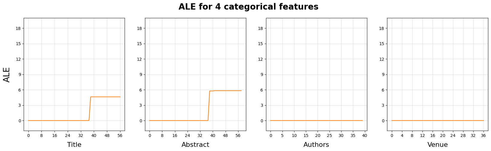

  Figure 14. ALE Plots of for categorical features for 1000 papers data set. 
   The values of Y-axis are the acculumated local effect values of the intervals. 
   The values of X-axis are the sequence numbers of the intervals.

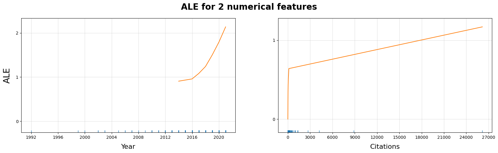

  Figure 15. ALE Plots of for numerical features for 1000 papers data set. 
   The values of Y-axis are the acculumated local effect values of the intervals. 
   The values of X-axis are the maximum value of the intervals.

##### 5000 Papers

###### Plot

For 5000 paper data set, the size of the interval for every feature is 1% of the total 5000 paper.

This means that for every ALE plot, a total of 100 intervals are used for ALE estimation.

The following plots show the ALE of categorical features.

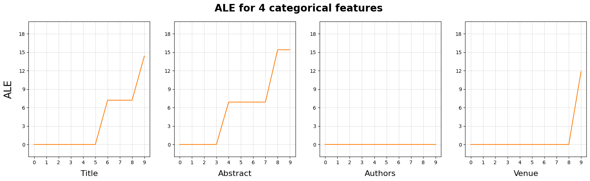

  Figure 16. ALE Plots of for categorical features for 5000 papers data set. 
   The values of Y-axis are the acculumated local effect values of the intervals. 
   The values of X-axis are the sequence numbers of the intervals.

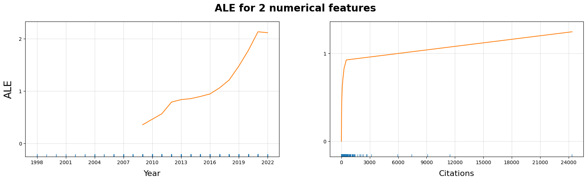

  Figure 17. ALE Plots of for numerical features for 5000 papers data set. 
   The values of Y-axis are the acculumated local effect values of the intervals. 
   The values of X-axis are the maximum value of the intervals.

##### All `cslg` Papers

###### Plot

For 92938 paper data set, the size of the interval for every feature is 1000 papers.

This means that for every ALE plot, a total of 93 intervals are used for ALE estimation.

The following plots show the ALE of categorical features. Again, since it used the larger size of the data set, zoomed sub-plots are used for better illustration.

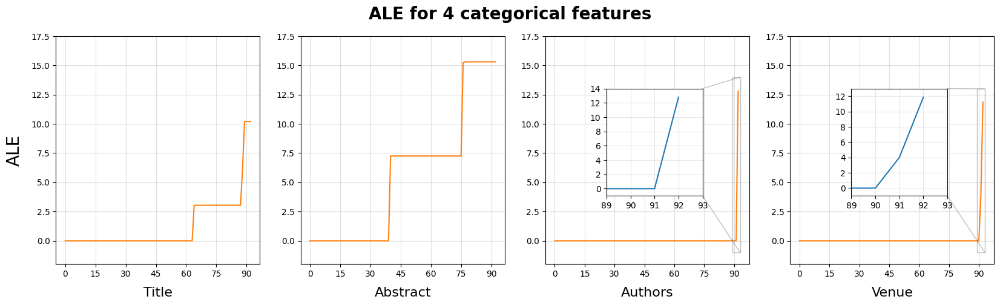

  Figure 18. ALE Plots of for categorical features for 92938 papers data set. 
   The values of Y-axis are the acculumated local effect values of the intervals. 
   The values of X-axis are the sequence numbers of the intervals.

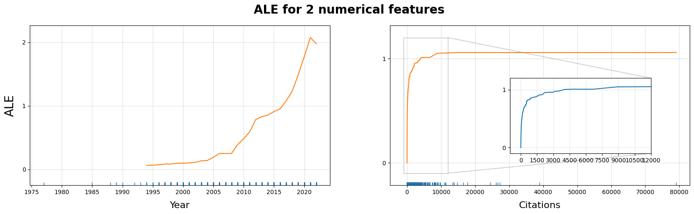

  Figure 19. ALE Plots of for numerical features for 92938 papers data set. 
   The values of Y-axis are the acculumated local effect values of the intervals. 
   The values of X-axis are the maximum value of the intervals.

##### Conclusion

The previous two experiments show the same importance order as we got in PDP experiments.

But when we used the biggest data set we have, feature $author$ shows more contribution than the $venue$ does. This might due to the fact that when we have small data set, non of the authors value can contribute the predictions. And the others' importance position remain the same.

| Feature name | 1000p. ALE-based Imp. | 5000p. PDP-based Imp. | 92938p. PDP-based Imp. |
| :----------: | :-------------------: | :-------------------: | :--------------------: |
|   abstract   |       4.243614        |     **5.085414**      |        5.664805        |
|    title     |       4.289228        |     **3.992325**      |        2.382722        |
|    venue     |       0.829445        |       1.340829        |      **1.316654**      |
|   authors    |       0.000000        |       0.000000        |      **1.327196**      |
|     year     |       0.460942        |       0.449724        |        0.433338        |
| n_citations  |       0.217293        |       0.238238        |        0.236456        |

Table 3. ALE-based Feature Importance list for 1000 Papers, 5000 Papers and 92938 Papers data set.

From the last result, we can have the feature importance ordering as follow:
$$
abstract > title > authors > venue > year > n\_citations
$$

#### 2-way ALE Experiment

Since too many plots for two experiments, you can refer to the Github to check the plots: 

1. https://github.com/youyinnn/s2search/blob/pipelining/pipelining/ale-exp1/ale-exp1_cslg-rand-1000_2w_ale_plotting.ipynb
2. https://github.com/youyinnn/s2search/blob/pipelining/pipelining/ale-exp1/ale-exp1_cslg-rand-5000_2w_ale_plotting.ipynb
3. https://github.com/youyinnn/s2search/blob/pipelining/pipelining/ale-exp1/ale-exp1_cslg_2w_ale_plotting.ipynb

The joint result of feature interaction estimation is shown as follow:

|         Feature Pairs         | 1000p. ALE-based Int. | 5000p. ALE-based Int. | 92938p. ALE-based Int. |
| :---------------------------: | :-------------------: | :-------------------: | :--------------------: |
|    $title \times abstract$    |       3.852272        |       4.310072        |        5.933907        |
|      $title\times venue$      |       0.000000        |       0.407969        |        0.262588        |
|     $title\times authors$     |       0.000000        |       0.000000        |        0.211917        |
|      $title\times year$       |       0.024064        |       0.069945        |        0.146681        |
|  $title\times n\_citations$   |       0.017638        |       0.633668        |        0.056150        |
|    $abstract\times venue$     |       0.000000        |       0.438959        |        0.630956        |
|   $abstract\times authors$    |       0.000000        |       0.000000        |        0.188118        |
|     $abstract\times year$     |       0.006473        |       0.024601        |        0.088027        |
| $abstract\times n\_citations$ |       0.006053        |       0.015580        |        0.029473        |
|     $venue\times authors$     |       0.000000        |       0.000000        |        0.130406        |
|      $venue\times year$       |       0.000659        |       0.005818        |        0.003074        |
|  $venue\times n\_citations$   |       0.000554        |       0.002192        |        0.006128        |
|     $authors\times year$      |       0.000000        |       0.000000        |        0.005345        |
| $authors\times n\_citations$  |       0.000000        |       0.000000        |        0.011496        |
|   $year\times n\_citations$   |       0.044821        |       0.108069        |        0.180502        |

Table 4. ALE-based Feature Interaction Strength for data set of 1000 Papers and 5000 Papers and 92938 Papers.

##### Conclusion

From the result, we can draw the conclusion that the top 3 interactions are:

1. $title \times abstract$
2. $abstract\times venue$
3. $title\times venue$

and the first interaction strength is much stronger than the sum of all the others.

#### Heat-map and Network Graph

Since the first two ale result experiments are unstable, here we only show the last experiment.

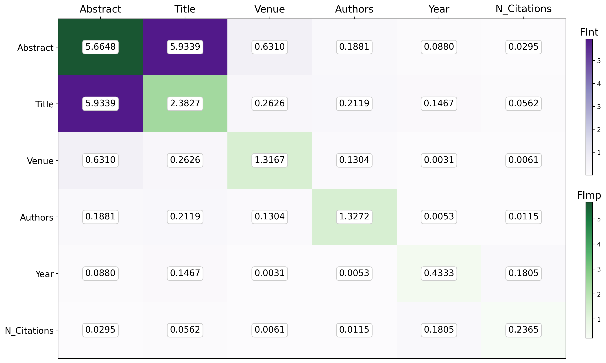

  Figure 20. ALE-based Heat-map for Showing Feature Importance and the Feature Interaction Strength. 
  Cells with Green Color Indicate the Feature Importance Values. Deeper color indicates larger value.  
  Cells with Purple Color Indicate the Feature Interaction Strength. Deeper color indicates larger value. 
  The Cells Are Ordered by the Sum of Two Metrics. The Top Left Most Cells Contribute More than the Others.

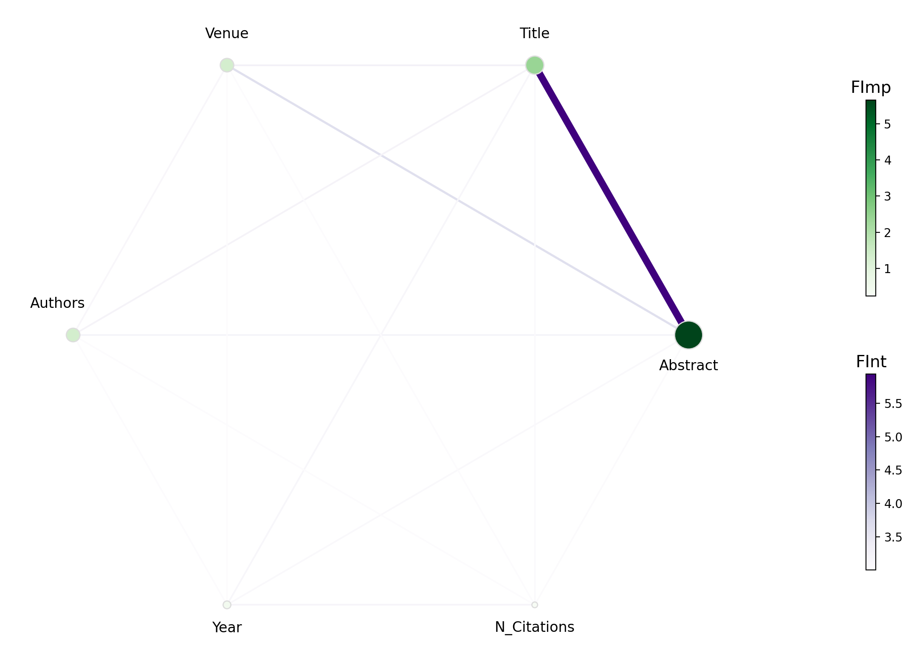

  Figure 21. ALE-based Network Graph for Showing Feature Importance  and the Feature Interaction Strength. 
  Notes with Green Color Indicate the Feature Importance Values.  Deeper color and bigger size indicates larger value. 
  Edges with Purple Color Indicate the Feature Interaction Strength.  Deeper color and wider edge width indicates larger value.

  Figure 22. ALE-based Network Graph for Showing Feature Importance  and the Feature Interaction Strength. 
  This Graph is altered by removing the Abstract Node for showing the metrics for the rest of the features.

### H-statistic Feature Interaction

This technique is based on **Partial dependence function**. The formula of it is:
$$
H^2_{jk} = \frac{\sum_{i=1}^n\left[PD_{jk}(x_{j}^{(i)},x_k^{(i)})-PD_j(x_j^{(i)}) - PD_k(x_{k}^{(i)})\right]^2}{\sum_{i=1}^n{PD}^2_{jk}(x_j^{(i)},x_k^{(i)})}
$$
This is used for estimating the interaction between feature $j$ and $k$.

The experiment result is presented as following table:

|            Features            | H-statistic for 500p. | H-statistic for 1000p. | H-statistic for 5000p. |
| :----------------------------: | :-------------------: | :--------------------: | :--------------------: |
|    $title \times abstract$     |     0.2174814336      |      0.2664149087      |      0.2510489798      |
|      $title \times venue$      |     0.9459569320      |      0.9906408142      |      1.0314859797      |
|     $title \times authors$     |     0.9691326399      |      1.0153224425      |      1.0475620936      |
|      $title \times years$      |     0.9624149158      |      1.0030108805      |      1.0306418632      |
|  $title \times n\_citations$   |     0.9608109213      |      1.0028524626      |      1.0363504646      |
|    $abstract \times venue$     |     0.6530887459      |      0.6480989307      |      0.6929262084      |
|   $abstract \times authors$    |     0.6731584914      |      0.6620560612      |      0.7052068789      |
|     $abstract \times year$     |     0.6706629075      |      0.6604602498      |      0.6956860299      |
| $abstract \times n\_citations$ |     0.6677419869      |      0.6571619591      |      0.7020495081      |
|     $venue \times authors$     |     0.9688473428      |      0.9769444729      |      0.9874531648      |
|      $venue \times year$       |     0.9567614749      |      0.9649247107      |      0.9764694790      |
|  $venue \times n\_citations$   |     0.9589898713      |      0.9679587055      |      0.9792065804      |
|     $authors \times year$      |     0.9843642076      |      0.9860892220      |      0.9887802334      |
| $authors \times n\_citations$  |     0.9900262401      |      0.9904366160      |      0.9915394058      |
|   $year \times n\_citations$   |     1.0115519498      |      1.0136085292      |      1.0139521223      |

Table 5. H-Statistic Feature Interaction Strength for data set of 5000 Papers and 1000 Papers and 5000 Papers.

Although the result is stable, but they are not promising, take a look at the heat-map for building the intuition.

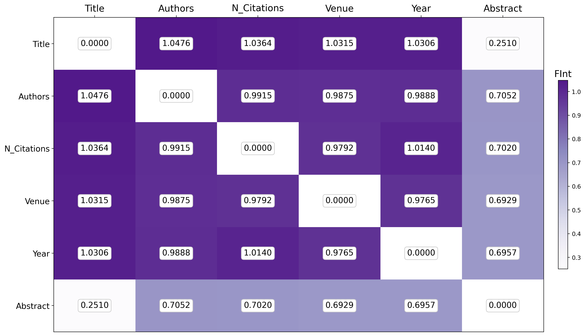

  Figure 23. H-Statistic Heat-map for Showing Feature Interaction Strength. 
  Cells with Purple Color Indicate the Feature Interaction Strength. Deeper color indicates larger value. 
  The Cells Are Ordered by the Sum of Two Metrics.  
  The Top Left Most Cells Contribute More than the Others.

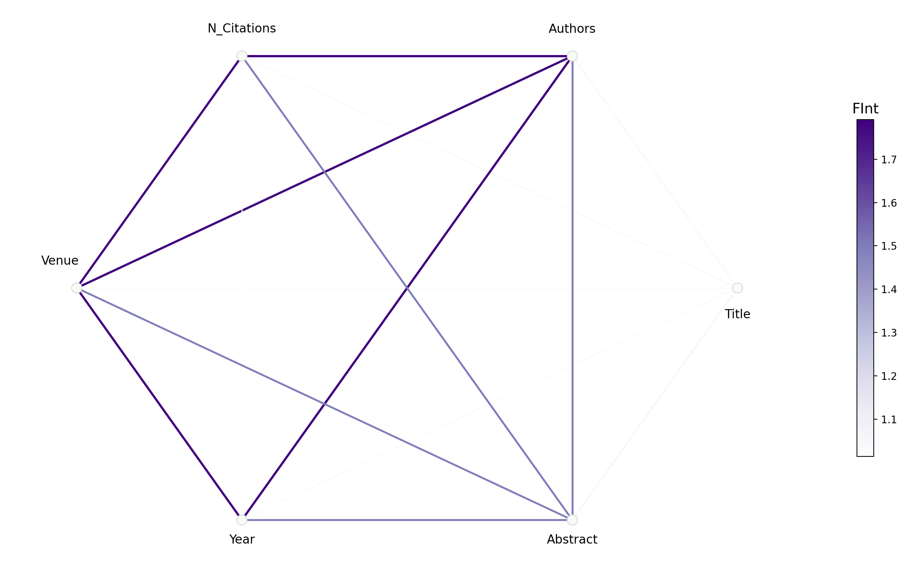

  Figure 24. H-Statistic Network Graph for Showing Feature Interaction Strength. 
  Edges with Purple Color Indicate the Feature Interaction Strength.  
  Deeper color and wider edge width indicates larger value.

According to the book - <[Intepretable Machine Learning](https://christophm.github.io/interpretable-ml-book/interaction.html)>:

*"The statistic is 0 if there is no interaction at all and 1 if all of the variance of the $PD_{{jk}}$ or $f$ is explained by the sum of the partial dependence functions. An interaction statistic of 1 between two features means that each single PD function is constant and the effect on the prediction only comes through the interaction. The H-statistic can also be larger than 1, which is more difficult to interpret."*

The result of h-statistic show that $title \times authors$ has the strongest interaction and the $title \times abstract$ has the weakest interaction. This result is quite different compare to what we excepted and the common sense.

Also from the paper [A Simple and Effective Model-Based Variable Importance Measure](https://arxiv.org/pdf/1805.04755.pdf), it says: "*To our surprise, the H-statistic did not seem to catch the true interaction between x1 and x2.*". Which means that the results of H-statistic are **misleading** to some extend.

So we have to turn to the **PDP-based Feature Interaction Detection** and compare it to **ALE-based Interaction Detection**.

